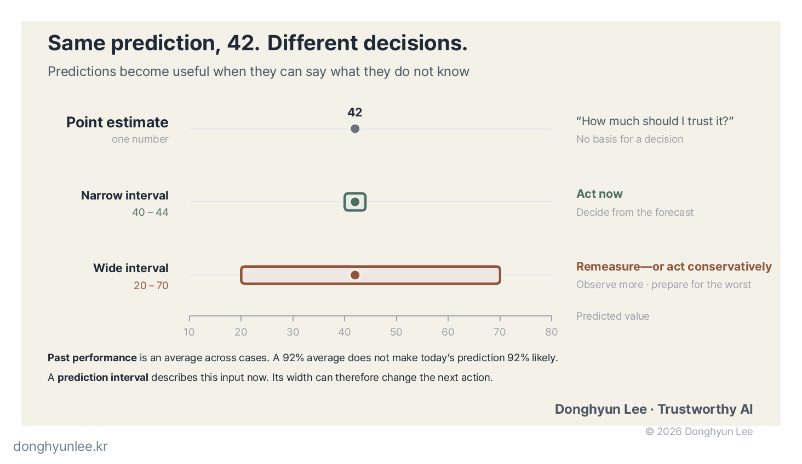

## When You Do Not Know What You Do Not Know

Do you know the most difficult moment when you are studying?

It is not when you get something wrong. It is **when you do not even know what you do not know**.

A wrong answer is almost easier. At least you know what to review. What is truly frustrating is feeling as though you know everything but being unable to write an answer—and then being unable to explain what you do not understand when someone asks.

I have found that learning begins to improve at a particular point: **the moment you can say that you do not know something.** From then on, you know what to look up and whom to ask.

Most AI systems today are still at the stage before that. **They produce a single answer without knowing what they do not know.**

I research predictive models for infectious diseases (avian influenza) and environmental problems (algal blooms and particulate matter), and I have applied them in real-world settings. Along the way, I learned one thing: **what people in the field really want to know is not the prediction itself, but how much they can trust it.**

When I bring a prediction into the field, there is something people ask about before the number itself: **what evidence supports this value?** And what I can usually offer in response is past performance metrics.

This is the first article in the “Trustworthy AI” series. One promise runs through the entire series: **to make AI say, “I don’t know.”** As a starting point, I will discuss the difference between point and interval estimates.

## Two Answers to “What Time Will You Arrive?”

Let us begin with the terminology in plain language.

A friend asks, “What time will you arrive?”

There are two possible answers. One is **“Exactly 3:00.”** The other is **“Sometime between 3:00 and 3:30, almost certainly.”**

The first is what statistics calls a <strong>point estimate</strong>: selecting one value as the most plausible answer. The second is an <strong>interval estimate</strong>: giving a range as the answer, together with how much confidence to place in that range.

In daily life, we already speak in intervals because traffic might delay us. Yet, strangely, **most AI systems still answer only with points.** “The algal concentration at this site tomorrow will be 42.” That is all. They do not tell us how much to trust that value.

## The Illusion Created by a Single Number — Point Estimates

Point estimates are appealing because they are clear. “Tomorrow’s concentration: 42” looks tidy on a presentation slide.

But there is a trap. When predicting a continuous value, **the probability that the prediction will be exactly correct is effectively close to zero.** The actual value might be 41.3 or 48.9. The real questions are therefore these:

- Where **around** 42 is the actual value likely to fall?
- How **wide** is that surrounding range?

Even with the same point estimate of 42, “it is likely to be between 40 and 44” tells a completely different story from “it could be anywhere between 20 and 70.” The first 42 can support action; the second is merely a reference point. **A single point does not distinguish between them.** The clearer the number appears, the stronger the illusion of certainty becomes.

## “It Was 92% Accurate Last Year” Is Not Persuasive Enough

When we argue that a model is useful in practice, we really have only one card to play: **past performance metrics.** We tested it on data from the past several years, and this is how often it was right.

But the person sitting across the table is really asking something else:

**“So how much do you trust this number, at this site, today?”**

Past performance is **a statement averaged over the whole.** It tells us how a model performed on average across thousands of predictions. What the person is looking at, however, is **one case, here and now**.

Models have easy days and hard days. Some sites have dense observations; others have sparse ones. Some conditions are familiar; others have never been seen before. **An average accuracy of 92% does not mean that today’s prediction is 92% certain.**

A point estimate cannot bridge this gap. It produces one number and adds, “Our model performs well on average.” The person responsible for acting on it still lacks the evidence needed to decide whether it is safe to rely on that statement.

**A prediction interval provides that evidence.** It is not a statement about past performance as a whole, but **a statement about this input now**. If today’s data are poor, the interval widens. If the conditions are familiar, it narrows. It is the model saying, “I am not very confident today either.”

Can we trust the interval itself? That is a good question—and the subject of the next article.

## Statistics Has Already Gone Through This Transition

Statistics passed through this problem a century ago.

In the early twentieth century, statisticians focused on refining theories for finding the single best value: point estimation. The person who changed that trajectory was the Polish-born statistician <strong>Jerzy Neyman</strong>. In a 1934 paper, he introduced the concept of the **confidence interval**, and in a 1937 paper he developed it into a systematic theory.[1][2]

That work established a framework for reporting not “one answer,” but “a range likely to contain the answer, together with how much the procedure can be trusted.”

Confidence intervals subsequently became a standard language of science. Today, research papers and clinical-trial results report intervals alongside individual values. The most familiar example is an opinion poll. Next to “candidate support: 45%” we expect wording such as “margin of error: ±3 percentage points at the 95% confidence level.” Society has, in effect, agreed that a poll reported without this information is incomplete.

**We moved from stating one number to stating both the number and the degree of confidence we can place in it.** Keep this transition in statistics in mind. The same thing is now happening in AI.

## AI Is in the Middle of the Same Transition

The default output of today’s AI, especially deep-learning models, is a point estimate: tomorrow’s concentration, next week’s outbreak risk, or the interpretation of an image. Most systems return a single value or label.

That is why <strong>uncertainty quantification</strong> has become an important area of research. Its goal is to have a model produce not only an answer, but also an indication of how confident or uncertain it is about that answer. Comprehensive review articles have surveyed this field; two such reviews have been cited more than 2,000 and 1,000 times, respectively, as of July 2026.[3][4] That is evidence that this is an active area of research.

In my own words: **just as statistics moved from point estimates to confidence intervals, AI is moving from an age of point estimates to an age of intervals.** Prediction is shifting from “tomorrow’s algal concentration will be 42” to “42, within this range, at this level of confidence.”

## This Transition Will Not Reverse — Because the Areas of Application Have Changed

Why do I believe this is more than a passing trend? Because the **areas in which AI is being applied have changed**.

Until recently, AI was used mainly in convenience-oriented areas such as recommendations, advertising, and search. The cost of an incorrect prediction in these settings is small. If a film recommendation does not match your taste, you simply do not watch it. There was little need to say, “I am 87% confident in this recommendation.”

Now AI is entering **medicine, infectious-disease control, environmental management, and infrastructure—areas where mistakes carry serious costs.** Water-treatment operations, the allocation of disease-control resources, diagnostic support: if predictions inform decisions such as these, “how confident are you?” is not optional metadata. It is **an essential part of the output**. The greater the cost of being wrong, the less usable a prediction without uncertainty information becomes.

Regulation points in the same direction.

In Annex III, the European Union’s AI Act (Regulation (EU) 2024/1689) classifies AI used as a safety component in managing and operating the **supply of water, gas, heating, or electricity** as “high-risk.”[5] The law has begun to treat AI used for convenience differently from AI used where safety is at stake.

Reduced to one sentence, the legal direction is this: **the more important the setting in which AI is used, the more clearly it must explain how much its judgment can be trusted.**

## “So What Can We Do with It?”

When we say we have built a model to predict something, one question almost always comes back from the field. I hear it often as well:

**“So what can we do with that prediction?”**

A prediction is not an action. It becomes valuable only when it leads to a decision about what to change—what is often called an <strong>intervention</strong>. What determines that decision is the **width of the uncertainty interval**.

- If the interval is **narrow**, we can act directly on the prediction.
- If the interval is **wide**, we may collect more observations or choose a conservative response that prepares for the worst case.

Even with the same prediction of 42, **what we do next changes** depending on whether the interval is 40–44 or 20–70. In the first case, we proceed as planned. In the second, we measure again or leave more room for error.

An interval is therefore **not merely a display of humility by the model; it is guidance for the user’s next action.** A model that offers only a point estimate leaves this entire judgment to the user’s intuition. It predicts, but does not help decide what to do—a partial output at best.

*Figure 1. The point estimate is identical, but the interval width changes the next action.*

## Does High Uncertainty Mean a Bad Model?

At this point, a reasonable objection may arise: if uncertainty is high, does that not simply mean the model is poor?

I do not see it that way.

Return to the example of studying. One student knows exactly what they do not understand. Another thinks they know everything but repeatedly gets answers wrong. **Which is the better student?**

**A model that reports high uncertainty is not necessarily a bad model; it is a model that knows its limits.** The truly dangerous model is one that is wrong with confidence. The first allows us to prepare; the second leaves us defenseless.

Of course, an interval that is too wide makes a prediction less useful in practice. That is true. Even then, however, we **know** that the prediction cannot support a decision. That is a very different position from being unaware of what we do not know.

## Conclusion — The Promise of This Series

In one sentence: **good AI does not merely give accurate answers; it also tells us how likely it is to be accurate.**

Learning works the same way. It begins when we can say that we do not know what we do not know. **AI is now crossing that threshold.**

It took statistics a generation to move from point estimates to confidence intervals. AI is in the middle of that transition now, and the shift will accelerate as AI expands into safety-critical areas. In this series, I will explain, one step at a time, how to make AI say, “I don’t know.”

The next article will be about **calibration**. When a model says it is “90% confident,” is that 90% really 90%? We will begin with that question.

What about your own field? When you receive an AI prediction, have you ever wondered how much you should trust it? Tell me in the comments, and I will draw on your responses in the next article.

---

## Sources

[1] Neyman, J. (1934). *On the Two Different Aspects of the Representative Method: The Method of Stratified Sampling and the Method of Purposive Selection.* Journal of the Royal Statistical Society, 97(4), 558–625. doi:10.2307/2342192 — The paper in which the concept of confidence intervals was first introduced.

[2] Neyman, J. (1937). *Outline of a Theory of Statistical Estimation Based on the Classical Theory of Probability.* Philosophical Transactions of the Royal Society A, 236(767), 333–380. doi:10.1098/rsta.1937.0005 — The paper that developed confidence intervals into a systematic theory.

[3] Abdar, M. et al. (2021). *A review of uncertainty quantification in deep learning: Techniques, applications and challenges.* Information Fusion, 76, 243–297. doi:10.1016/j.inffus.2021.05.008

[4] Gawlikowski, J. et al. (2023). *A survey of uncertainty in deep neural networks.* Artificial Intelligence Review, 56, 1513–1589. doi:10.1007/s10462-023-10562-9

[5] Regulation (EU) 2024/1689 (EU AI Act), Article 6 and Annex III. Annex III, point 2: critical infrastructure—AI systems intended to be used as safety components in the management and operation of the supply of water, gas, heating, or electricity. https://eur-lex.europa.eu/eli/reg/2024/1689/oj/eng

## Disclosure of Interests and Responsibility

Predictions always contain uncertainty. They must not be used as the sole basis for decisions on disease-control or environmental policy.

**Disclosure of Interests and Responsibility**

Donghyun Lee is a professor in the Division of Social Science & AI at Hankuk University of Foreign Studies and the CEO of AI Korea Inc.
The views expressed in this article are the author’s own and do not represent the official position of his affiliated institutions or the organizations commissioning his research projects.

This article is intended for general informational and educational purposes. It is not advice or
a policy recommendation for any particular matter, and must not be used as the sole basis for real-world decisions.

If you find a factual error, please let me know. I will correct the original and disclose the correction.
