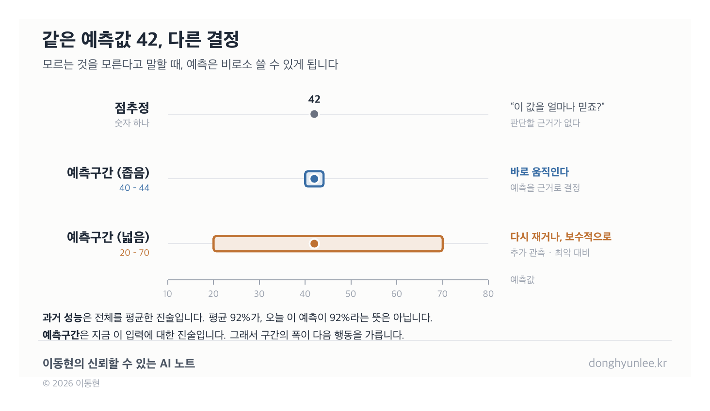

## 무엇을 모르는지 모를 때

공부하면서 가장 난감한 순간이 언제인지 아십니까.

틀렸을 때가 아닙니다. **내가 무엇을 모르는지조차 모를 때**입니다.

틀린 문제는 차라리 낫습니다. 어디를 다시 봐야 하는지가 분명하니까요. 정말 답답한 건 다 아는 것 같은데 답을 못 쓰는 때, 뭘 모르냐고 물으면 그것도 대답이 안 되는 때입니다.

저는 공부가 느는 시점이 따로 있다고 느낍니다. **모르는 것을 모른다고 말할 수 있게 되는 순간부터입니다.** 그때부터 무엇을 찾아봐야 할지, 누구에게 물어야 할지가 정해집니다.

지금의 AI 대부분은 그 이전 단계에 있습니다. **자기가 무엇을 모르는지 모른 채, 답을 하나 내놓습니다.**

저는 감염병(조류독감)과 환경(녹조·미세먼지) 예측 모델을 연구하고, 실제 현장에 적용해 왔습니다. 그 과정에서 배운 것이 하나 있습니다. **현장이 정말 궁금해하는 것은 예측값 자체가 아니라, 그 값을 얼마나 믿어도 되는가였습니다.**

예측 결과를 들고 현장에 가면, 숫자 자체보다 먼저 확인받는 것이 있습니다. **이 값을 무엇으로 뒷받침하느냐**입니다. 그리고 그 자리에서 제가 내밀 수 있는 것은, 대개 과거 성능 지표뿐이었습니다.

이 글은 "신뢰할 수 있는 AI" 시리즈의 첫 글입니다. 시리즈 전체를 관통하는 약속은 하나입니다. **AI가 "모른다"고 말하게 하기.** 오늘은 그 출발점으로, 점추정과 구간추정의 차이부터 이야기하겠습니다.

## "몇 시에 도착해?"라는 질문의 두 가지 대답

먼저 용어부터 쉽게 풀겠습니다.

친구가 묻습니다. "몇 시에 도착해?"

대답이 두 가지 있을 수 있습니다. 하나는 **"3시 정각"**. 다른 하나는 **"3시에서 3시 반 사이, 거의 확실히"**.

첫 번째가 통계학에서 말하는 <strong>점추정(point estimate)</strong>입니다. 가장 그럴듯한 값 하나를 딱 찍어 주는 것이지요. 두 번째가 <strong>구간추정(interval estimate)</strong>입니다. 답을 범위로 주되, 그 범위를 얼마나 믿어도 되는지까지 함께 주는 방식입니다.

우리는 일상에서 이미 구간으로 말합니다. 길이 막힐지 모르니까요. 그런데 이상하게도, **지금의 AI 대부분은 여전히 점으로만 답합니다.** "내일 이 지점의 녹조 농도는 42입니다." 끝. 이 값을 얼마나 믿어야 하는지는 말해 주지 않습니다.

## 하나의 숫자가 주는 착시 — 점추정

점추정은 매력적입니다. 명료하니까요. 회의 자료에 "내일 농도 42"라고 적으면 깔끔합니다.

하지만 여기에 함정이 있습니다. 연속적인 값을 예측하는 문제에서, **예측값이 정확히 들어맞을 확률은 사실상 0에 가깝습니다.** 실제 값은 41.3일 수도, 48.9일 수도 있습니다. 그러니 진짜 질문은 이것입니다.

- 실제 값은 42 **주변 어디쯤**에 있는가?
- 그 "주변"은 **얼마나 넓은가**?

같은 42라도 "40–44 사이일 가능성이 높다"와 "20–70 사이 어디일지 모르겠다"는 전혀 다른 이야기입니다. 앞의 42는 행동의 근거가 되지만, 뒤의 42는 참고 사항일 뿐입니다. **점 하나만 보여 주면 이 둘이 구분되지 않습니다.** 숫자가 명료해 보일수록, 확신의 착시는 커집니다.

## "작년에 92% 맞혔습니다"로는 설득되지 않습니다

현장에서 이 모델이 쓸 만하다고 주장할 때, 사실 우리가 꺼낼 수 있는 카드는 하나뿐입니다. **과거 성능 지표.** 지난 몇 년 데이터로 검증해 보니 이만큼 맞혔다는 것.

그런데 마주 앉은 담당자가 정말 묻는 것은 다른 이야기입니다.

**"그래서 오늘, 이 지점, 이 숫자는 얼마나 믿어요?"**

과거 성능은 **전체를 평균한 진술**입니다. 모델이 수천 번 예측했을 때 평균적으로 어땠는가. 반면 담당자 앞에 놓인 것은 **오늘 여기 한 건**입니다.

그리고 모델에게도 쉬운 날과 어려운 날이 있습니다. 관측이 촘촘한 지점이 있고 드문 지점이 있습니다. 익숙한 조건이 있고 처음 보는 조건이 있습니다. **평균 92%가, 오늘 이 예측이 92%라는 뜻은 아닙니다.**

점추정은 이 간극을 메우지 못합니다. 숫자 하나를 내놓고 "저희 모델은 평균적으로 잘 맞습니다"라고 덧붙일 뿐입니다. 담당자는 이 말을 믿고 움직여도 되는지 판단할 근거를 갖지 못합니다.

**예측구간이 바로 그 근거입니다.** 과거 전체에 대한 진술이 아니라, **지금 이 입력에 대한 진술**이기 때문입니다. 오늘 데이터가 부실하면 구간이 넓어지고, 조건이 익숙하면 좁아집니다. 모델이 "오늘은 저도 자신이 없습니다"라고 말하는 셈입니다.

그럼 그 구간 자체는 믿을 수 있는가. 좋은 질문이고, 다음 글의 주제입니다.

## 통계학은 이 전환을 이미 한 번 겪었습니다

사실 통계학은 이 문제를 100년 전에 이미 통과했습니다.

20세기 초의 통계학은 "가장 좋은 값 하나를 어떻게 찾을 것인가", 즉 점추정의 이론을 다듬는 데 집중했습니다. 흐름을 바꾼 사람은 폴란드 태생의 통계학자 <strong>예르지 네이만(Jerzy Neyman)</strong>입니다. 그는 1934년 논문에서 **신뢰구간(confidence interval)** 이라는 개념을 처음 내놓았고, 1937년 논문에서 그것을 하나의 이론으로 체계화했습니다.[1][2]

"답 하나"가 아니라 "답이 들어 있을 범위 + 그 절차를 믿을 수 있는 정도"를 함께 보고하는 틀이 이때 생겼습니다.

이후 신뢰구간은 과학의 표준 언어가 되었습니다. 오늘날 논문도, 신약 임상시험 결과도 값 하나만 보고하지 않고 구간을 함께 보고합니다. 가장 익숙한 예는 여론조사입니다. "후보 지지율 45%"라는 숫자 옆에는 반드시 "오차범위 ±3%포인트, 95% 신뢰수준" 같은 문구가 붙습니다. 이 문구가 빠진 여론조사 보도는 반쪽짜리 정보라는 것을, 우리 사회는 이미 합의한 셈입니다.

**하나의 숫자에서, 숫자와 그 숫자에 대한 믿음의 정도를 함께 말하는 방식으로.** 통계학이 지나온 이 전환을 잠시 붙들어 두십시오. 지금 AI에서 같은 일이 벌어지고 있습니다.

## AI도 같은 전환의 한가운데에 있습니다

지금의 AI, 특히 딥러닝 모델의 기본 출력은 점추정입니다. 내일의 농도, 다음 주의 발생 위험, 이 영상의 판독 결과 — 대부분 값 하나 또는 라벨 하나로 나옵니다.

그래서 최근 연구 흐름 중 하나가 <strong>불확실성 정량화(uncertainty quantification)</strong>입니다. 모델이 답과 함께 "이 답을 이 정도로 확신한다/못 한다"를 산출하게 만드는 것이지요. 이 주제를 정리한 종합 리뷰 논문들이 나와 있고, 그중 두 편은 각각 2천 회, 1천 회 이상 인용됐습니다(2026년 7월 기준).[3][4] 활발히 다뤄지는 분야라고 말할 수 있는 근거입니다.

제 표현으로 정리하면 이렇습니다. **통계학이 점추정에서 신뢰구간으로 넘어갔듯이, AI도 점추정의 시대에서 신뢰구간의 시대로 넘어가고 있습니다.** "내일 녹조 농도는 42"가 아니라, "42 ± 얼마, 이 정도 신뢰수준으로"가 예측의 본질이 되어 가는 전환입니다.

## 이 전환은 되돌아가지 않습니다 — 적용 영역이 바뀌었기 때문에

왜 이 흐름이 일시적 유행이 아니라고 보는가. 이유는 AI가 **적용되는 영역 자체가 바뀌고 있기 때문**입니다.

지금까지 AI가 주로 쓰인 곳은 추천, 광고, 검색 같은 편의 영역이었습니다. 이런 곳에서는 예측이 틀려도 대가가 작습니다. 영화 추천이 취향에 안 맞으면 그냥 안 보면 됩니다. 굳이 "이 추천을 87% 확신합니다"라고 말할 필요가 없었지요.

그런데 지금 AI는 **의료, 감염병, 환경, 인프라처럼 틀렸을 때의 대가가 큰 영역**으로 들어가고 있습니다. 정수장 운영, 방역 자원 배치, 진단 보조 — 이런 결정에 쓰이는 예측이라면 "얼마나 확신하는가"는 부가 정보가 아니라 **산출물의 필수 요소**가 됩니다. 틀렸을 때의 비용이 커질수록, 불확실성 정보 없는 예측은 쓸 수 없는 예측이 됩니다.

규제도 같은 방향을 가리킵니다.

유럽연합의 AI 법(Regulation (EU) 2024/1689)은 부속서 III에서 **물·가스·난방·전기의 공급**을 관리·운영하는 안전 부품으로 쓰이는 AI를 '고위험(high-risk)'으로 분류합니다.[5] 편의 영역의 AI와 안전이 걸린 영역의 AI를, 법이 다르게 취급하기 시작한 것입니다.

법이 요구하는 것을 한 줄로 줄이면 이렇습니다. **중요한 곳에 쓰는 AI일수록, 그 판단을 얼마나 믿을 수 있는지 설명하라.**

## "그래서 그걸로 뭘 할 수 있는데요?"

모델을 만들어 무언가를 예측한다고 하면, 현장에서 거의 반드시 돌아오는 질문이 있습니다. 저도 자주 듣습니다.

**"그래서 그 예측으로 뭘 할 수 있는데요?"**

예측 자체는 행동이 아닙니다. 예측을 받아 무엇을 바꿀 것인가 — 흔히 <strong>개입(intervention)</strong>이라고 부르는 그 결정이 이어져야 비로소 값이 생깁니다. 그리고 그 결정을 가르는 것이 바로 **불확실성의 폭**입니다.

- 구간이 **좁으면**: 예측을 근거로 바로 움직일 수 있습니다.
- 구간이 **넓으면**: 추가 관측을 하거나, 최악의 경우에 대비한 보수적 대응을 택하게 됩니다.

같은 예측값 42라도, 구간이 40–44냐 20–70이냐에 따라 **다음에 할 일이 달라집니다.** 앞의 경우엔 계획대로 가고, 뒤의 경우엔 한 번 더 재 보거나 여유를 둡니다.

그러니 **구간은 모델의 겸손 표시가 아니라, 사용자의 행동 지침입니다.** 점추정만 주는 모델은 이 판단을 전부 사용자의 감에 떠넘기는 셈입니다. 예측은 했는데 무엇을 해야 할지는 알려주지 않는, 반쪽짜리 산출물이 됩니다.

*그림 1. 같은 42라도 구간의 폭에 따라 다음 행동이 갈립니다. 점추정만으로는 이 판단을 할 수 없습니다.*

## 불확실성이 크면 나쁜 모델일까요

여기서 이런 반문이 나올 법합니다. 불확실성이 크다는 건 결국 그 모델이 별로라는 뜻 아니냐고.

저는 그렇게 보지 않습니다.

다시 공부 이야기입니다. 자기가 무엇을 모르는지 정확히 아는 학생과, 다 안다고 생각하는데 시험만 보면 틀리는 학생. **둘 중 누가 더 나은 학생입니까.**

**불확실성을 크게 내놓는 모델은 나쁜 모델이 아니라, 자기 한계를 아는 모델입니다.** 정말 위험한 모델은 틀리면서 확신하는 모델입니다. 앞의 모델은 우리가 대비할 수 있게 해 주고, 뒤의 모델은 우리를 무방비로 만듭니다.

물론 구간이 지나치게 넓으면 그 예측의 실용성은 떨어집니다. 그건 사실입니다. 다만 그때조차 우리는 "이 예측으로는 결정할 수 없다"는 것을 **알고** 있습니다. 모르면서 아는 줄 아는 것과는 처지가 다릅니다.

## 마무리 — 이 시리즈의 약속

한 문장으로 요약하겠습니다. **좋은 AI는 답을 잘 맞히는 AI가 아니라, 자신이 얼마나 맞힐 수 있는지까지 말해 주는 AI입니다.**

공부가 그렇듯이 말입니다. 모르는 것을 모른다고 말할 수 있을 때부터 배움이 시작됩니다. **AI도 지금 그 문턱을 넘고 있습니다.**

통계학이 점추정에서 신뢰구간으로 넘어가는 데 한 세대가 걸렸습니다. AI는 지금 그 전환의 한가운데에 있고, 안전이 걸린 영역으로 적용이 확대될수록 이 전환은 빨라질 것입니다. 이 시리즈에서는 "AI가 '모른다'고 말하게 하는 법"을 하나씩 풀어 가려 합니다.

다음 글은 **보정(calibration)** 이야기입니다. 모델이 "90% 확신한다"고 말할 때, 그 90%는 진짜 90%일까요? 이 질문에서 시작하겠습니다.

여러분의 현장에서는 어떤가요 — AI의 예측값을 받았을 때, "얼마나 믿어야 하나"가 궁금했던 적이 있으신가요? 댓글로 들려주시면 다음 글에 반영하겠습니다.

---

## 출처

[1] Neyman, J. (1934). *On the Two Different Aspects of the Representative Method: The Method of Stratified Sampling and the Method of Purposive Selection.* Journal of the Royal Statistical Society, 97(4), 558–625. doi:10.2307/2342192 — 신뢰구간 개념이 처음 제시된 논문.

[2] Neyman, J. (1937). *Outline of a Theory of Statistical Estimation Based on the Classical Theory of Probability.* Philosophical Transactions of the Royal Society A, 236(767), 333–380. doi:10.1098/rsta.1937.0005 — 신뢰구간을 이론으로 체계화한 논문.

[3] Abdar, M. et al. (2021). *A review of uncertainty quantification in deep learning: Techniques, applications and challenges.* Information Fusion, 76, 243–297. doi:10.1016/j.inffus.2021.05.008

[4] Gawlikowski, J. et al. (2023). *A survey of uncertainty in deep neural networks.* Artificial Intelligence Review, 56, 1513–1589. doi:10.1007/s10462-023-10562-9

[5] Regulation (EU) 2024/1689 (EU AI Act), Article 6 및 Annex III. 부속서 III 제2항: 핵심 인프라 — 물·가스·난방·전기 공급의 관리·운영에 쓰이는 안전 부품. https://eur-lex.europa.eu/eli/reg/2024/1689/oj/eng

---

## 이해관계 및 책임 고지

예측 결과는 언제나 불확실성을 포함합니다. 방역·환경 정책 의사결정의 단독 근거가 될 수 없습니다.

**이해관계 및 책임 고지**

이동현은 한국외국어대학교 교수이자 한국인공지능㈜(AI Korea)의 대표입니다.
이 글의 견해는 저자 개인의 것이며, 소속 기관이나 연구과제 발주처의 공식 입장이 아닙니다.

이 글은 일반적인 정보 제공과 교육을 목적으로 합니다. 특정 사안에 대한 자문이나
정책 권고가 아니며, 실제 의사결정의 단독 근거로 사용될 수 없습니다.

사실에 오류가 있다면 알려주십시오. 원문을 고치고, 고친 사실을 함께 밝히겠습니다.

---
