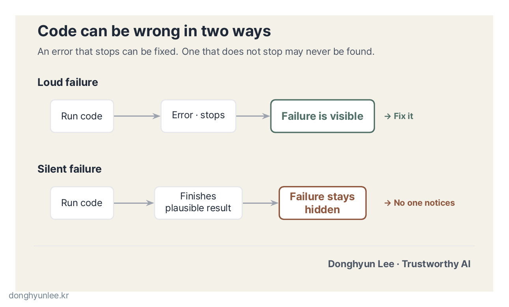
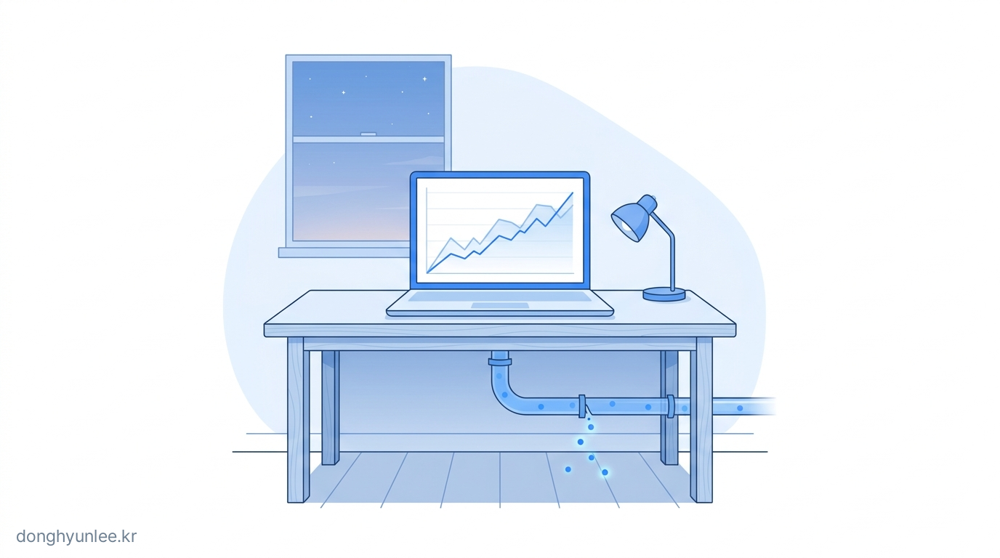
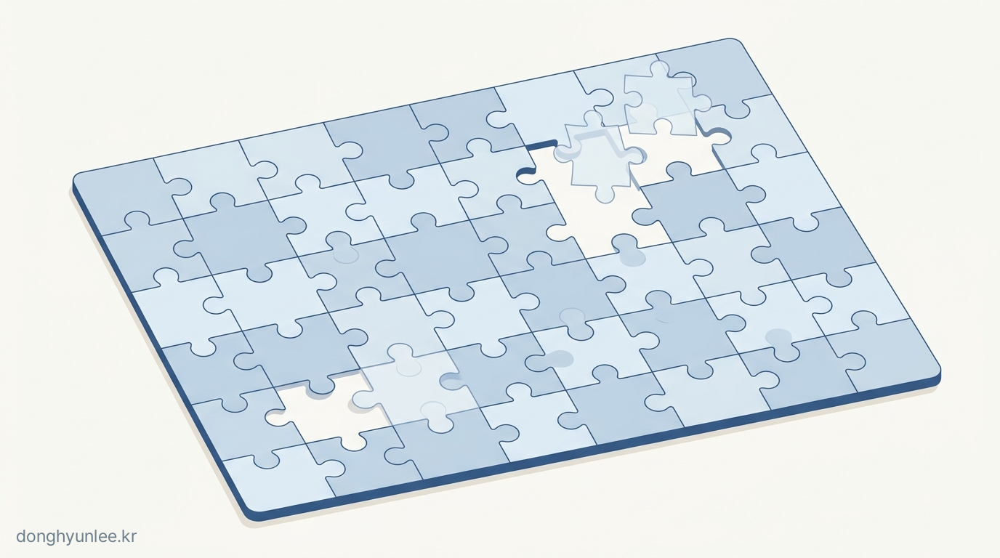
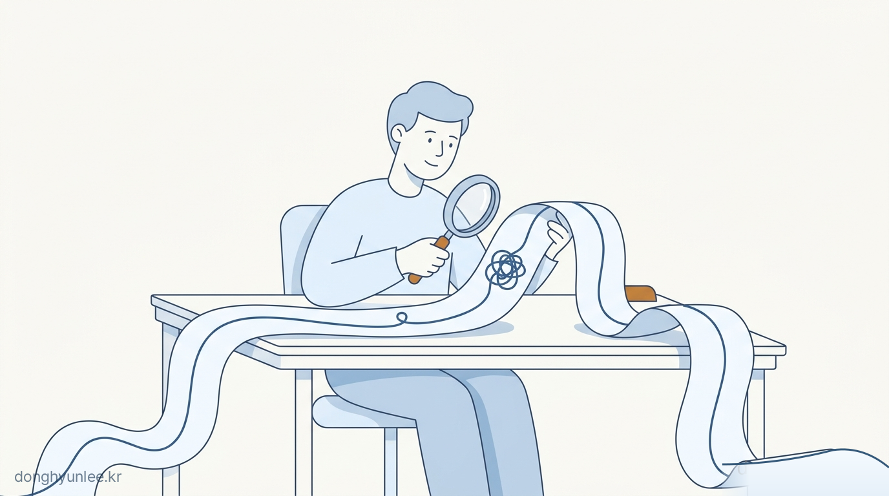

## We Have the Code, but No One Who Understands It

These days, I often encounter the same scene while evaluating term projects at school or working on research projects.

A student brings in analysis code. It runs without errors, and the resulting graphs look plausible. But when I ask, “Why did you handle this part this way?” the student cannot answer. AI wrote the code, and often even the person who brought it in does not know exactly what it does.

**We have the code, but no one who understands it.** So no verification takes place either.

Whenever I encounter this scene, one question comes to mind. It is also one of the questions I hear most often today from students and professionals deciding whether to learn to code:

**“If AI is going to write all the code anyway, do I still need to learn Python?”**

Today, I will answer that question directly.

## The Claim Is Half Right

Let us first acknowledge what is true. Code-generating AI is good. Even without knowing the syntax, you can describe what you want in ordinary language and receive code that runs. Tasks that once took half a day can indeed take only a few minutes.

I am no exception. I use code-generating AI in development nearly every day. We are already past the stage of asking whether it is acceptable to use it. For me, AI coding has become not an option but **an essential tool**.

So I do not intend to shut down the question by saying, “The fundamentals are still important.” That statement is not wrong, but it explains nothing. Instead, let us change the question:

**Not “Can I write code?” but “When should I trust the result this code produces, and when should I question it?”**

It is the same question this blog returns to repeatedly. This is precisely why Python still matters even when AI writes the code.

## The Problem Is Not Writing Code, but Trusting It

Errors in AI-generated code come in two forms.

**First, errors that fail loudly.** The program raises an error and stops. This is actually a good kind of error: the code itself tells us that something is wrong. Feed the error message back to the AI and it will fix the problem in most cases. This is a stage that people can often get through somehow even without much Python knowledge.

**Second, errors that fail silently.** The program runs all the way through without an error and produces plausible numbers and graphs. The only problem is that the numbers are wrong. Because the program never stops, no one notices.

The second kind is the real problem, and it becomes more dangerous as AI code generation spreads. Think back to the opening scene. If no one “wrote” the code, there may be no one prepared to “question” it either.

_Figure 1. Loud errors reveal themselves; silent errors may never be discovered._

## Code That Runs Is Not Necessarily Code That Is Correct

Here are several common examples from data analysis of what it means for code to fail silently. Every one of them can run without an error.

- **Missing values disappear without a sound.** When you calculate an average with Python’s pandas library, empty values (`NaN`) are excluded by default. An average for a day with half its observations missing looks just as valid as an average for a complete day.
- **Mismatched units do not stop the calculation.** Even if one file uses millimeters and another uses centimeters, Python does not complain. It simply multiplies and adds the values.
- **Merging data can multiply the number of rows.** If you join two tables on the wrong key, the same data may be duplicated several times, yet the code still completes successfully. With more apparent observations, the statistics become more “confidently” wrong.
- **Time can shift by a day.** Anyone who works with data is likely to have seen every date move silently because of one timezone-handling choice.

These errors do not occur because AI is uniquely incapable. Humans make them too. The difference is that **when a person writes the code, at least someone made the choice**. When AI writes it, the choice can be made without anyone noticing. Whether to drop missing values, fill them in, or discard the entire day is not a coding question but an analytical judgment—and that judgment becomes hidden inside a default setting.

_Figure 2. Even when code does not stop, its result can still be quietly wrong._

## It Will Invent Data If That Is What It Takes to Produce an Answer

There is one form of silent error that I consider especially dangerous.

Today’s AI is best understood as a tool trained with a strong tendency to **produce an answer somehow**. Recent models may ask follow-up questions or stop, but when blocked they still have a tendency to invent something plausible. This is commonly called hallucination, and it does not occur only in prose. **It happens in code as well.**

Here is a pattern I have witnessed several times in real projects. I asked AI to write data-analysis code, but when required data were missing or the format did not match, instead of stopping and asking a question, it **filled the gaps with plausible values—or even created data that did not exist—to complete the result.** On the surface, the analysis looked successful. Without verification, data that never existed in the real world remained embedded in the result.

I build AI systems that predict infectious diseases and environmental conditions. In these fields, “silently invented data” does more than make a graph look slightly odd. Predictions become evidence used in real-world judgments.

This risk applies equally to us. As I said earlier, my team and I also use code-generating AI as an essential tool. The danger does not come from code being written by AI; it comes from **code not being verified**. By that standard, the code we produce is no exception. That is why the more plausible a result looks, the more deliberately I try to question it one more time.

_Figure 3. When AI fills a gap with a plausible value, the fabrication can be hard to see._

## So How Much Do We Need to Learn?

If your reaction so far is, “So the answer is that I need to study coding hard after all,” you are only half right. My answer is slightly different: **the center of gravity of “the Python we need to learn” has shifted in the age of AI.**

In the past, the focus was the ability to fill a blank screen with code—the ability to **write**. That has become the part AI is best at replacing. What remains, however, has not been replaced:

1. **A feel for the shape of data.** Tables, lists, dictionaries—you need to be able to picture the form of your data in your mind before you can suspect what may be missing and where.
2. **The ability to read code written by someone else.** AI-generated code is also “code written by someone else.” You do not need to understand every line. You need to read well enough to locate the points worth questioning: “What happens to missing values here?” “Is this the right join key?”
3. **A habit of testing on a small scale.** Before running the full dataset, run ten rows and compare the output with a value calculated by hand. This is closer to an attitude than a knowledge of syntax, but it cannot be practiced without at least some Python.
4. **The ability to reproduce the same result.** A result that cannot be reproduced cannot be verified.

What these four abilities share is not “writing,” but <strong>reading and questioning</strong>. The amount we need to learn may even have decreased. The direction has changed.

_Figure 4. In the age of AI coding, Python is increasingly a tool for reading and questioning, not just writing._

## When to Question AI-Generated Code

To summarize, here are five warning signs I look for—questions to ask yourself when you see the output of AI-generated analysis code.

1. **The result is too good.** If accuracy suddenly jumps, first check for data leakage—information about the correct answer accidentally included in the inputs—before celebrating an improvement in the model.
2. **No one checked the row counts.** If you did not count the rows before and after joins or filters, the result is not yet ready to be trusted.
3. **No one knows what happened to missing values.** If you cannot say how many values were missing or how they were handled, averages and trends may have been silently distorted. Check especially whether the AI “filled in” the gaps.
4. **Not a single value was checked by hand.** A result that has not been compared with a hand calculation on even one tiny subset has run, but it has not been verified.
5. **No one can explain why it was handled that way.** Pick any choice in the code and ask “Why?” If you cannot answer, you do not yet own the analysis.

## Conclusion — Back to the Original Question

“If AI writes everything, do I still need to learn Python?”

My answer is this: **we will entrust more and more of the work of writing code to AI. The more we do so, the more the work of questioning and verifying that code will belong to people.** The meaning of learning Python is shifting from the skill of writing code to the ability to decide whether to trust it.

In the previous article, I discussed why AI predictions should not answer with “one number.” When to trust an AI answer and when to question it is not a concern limited to predictive models. It begins with a single line of code written by AI.

What about you? How much do you check before using code or analytical results produced by AI? Tell me in the comments, and I will draw on your responses in the next article.

**Disclosure of Interests and Responsibility**

Donghyun Lee is a professor in the Division of Social Science & AI at Hankuk University of Foreign Studies and the CEO of AI Korea Inc.
The views expressed in this article are the author’s own and do not represent the official position of his affiliated institutions or the organizations commissioning his research projects.

This article is intended for general informational and educational purposes. It is not advice or
a policy recommendation for any particular matter, and must not be used as the sole basis for real-world decisions.

If you find a factual error, please let me know.
