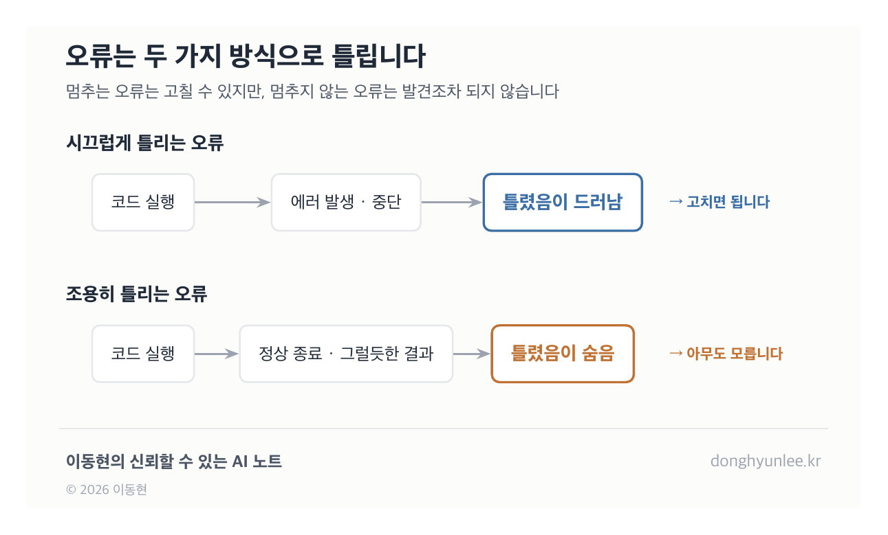
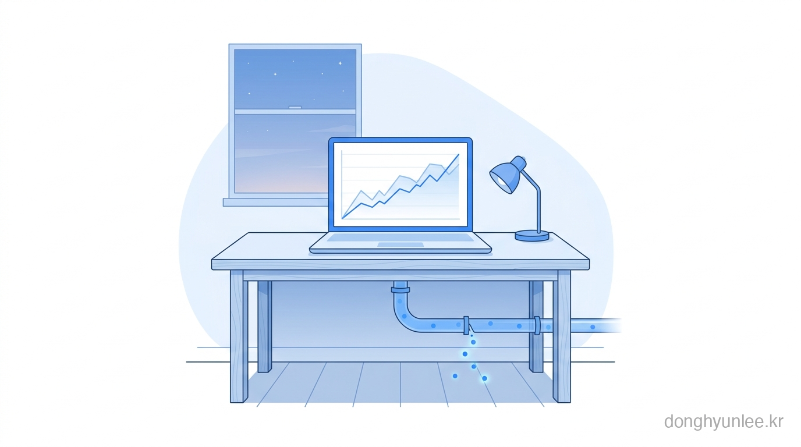
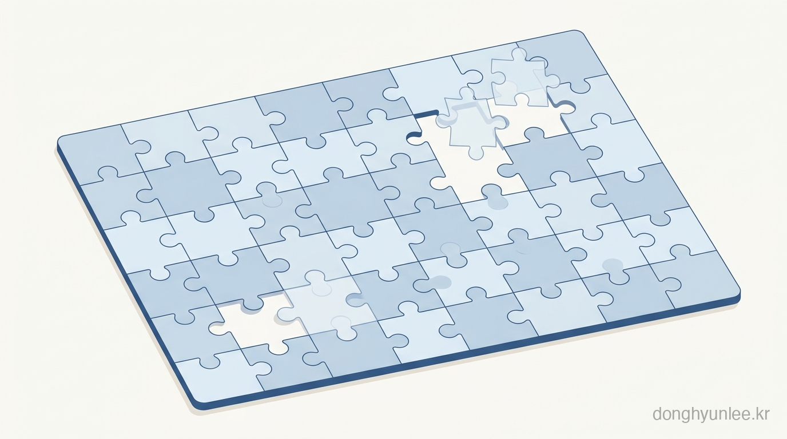
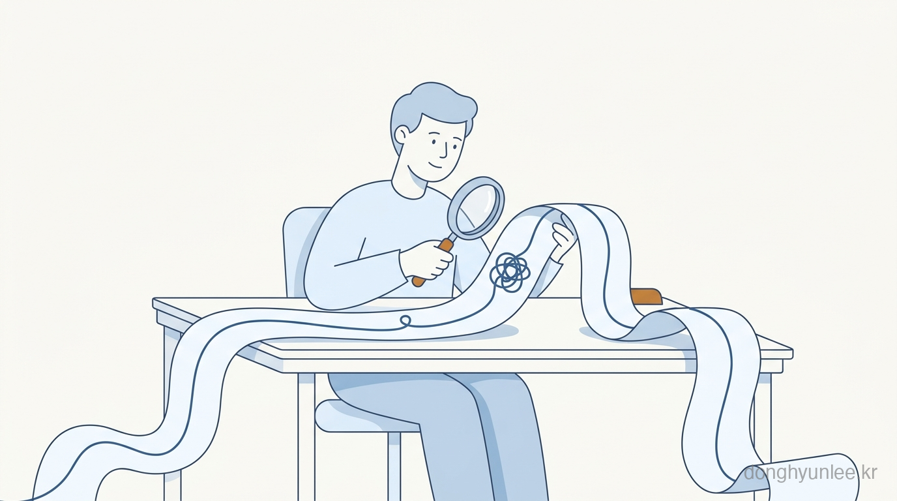

## 코드는 있는데, 아는 사람이 없습니다

요즘 학교 텀 프로젝트 평가나 연구 프로젝트를 하면서 자주 겪는 장면이 있습니다.

학생이 분석 코드를 가져옵니다. 에러 없이 잘 돌아가고, 결과 그래프도 그럴듯합니다. 그런데 "이 부분은 왜 이렇게 처리했어요?"라고 물으면 대답이 막힙니다. AI가 짜 준 코드라서, 가져온 본인도 그 코드가 정확히 무엇을 하는지 모르는 경우가 많습니다.

**코드는 있는데, 그 코드를 아는 사람이 없습니다.** 그러니 검증도 일어나지 않습니다.

이 장면을 겪을 때마다 떠오르는 질문이 있습니다. 코딩을 배울지 고민하는 학생과 직장인들이 요즘 가장 많이 하는 질문이기도 합니다.

**"어차피 AI가 코드를 다 짜주는데, 파이썬을 배워야 하나요?"**

오늘은 이 질문에 정면으로 답해 보겠습니다.

## 절반은 맞는 말입니다

먼저 인정할 것은 인정하겠습니다. 코드 생성 AI는 잘합니다. 문법을 몰라도 원하는 것을 말로 설명하면 돌아가는 코드가 나옵니다. 예전에 반나절 걸리던 작업이 몇 분으로 줄어드는 경우도 실제로 있습니다.

저부터 그렇습니다. 저는 코드 생성 AI를 개발에 매일같이 씁니다. "써도 되나"를 고민하는 단계는 이미 지났습니다. 제게 AI 코딩은 선택이 아니라 **필수재**가 됐습니다.

그러니 "그래도 기초는 중요합니다" 같은 말로 이 질문을 막을 생각은 없습니다. 그 말은 틀리지는 않지만, 아무것도 설명하지 않습니다. 대신 질문을 바꿔 보겠습니다.

**"코드를 짤 수 있는가"가 아니라, "그 코드가 내놓은 결과를 언제 믿고, 언제 의심할 것인가."**

이 블로그에서 계속 다루는 질문과 같은 질문입니다. AI가 코드를 짜주는 시대에도 파이썬이 필요한 이유는, 정확히 이 지점에 있습니다.

## 문제는 '짜는 것'이 아니라 '믿는 것'입니다

AI가 짠 코드의 오류에는 두 종류가 있습니다.

**첫째, 시끄럽게 틀리는 오류.** 실행하면 에러가 나고 프로그램이 멈춥니다. 이것은 사실 좋은 오류입니다. 틀렸다는 사실을 코드가 스스로 알려주기 때문입니다. 에러 메시지를 AI에게 다시 넣어주면 대부분 고쳐 줍니다. 파이썬을 잘 몰라도 어떻게든 넘어갈 수 있는 구간입니다.

**둘째, 조용히 틀리는 오류.** 에러 없이 끝까지 실행되고, 그럴듯한 숫자와 그래프까지 나옵니다. 다만 그 숫자가 틀렸을 뿐입니다. 멈추지 않으니 아무도 눈치채지 못합니다.

진짜 문제는 두 번째입니다. 그리고 AI 코드 생성이 늘어날수록 위험해지는 쪽도 두 번째입니다. 도입부의 장면을 떠올려 보십시오. 코드를 '쓴' 사람이 없으면, 코드를 '의심할' 사람도 없어집니다.

_그림 1. 시끄러운 오류는 스스로 드러나지만, 조용한 오류는 발견조차 되지 않습니다._

## 실행되는 코드와 맞는 코드는 다릅니다

"조용히 틀린다"는 것이 어떤 것인지, 데이터 분석에서 흔한 예를 들겠습니다. 전부 에러 없이 멀쩡하게 실행되는 코드들입니다.

- **결측치가 소리 없이 빠집니다.** 파이썬의 판다스(pandas)로 평균을 구하면, 비어 있는 값(NaN)은 기본적으로 계산에서 제외됩니다. 관측이 절반 빠진 날의 평균도, 다 채워진 날의 평균과 똑같이 멀쩡한 숫자로 나옵니다.
- **단위가 어긋나도 계산은 됩니다.** 한쪽 파일은 밀리미터, 다른 쪽은 센티미터여도 파이썬은 불평하지 않습니다. 곱하고 더한 값이 나올 뿐입니다.
- **데이터를 합치다 행이 불어납니다.** 두 표를 잘못된 기준으로 병합하면 같은 데이터가 몇 배로 복제되는데, 코드는 성공적으로 끝납니다. 표본이 늘었으니 통계는 오히려 더 '자신 있게' 틀립니다.
- **시간이 하루씩 밀립니다.** 시간대(timezone) 처리 하나로 모든 날짜가 조용히 밀리는 일은, 데이터를 다루는 사람이라면 한 번쯤 겪습니다.

이런 오류는 AI가 특별히 못해서 생기는 것이 아닙니다. 사람이 짜도 생깁니다. 차이는, **사람이 직접 짤 때는 최소한 그 선택을 한 사람이 존재한다**는 점입니다. AI가 짜면 그 선택은 아무도 모르는 사이에 내려집니다. 결측치를 뺄지, 채울지, 그날을 통째로 버릴지 — 이것은 코딩 문제가 아니라 분석의 판단 문제인데, 그 판단이 기본값 속에 숨어 버립니다.

_그림 2. 조용히 틀리는 오류는 멈추지 않기 때문에 발견되지 않습니다. 그래프가 그럴듯할수록 더 그렇습니다._

## 없는 데이터를 만들어서라도, 답을 냅니다

조용한 오류 중에서도 제가 가장 위험하다고 보는 형태가 있습니다.

지금의 AI는 **어떻게든 답을 내는 쪽으로 기울도록 학습된 도구**에 가깝습니다. 최근 모델은 되묻거나 멈추기도 하지만, 막히면 그럴듯한 것을 지어내는 경향이 여전히 남아 있습니다. 흔히 할루시네이션(환각)이라고 부르는 현상인데, 이것이 글에서만 일어나는 일이 아닙니다. **코드에서도 일어납니다.**

제가 실제 프로젝트에서 여러 번 목격한 패턴은 이렇습니다. AI에게 데이터 분석 코드를 맡겼는데, 있어야 할 데이터가 없거나 형식이 맞지 않으면 — 거기서 멈추고 물어보는 것이 아니라 — **그럴듯한 값으로 빈자리를 채우거나, 아예 존재하지 않는 데이터를 만들어서라도 결과를 완성해 버립니다.** 겉보기에는 분석이 성공한 것처럼 보입니다. 검증하지 않으면, 세상에 없는 데이터가 결과 속에 그대로 들어갑니다.

저는 감염병과 환경을 예측하는 AI를 만드는 일을 합니다. 이 분야에서 '조용히 만들어진 데이터'는 그래프가 조금 이상해지는 정도로 끝나지 않습니다. 예측 결과가 현장의 판단 재료로 쓰이기 때문입니다.

그리고 이 위험은 저희에게도 똑같이 적용됩니다. 앞서 말했듯 저와 저희 팀도 코드 생성 AI를 필수재처럼 씁니다. AI가 짠 코드라서 위험한 것이 아니라 **검증되지 않은 코드라서 위험한 것**이고, 그 기준에서는 저희가 만든 코드도 예외가 아닙니다. 그래서 저는 결과가 그럴듯하게 나올수록 오히려 한 번 더 의심하려고 합니다.

_그림 3. AI는 막히면 그럴듯한 것을 지어내는 경향이 있습니다. 채워진 자리는 겉으로 구분되지 않습니다._

## 그래서, 어디까지 배워야 할까요

여기까지 읽고 "결국 코딩을 열심히 배우라는 이야기군요"라고 하시면, 절반만 맞습니다. 제 답은 조금 다릅니다. **AI 이전과 이후에, '배워야 할 파이썬'의 무게중심이 달라졌다**는 것입니다.

예전에는 빈 화면에 코드를 채워 넣는 능력, 즉 **쓰는 능력**이 중심이었습니다. 지금 그 부분은 AI가 가장 잘 대체하는 영역이 됐습니다. 대신 대체되지 않은 것이 있습니다.

1. **데이터가 어떻게 생겼는지 아는 감각.** 표, 리스트, 딕셔너리 — 지금 내 데이터가 어떤 모양인지 머릿속에 그릴 수 있어야, 어디서 무엇이 빠졌는지 의심할 수 있습니다.
2. **남이 쓴 코드를 읽는 능력.** AI가 짠 코드도 '남이 쓴 코드'입니다. 한 줄씩 전부 이해할 필요는 없습니다. "여기서 결측치는 어떻게 되지?", "이 병합 기준이 맞나?" — 의심할 지점을 짚어낼 만큼 읽으면 됩니다.
3. **작게 검증하는 습관.** 전체 데이터를 돌리기 전에 열 줄짜리 데이터로 돌려 보고, 손으로 계산한 값과 맞춰 보는 것. 이것은 문법 지식이 아니라 태도에 가깝지만, 최소한의 파이썬 없이는 실행할 수 없는 태도입니다.
4. **같은 결과를 다시 만들 수 있는가.** 재현되지 않는 결과는 검증할 수도 없습니다.

이 네 가지의 공통점은 '쓰기'가 아니라 **'읽기와 의심하기'**라는 점입니다. 배워야 할 양은 오히려 줄었을 수 있습니다. 다만 방향이 달라졌습니다.

_그림 4. AI 코딩 시대의 파이썬은 '쓰기'보다 '읽기와 의심하기'의 도구에 가까워지고 있습니다._

## AI가 짠 코드, 이럴 때는 의심하십시오

정리 삼아, 제가 생각하는 '의심 신호' 다섯 가지를 적어 둡니다. AI가 만들어 준 분석 코드의 결과 앞에서 스스로 물어볼 질문들입니다.

1. **결과가 너무 좋다.** 정확도가 갑자기 확 뛰었다면, 실력이 는 것이 아니라 데이터가 샌 것(정답 정보가 입력에 섞인 것)일 가능성부터 확인해야 합니다.
2. **행 개수를 확인하지 않았다.** 병합·필터 전후로 데이터가 몇 행인지 세어 보지 않았다면, 그 결과는 아직 믿을 단계가 아닙니다.
3. **결측치의 행방을 모른다.** 빠진 값이 몇 개였고 어떻게 처리됐는지 답할 수 없다면, 평균과 추세는 조용히 왜곡돼 있을 수 있습니다. 특히 AI가 빈자리를 '채워 준' 것은 아닌지 확인해야 합니다.
4. **손으로 검산한 값이 하나도 없다.** 아주 작은 부분집합 하나라도 수작업 계산과 맞춰 보지 않은 결과는, 실행된 것이지 검증된 것이 아닙니다.
5. **왜 그렇게 처리했는지 설명할 수 없다.** 코드의 어떤 선택 하나를 골라 "왜?"라고 물었을 때 답할 수 없다면, 그 분석의 주인은 아직 내가 아닙니다.

## 마무리 — 다시, 처음의 질문으로

"AI가 다 짜주는데, 파이썬을 배워야 하나요?"

제 답은 이렇습니다. **코드를 쓰는 일은 AI에게 점점 더 많이 맡기게 될 것입니다. 그럴수록 그 코드를 의심하고 검증하는 일은 점점 더 사람의 몫이 됩니다.** 파이썬을 배운다는 것의 의미가, 쓰는 기술에서 믿을지 말지를 판단하는 능력으로 옮겨 가고 있는 것입니다.

지난 글에서 AI의 예측은 왜 '하나의 숫자'로 답하면 안 되는지 이야기했습니다. AI의 답을 언제 믿고 언제 의심할 것인가 — 이 질문은 예측 모델만의 이야기가 아닙니다. AI가 짜 준 코드 한 줄에서부터 시작되는 이야기입니다.

여러분은 어떠신가요. AI가 짜 준 코드나 분석 결과를, 어디까지 확인하고 쓰고 계신가요? 댓글로 들려주시면 다음 글에 반영하겠습니다.

---

───────────────────────────────
**이해관계 및 책임 고지**

이동현은 한국외국어대학교 Social Science & AI융합학부 교수이자 한국인공지능 주식회사(AI Korea Inc.)의 대표입니다.
이 글의 견해는 저자 개인의 것이며, 소속 기관이나 연구과제 발주처의 공식 입장이 아닙니다.

이 글은 일반적인 정보 제공과 교육을 목적으로 합니다. 특정 사안에 대한 자문이나
정책 권고가 아니며, 실제 의사결정의 단독 근거로 사용될 수 없습니다.

사실에 오류가 있다면 알려주십시오.
───────────────────────────────
