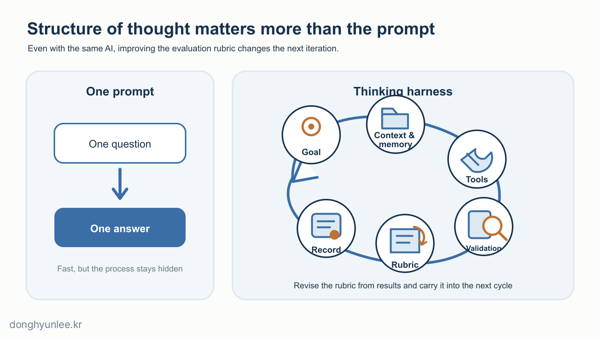
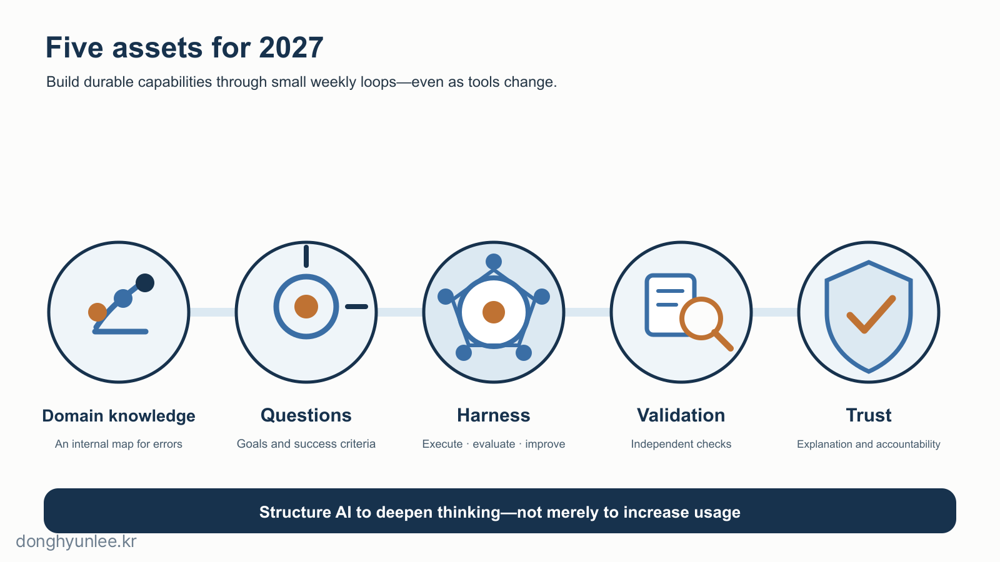

How much will our work change by 2027? It is a question that appears in almost every talk about AI, but I think focusing on that question alone may cause us to miss a more important change.

I often encounter the same scene in evaluations today. The analysis code runs without errors, but when I ask, “Why did you handle it this way?” the person cannot answer. AI wrote the code, and the person submitting it does not know what it does—a decidedly dangerous situation.

By 2027, the same scene may spread to reports, data analysis, research design, and business plans: **an abundance of output, with no one who understands it or can take responsibility for it.** The first risk that comes to my mind is not the disappearance of jobs, but this scene. I believe the opportunity lies in the same place. It is likely to go not merely to people who can extract answers from AI, but to those who can design work structures and evaluation criteria that make AI reason more deeply.

Opening ChatGPT, Gemini, or Claude on the web or in an app, entering a prompt, and receiving an answer—this has been our basic way of using AI. If you think this question-and-answer pattern is enough preparation for the AI era, it is worth pausing for a moment.

What is now emerging is **a structure in which AI develops its own reasoning chain and work process**. I am convinced that the gap between people who understand this structure and those who do not will grow not linearly but quadratically. This article is about understanding and learning that structure.

_Figure 1. The 2027 divide may depend less on whether people use AI than on who designs the structure in which AI works._

## The 30-Second Takeaway

- In 2027, AI will likely resemble a work environment that performs multistep tasks more than a tool that simply answers questions.
- Bundles of tasks and entry-level pathways will change before occupations do, while scarcity will shift from generation to goal setting, verification, and responsibility.
- The preparation that matters is not learning to use one particular model, but building five assets: domain knowledge, questions, harnesses, verification, and trust.

## 1. The Future Should Be Read as Scenarios with Different Probabilities, Not One Number

Let me draw a clear line first. No one can predict AI in 2027 precisely. I therefore divide the future into three layers. **Relatively certain:** AI will become more deeply embedded in documents, code, search, and analytical tools, and most knowledge workers will work with it. **Likely, but uncertain in speed:** AI will expand into agents that use multiple tools and carry out longer processes. **Difficult to assert:** the date on which a particular occupation will disappear or artificial general intelligence will be completed.

According to Stanford’s *2026 AI Index*, AI adoption among surveyed organizations reached 88%, but actual deployment of AI agents remained in the single digits across most business functions.[1] AI use has spread rapidly, but the stage at which it reshapes an organization’s work as a whole is only beginning. The forecasts in this article are therefore not declarations. They are **a record of what is likely to change first if today’s signals continue—and what signals would tell us that the forecast was wrong.**

## 2. AI Will Move from a Prompting Tool to a “Thinking Harness”

Many people currently use AI as a question box: one question, one answer. By 2027, that approach alone is likely to be insufficient. What will matter more is the structure around the model—a framework connecting goals, context and memory, tools, human verification points, evaluation rubrics, records, and improvement. I will call this a <strong>thinking harness</strong>.

Asking “Write a report” once is prompt use. Breaking the question down, gathering trustworthy sources first, searching for counterevidence to each claim, and independently checking calculations again is a harness. Add a <strong>rubric</strong> that lists the requirements for a good result, and it becomes a learning structure: weaknesses found in one result can be added to the evaluation criteria so that the next error is caught earlier.

_Figure 2. Even with the same model, results change with how goals, context, tools, validation, rubric improvement, and records are connected._

Research by METR reported a trend in which the length of well-defined software, machine-learning, and cybersecurity tasks that AI can complete with a 50% success rate doubled roughly every seven months.[2] METR also cautions that estimates beyond 16 hours are difficult to trust with its current task suite. Because the measured tasks are technical work with clear success criteria, this trend must not be converted directly into a percentage of jobs automated. Even so, the direction matters. As AI takes on longer tasks, the human role shifts toward **setting goals and boundaries, designing intermediate checkpoints, and reversing failures**. If organizational AI use remains confined to one-off questions and answers through the end of 2027, this transition will have been slower than expected.

## 3. Bundles of Tasks and Entry-Level Pathways Will Change Before Jobs Do

An occupation consists of many kinds of work, and AI will not take over every task at the same speed. A 2025 analysis by the International Labour Organization (ILO) and Poland’s NASK estimated that one in four workers worldwide was in an occupation exposed to generative AI, while concluding that **tasks within jobs were more likely to be transformed** than entire jobs replaced.[3]

What concerns me in particular is the **entry pathway**. Until now, beginners have developed expert judgment by organizing materials, writing first drafts, and doing basic coding. If AI begins by taking over precisely those tasks, beginners may produce results more quickly while skipping the process through which judgment develops. The challenge for education and organizations in 2027 is likely to be not “whether to ban AI,” but **how to build fundamentals and the muscles of judgment while still using AI**. This is my forecast, not an observed fact. I should revise it if the work and evaluation of beginners remain largely unchanged in 2027.

## 4. Scarcity Will Shift from Producing Answers to Setting Goals, Verifying, and Taking Responsibility

As the cost of producing an answer falls, four things become scarce: **the ability to decide what problem to solve, to read the context of the field, to question and verify a plausible result, and to put one’s name behind the final decision and take responsibility for it.** AI can assist with these too, but assistance is not delegation.

In a study by Microsoft Research collaborators covering 936 cases of AI use reported by 319 knowledge workers, greater confidence in AI was associated with lower reported critical-thinking effort, while the center of cognitive effort shifted from generation to **verification, integration, and task management**.[4] Because this was a self-report survey, it does not establish causality. It does, however, reveal a design risk: the more people trust AI, the looser their review may become.

**Whether AI weakens or deepens thinking depends less on AI itself than on the harness we build around it.** A system that encourages people to submit the first answer outsources thinking. One that requires competing hypotheses and traceable evidence expands it.

## 5. We Need to Prepare Domain Knowledge, Questions, Harnesses, Verification, and Trust

Memorizing the menus of a particular model is not durable preparation. We need to build five assets that remain valuable even as tools change.

1. **Domain knowledge** — An internal map for judging whether an AI answer falls within a sensible range. You should be able to explain the core concepts, how the data are produced, and which errors occur frequently.
2. **Questions and success criteria** — Write them down before delegating the task. What decision is this work intended to support? What is the cost of being wrong? What evidence is required before the task is complete? Without criteria, the most fluent answer can look like the best one.
3. **A personal harness and rubric** — Take one task you repeat each week and attach a goal, materials, sequence, checkpoints, and records. Create a first rubric covering factual accuracy, links to primary sources, counterevidence, and reproducibility. When a failure is discovered, revise the rubric as well as the prompt.
4. **A verification routine** — Check numbers by hand on a small sample, confirm important facts in primary sources, and record competing hypotheses and failure conditions before making a decision. A second answer from the same model is not independent verification.
5. **Trust and responsibility** — Record who approved the result and what remains unknown. Do not use a result you cannot explain in an important decision.

_Figure 3. The most durable preparation is not a particular AI tool, but domain knowledge, questions, a thinking harness, validation, and trust._

This month, choose just one recurring task. Perform it once without AI and record the time and errors. Create your first rubric. Then perform it with AI, adding two verification points, and run it again after adding any missed failure conditions to the rubric. The key is to compare not only speed, but whether both the error rate and your own understanding improve.

The forecast in this article should be evaluated in the same way. If agents have not become more reliable on unstructured tasks by the end of 2027 and entry-level learning pathways have barely changed, I should revise this forecast.

## Conclusion — Do Not Hand Your Thinking to AI; Build a Structure That Deepens It

**Do not try to become someone who produces answers faster than AI. Become someone who works with AI to ask better questions, verify more rigorously, and take responsibility for the result.**

Using AI will not be remarkable in itself in 2027. The difference will lie in what was not delegated, where a person intervened, and what evidence and evaluation criteria were recorded.

What recurring task in your work would you turn into a small harness first?

---

## Related Articles

- [If AI Writes All the Code, Do We Still Need to Learn Python? — From Writing to Verification](/en/posts/2026-07-14-python-still-needed/)
- [Why AI Predictions Should Not Give a Single Number — From Point Estimates to Confidence Intervals](/en/posts/2026-07-07-ai-uncertainty-interval/)

## Sources

[1] Stanford Institute for Human-Centered Artificial Intelligence. *The 2026 AI Index Report.* https://hai.stanford.edu/ai-index/2026-ai-index-report

[2] METR. *Task-Completion Time Horizons of Frontier AI Models* (updated May 8, 2026); Kwa, T. et al. *Measuring AI Ability to Complete Long Tasks.* https://metr.org/time-horizons/ · https://arxiv.org/abs/2503.14499

[3] International Labour Organization & NASK. *Generative AI and Jobs: A Refined Global Index of Occupational Exposure* (2025). https://www.ilo.org/publications/generative-ai-and-jobs-refined-global-index-occupational-exposure

[4] Lee, H.-P. H. et al. (2025). *The Impact of Generative AI on Critical Thinking: Self-Reported Reductions in Cognitive Effort and Confidence Effects From a Survey of Knowledge Workers.* CHI '25. https://doi.org/10.1145/3706598.3713778

**Disclosure of Interests and Responsibility**

Donghyun Lee is a professor in the Division of Social Science & AI at Hankuk University of Foreign Studies and the CEO of AI Korea Inc.
The views expressed in this article are the author’s own and do not represent the official position of his affiliated institutions or the organizations commissioning his research projects.

This article is intended for general informational and educational purposes. It is not advice or
a policy recommendation for any particular matter, and must not be used as the sole basis for real-world decisions.

If you find a factual error, please let me know.
