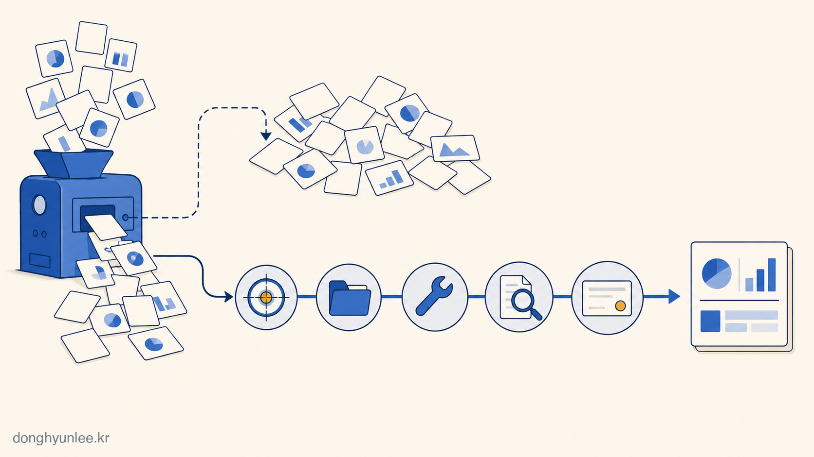
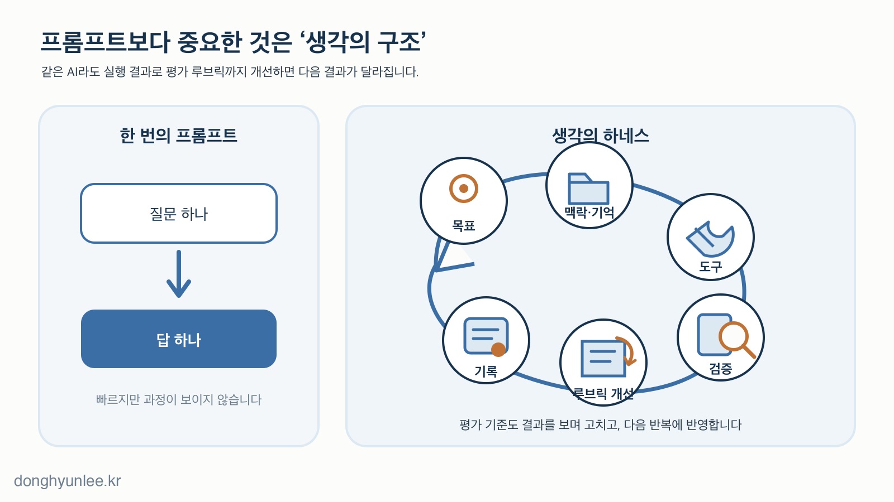
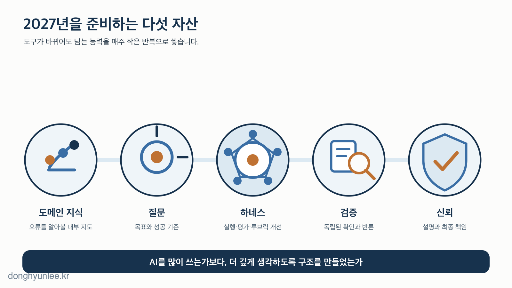

2027년에는 우리의 일이 얼마나 달라질까요. AI 강연에서 빠지지 않는 질문이지만, 저는 이 질문만 붙들고 있으면 더 중요한 변화를 놓칠 수 있다고 생각합니다.

요즘 평가에서 자주 겪는 장면이 있습니다. 분석 코드는 에러 없이 잘 돌아가는데, “왜 이렇게 처리했어요?”라고 물으면 대답이 막힙니다. AI가 짜 준 코드라서 본인도 그 코드가 무엇을 하는지 모르는, 상당히 위험한 상황입니다.

2027년에는 같은 장면이 보고서, 데이터 분석, 연구 설계, 사업 계획으로 넓어질 수 있습니다. **결과는 넘치는데, 그 결과를 이해하고 책임질 사람은 없는 상태.** 제가 가장 먼저 떠올리는 위험은 일자리의 소멸보다 이 장면이고, 기회도 같은 곳에 있다고 봅니다. AI에게 답을 받아내는 사람을 넘어, AI가 더 깊게 생각하도록 작업 구조와 평가 기준을 설계하는 사람에게 기회가 갈 가능성이 큽니다.

ChatGPT나 Gemini, Claude를 웹과 앱에서 열고, 프롬프트를 입력하고, 답을 받는 것 — 지금까지 우리가 AI를 써 온 기본 방식입니다. 이 질문-답 방식만으로 AI 시대를 충분히 대비하고 있다고 생각한다면, 한 번 멈춰 볼 필요가 있습니다.

지금 등장하고 있는 것은 **AI가 스스로 사고의 사슬과 작업 과정을 발전시켜 나가는 구조**입니다. 저는 이 구조를 이해하는 사람과 그렇지 않은 사람의 차이가 앞으로 선형이 아니라 제곱으로 벌어질 것이라고 확신합니다. 이 글은 바로 그 구조를 이해하고 학습하는 이야기입니다.

_그림 1. 2027년의 격차는 AI 사용 여부보다, AI가 일하는 구조를 누가 설계하느냐에서 벌어질 수 있습니다._

## 30초 핵심

- 2027년의 AI는 답하는 도구보다 여러 단계의 일을 수행하는 작업 환경에 가까워질 것입니다.
- 직업보다 과업 묶음과 입문 경로가 먼저 바뀌고, 희소성은 생성에서 목표 설정·검증·책임으로 이동합니다.
- 준비할 것은 특정 모델 사용법이 아니라 도메인 지식·질문·하네스·검증·신뢰라는 다섯 자산입니다.

## 1. 미래는 하나의 숫자가 아니라 확률이 다른 전망으로 읽어야 합니다

먼저 선을 긋겠습니다. 2027년의 AI를 정확히 맞히는 사람은 없습니다. 그래서 저는 미래를 세 층으로 나눠 봅니다. **비교적 확실한 것** — AI가 문서·코드·검색·분석 도구 안으로 더 깊이 들어가고 대부분의 지식노동자가 AI와 함께 일하게 되는 것. **가능성은 높지만 속도가 불확실한 것** — AI가 여러 도구를 쓰며 긴 과정을 수행하는 에이전트로 확장되는 것. **단정하기 어려운 것** — 특정 직업의 소멸 시점이나 범용지능 완성 연도.

스탠퍼드대 「2026 AI Index」에 따르면 조사 대상 조직의 AI 도입률은 88%까지 올라갔지만, 대부분의 업무 기능에서 AI 에이전트의 실제 배치는 아직 한 자릿수 비율이었습니다.[1] AI 사용은 빠르게 넓어졌지만 조직의 일을 통째로 바꾸는 단계는 이제 시작이라는 뜻입니다. 따라서 이 글의 예측도 선언이 아니라, **지금 신호가 이어질 때 무엇이 먼저 바뀔지, 틀렸다면 어떤 신호로 알 수 있을지 적어 두는 작업**입니다.

## 2. AI는 프롬프트 도구에서 '생각의 하네스'로 이동합니다

지금 많은 사람은 AI를 질문 상자로 씁니다. 질문 하나, 답 하나. 2027년에는 이 방식만으로는 부족할 가능성이 큽니다. 더 중요해지는 것은 모델 주위의 구조 — 목표, 맥락과 기억, 도구, 사람의 검증 지점, 평가 루브릭, 기록과 개선을 연결한 틀입니다. 저는 이것을 **생각의 하네스(harness)**라고 부르겠습니다.

“보고서를 써 줘”라고 한 번 요청하는 것은 프롬프트 사용입니다. 질문을 쪼개고, 신뢰할 출처를 먼저 모으고, 주장마다 반대 근거를 찾고, 계산을 독립적으로 다시 확인하게 하는 것이 하네스입니다. 여기에 좋은 결과의 조건을 항목으로 적은 **루브릭(rubric)**이 들어가면, 결과에서 발견한 맹점을 평가 기준에 추가해 다음 오류를 더 일찍 잡는 학습 구조가 됩니다.

_그림 2. 모델이 같아도 하네스를 어떻게 연결하느냐에 따라 결과의 질은 달라집니다._

METR의 연구는 소프트웨어·머신러닝·사이버보안의 잘 정의된 과제에서, AI가 50%의 성공률로 수행할 수 있는 과제 길이가 약 7개월마다 두 배가 된 추세를 보고했습니다.[2] 다만 METR도 현재 과제 묶음으로 16시간을 넘는 측정은 신뢰하기 어렵다고 밝히고 있습니다. 측정 과제 역시 정답 기준이 분명한 기술 업무라서, 이 추세를 직업 자동화율로 곧바로 바꿔서는 안 됩니다. 그럼에도 방향은 중요합니다. AI가 더 긴 일을 맡을수록 사람의 역할은 **목표와 경계를 정하고, 중간 점검점을 설계하고, 실패를 되돌리는 것**으로 이동합니다. 2027년 말까지 조직의 AI 사용이 단발성 문답에 머문다면 이 전환은 예상보다 느린 것입니다.

## 3. 직업보다 과업 묶음과 초급자의 성장 경로가 먼저 바뀝니다

직업은 한 가지 일로 이루어져 있지 않고, AI가 모든 과업을 같은 속도로 가져가지도 않습니다. 국제노동기구(ILO)와 폴란드 NASK의 2025년 분석은 전 세계 노동자 네 명 중 한 명이 생성형 AI에 노출된 직업에 있다고 추정하면서도, 완전한 대체보다 **직업 안의 과업이 변형될 가능성**이 더 크다고 평가했습니다.[3]

제가 특히 주목하는 것은 **입문 경로**입니다. 지금까지 초급자는 자료 정리, 첫 초안, 기본 코딩을 하면서 숙련자의 판단을 배웠습니다. 바로 그 과업부터 AI가 맡기 시작하면, 초급자는 결과를 더 빨리 만드는 대신 판단이 자라는 과정을 건너뛸 수 있습니다. 2027년 교육과 조직의 과제는 “AI 금지 여부”가 아니라 **AI를 쓰면서도 기본기와 판단 근육을 어떻게 키우게 할 것인가**일 가능성이 큽니다. 이것은 관찰된 사실이 아니라 제 전망이며, 초급자의 업무와 평가 방식이 2027년에도 거의 바뀌지 않는다면 수정해야 합니다.

## 4. 희소성은 답을 만드는 능력에서 목표·검증·책임으로 이동합니다

답을 만드는 비용이 낮아질수록 희소해지는 것은 네 가지입니다. **무엇을 풀지 정하는 능력, 현장의 맥락을 읽는 능력, 그럴듯한 결과를 의심하고 검증하는 능력, 최종 결정에 이름을 걸고 책임지는 능력.** AI는 이것도 도울 수 있지만, 돕는 것과 맡기는 것은 다릅니다.

Microsoft Research 공동 연구진이 지식노동자 319명의 AI 사용 사례 936개를 조사한 연구에서는, AI에 대한 신뢰가 높을수록 비판적 사고 노력이 낮게 보고됐고, 사고의 중심은 생성에서 **검증, 통합, 과업 관리**로 이동했습니다.[4] 자기보고 설문이라 인과를 증명하지는 않지만, AI를 신뢰할수록 검토가 느슨해질 수 있다는 설계 위험을 보여 줍니다.

**AI가 생각을 약하게 만드는가, 깊게 만드는가는 AI 자체보다 우리가 만든 하네스에 달려 있습니다.** 첫 답을 그대로 제출하게 만들면 사고를 외주화하고, 반대 가설과 근거 추적을 요구하면 사고를 확장합니다.

## 5. 우리는 도메인 지식·질문·하네스·검증·신뢰를 준비해야 합니다

특정 모델의 메뉴를 외우는 것은 오래가는 준비가 아닙니다. 도구가 바뀌어도 남는 다섯 자산을 만들어야 합니다.

1. **도메인 지식** — AI의 답이 상식적인 범위에 있는지 판단할 내부 지도. 핵심 개념, 데이터가 만들어지는 과정, 자주 생기는 오류를 설명할 수 있어야 합니다.
2. **질문과 성공 기준** — 맡기기 전에 적습니다. 무엇을 결정하기 위한 일인가, 틀렸을 때 비용은, 어떤 증거가 있어야 완료인가. 기준이 없으면 가장 유창한 답이 가장 좋은 답처럼 보입니다.
3. **개인 하네스와 루브릭** — 매주 반복하는 업무 하나에 목표·자료·순서·점검 지점·기록을 붙이고, 사실 정확성·원 출처 연결·반대 근거·재현 가능성 항목으로 첫 루브릭을 만듭니다. 실패가 발견되면 프롬프트만 고치지 말고 루브릭도 고칩니다.
4. **검증 루틴** — 숫자는 작은 표본으로 손계산, 중요한 사실은 원 출처 확인, 결정 전에 반대 가설과 실패 조건 먼저 기록. 같은 모델의 두 번째 답은 독립 검증이 아닙니다.
5. **신뢰와 책임** — 누가 승인했고 무엇을 모르는지 남깁니다. 설명할 수 없는 결과는 중요한 결정에 쓰지 않습니다.

_그림 3. 특정 AI 도구보다 오래 남는 준비는 도메인 지식·질문·하네스·검증·신뢰입니다._

이번 달에는 반복 업무 하나만 골라 보십시오. AI 없이 한 번 수행해 시간과 오류를 기록하고, 첫 루브릭을 만들고, AI와 함께 실행하되 검증 지점 두 개를 두고, 놓친 실패 조건을 루브릭에 추가해 다시 실행합니다. 속도만이 아니라 오류와 내 이해도가 함께 좋아졌는지 비교하는 것이 핵심입니다.

이 글의 전망도 같은 방식으로 평가되어야 합니다. 2027년 말까지 에이전트가 비정형 과제에서 신뢰성을 높이지 못하고 초급자의 학습 경로가 거의 바뀌지 않는다면 저는 이 전망을 수정해야 합니다.

## 마무리 — AI에게 생각을 맡기지 말고, 생각이 깊어지는 구조를 만드십시오

**AI보다 더 빨리 답을 만드는 사람이 되려고 하지 마십시오. AI와 함께 더 좋은 질문을 만들고, 더 엄격하게 검증하고, 결과에 책임지는 사람이 되십시오.**

2027년에는 AI를 쓰는 것 자체가 특별하지 않을 것입니다. 차이는 무엇을 맡기지 않았고, 어디에서 사람이 개입하며, 어떤 근거와 평가 기준을 남겼는지에서 생길 것입니다.

여러분의 일에서 가장 먼저 작은 하네스로 만들어 볼 반복 업무는 무엇인가요?

---

## 관련 글

- [AI가 코드를 다 짜주는데, 파이썬을 배워야 할까요 — '쓰는 능력'에서 '검증하는 능력'으로](https://blog.naver.com/donghyunlee-ai/224346633417)
- [AI 예측은 왜 '하나의 숫자'로 답하면 안 될까 — 점추정에서 신뢰구간의 시대로](https://blog.naver.com/donghyunlee-ai/224343787239)

## 출처

[1] Stanford Institute for Human-Centered Artificial Intelligence. *The 2026 AI Index Report.* https://hai.stanford.edu/ai-index/2026-ai-index-report

[2] METR. *Task-Completion Time Horizons of Frontier AI Models* (updated May 8, 2026); Kwa, T. et al. *Measuring AI Ability to Complete Long Tasks.* https://metr.org/time-horizons/ · https://arxiv.org/abs/2503.14499

[3] International Labour Organization & NASK. *Generative AI and Jobs: A Refined Global Index of Occupational Exposure* (2025). https://www.ilo.org/publications/generative-ai-and-jobs-refined-global-index-occupational-exposure

[4] Lee, H.-P. H. et al. (2025). *The Impact of Generative AI on Critical Thinking: Self-Reported Reductions in Cognitive Effort and Confidence Effects From a Survey of Knowledge Workers.* CHI '25. https://doi.org/10.1145/3706598.3713778

---

───────────────────────────────
**이해관계 및 책임 고지**

이동현은 한국외국어대학교 Social Science & AI융합학부 교수이자 한국인공지능 주식회사(AI Korea Inc.)의 대표입니다.
이 글의 견해는 저자 개인의 것이며, 소속 기관이나 연구과제 발주처의 공식 입장이 아닙니다.

이 글은 일반적인 정보 제공과 교육을 목적으로 합니다. 특정 사안에 대한 자문이나
정책 권고가 아니며, 실제 의사결정의 단독 근거로 사용될 수 없습니다.

사실에 오류가 있다면 알려주십시오.
───────────────────────────────

