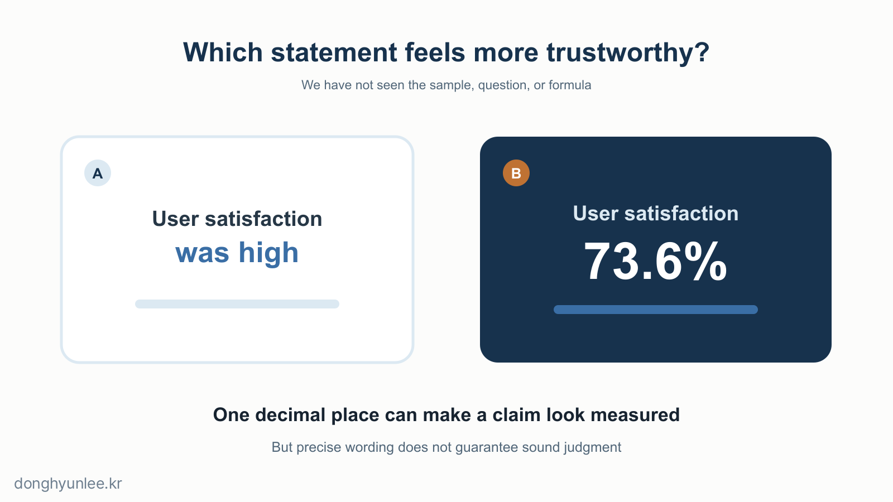
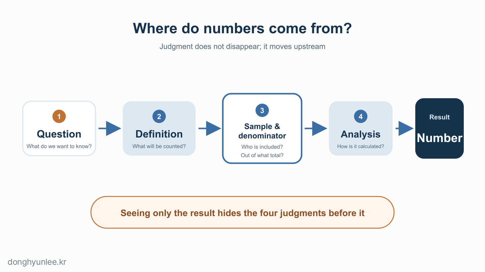
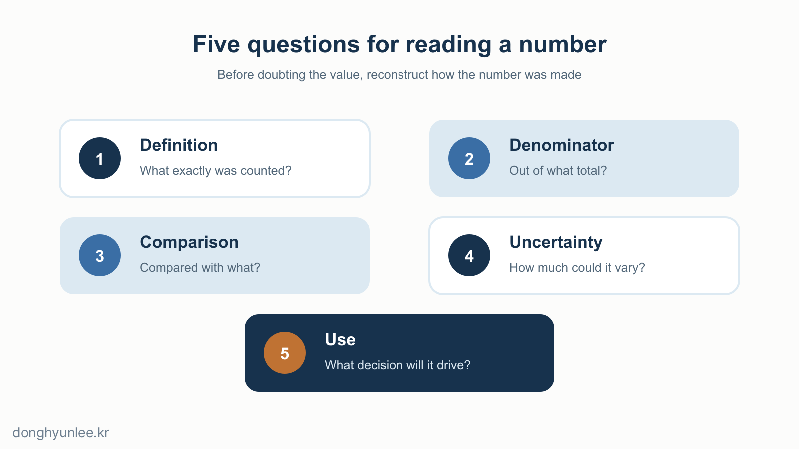

The following two statements are hypothetical examples created for illustration.

> User satisfaction increased after the new approach was introduced.
>
> User satisfaction was 73.6% after the new approach was introduced.

The second statement may make us look twice. It sounds as though a questionnaire exists somewhere, along with a spreadsheet and someone who checked the result. The first statement sounds like an opinion; the second sounds like evidence.

Yet we have not verified anything. We do not know how many people were asked, who they were, what the question was, or when the survey took place. The only new information is the presence of a decimal point.

**Numbers are a powerful language for comparing reality and making decisions.** Problems do not arise only when a number is wrong. They also arise when a number looks so convincing that we stop asking questions.

_Figure 1. A decimal point can make a sentence look like a measurement rather than an opinion._

## The 30-Second Takeaway

- Numbers reduce ambiguity, but the number of decimal places does not guarantee the quality of the evidence.
- Every number contains human choices about definitions, denominators, time periods, averages, and comparison points.
- To trust numbers well, look beyond the value to the path that produced it, its uncertainty, and the action it will change.

## [1] Numbers Earn Trust Before They Earn the Status of Fact

1. **“It improved by 37.2%” can feel more trustworthy than “It improved a lot.”**  
   The 37.2% is hypothetical. Even so, it can sound more like a solid measurement than “a lot” because an ambiguous adjective has been converted into a comparable value.

2. **But we still have not seen the raw data or the formula.**  
   The existence of a number is not the same as the existence of good evidence behind it. Being calculated is not the same as being calculated properly.

3. **A precise number can be read as a signal that “someone knows the details.”**  
   Experimental research has found conditions in which precise numbers influenced subsequent estimates more strongly than round numbers. The effect did not always appear, however. It emerged when people assumed that the speaker had relevant knowledge and a reason for communicating that precision, and when the level of detail seemed necessary for the task.[1]

4. **Decimal places alone cannot tell us whether a value is accurate.**  
   In metrology, “precision” refers to how close repeated measurements of the same object are to one another, while “accuracy” refers to how close a measured value is to the true value. Repeated measurements can be close to one another without being close to the truth.[2] If a thermometer consistently reads 0.5 degrees too high under the same conditions, its measurements may be consistent but not accurate.

5. **An opinion reveals the person speaking; a number can appear to speak for itself.**  
   The phrase “In my view” makes the interpreter visible. In a table or graph, however, the people who chose the question and selected the data can easily disappear into the background. This is one reason numbers look objective.

## [2] Numbers Do Not Remove Judgment; They Move It Upstream

6. **Every number begins with a definition of what to count.**  
   Does a “satisfied respondent” mean someone who chose 4 or 5 on a five-point scale, or only someone who chose 5? Change the definition, and the satisfaction rate changes even with the same responses.

7. **Every proportion has a denominator: “out of what?”**  
   “Eight out of ten” and “80% of respondents” may mean the same thing—or something entirely different. Whether nonrespondents can be excluded is a question for the survey design, not the number itself.

8. **A large sample is not sufficient by itself.**  
   Even a survey of 10,000 people can miss the answer if it includes only a group unlike the people we want to understand. Before looking at the size of the number, ask whom it represents.

9. **Averages are excellent at erasing differences.**  
   Two groups can have the same average even when one is clustered near the middle and the other is split between the extremes. An average is a useful summary, but it does not preserve the original shape of the data.

10. **The analytical method is part of the number.**  
    In one study, 29 analysis teams examined the same data and the same question, yet their effect estimates and conclusions varied substantially depending on choices about variables and models.[3] This does not mean statistics can say anything we want. It means that we must disclose the choices that produced a number before its meaning can be judged.

_Figure 2. Judgments omitted from a number do not disappear; they move upstream into how the number is made._

## [3] The Same Number Changes Meaning with Its Context

11. **Every rate of change has a starting point.**  
    An increase from one visitor to two is a 100% increase. “It doubled” is true, and “it increased by one person” is also true. What we choose to show alongside the number changes how large the increase feels.

12. **The comparison point sits outside the number but supplies half its meaning.**  
    A score of 20 tells us nothing about whether the result is good or bad. Judgment begins only when we know whether yesterday’s score was 10, the target is 100, or a comparable group averages 18.

13. **Changing the period can make the same phenomenon look like a different story.**  
    A one-day surge may look like a crisis, while the same movement may look small in a one-year trend. Neither the short nor the long period is always correct. What matters is whether the period fits the decision at hand.

14. **Mathematically equivalent outcomes can produce different choices depending on how they are framed.**  
    Classic research on decision-making found that people made different choices when the same outcomes were presented as gains rather than losses.[4] Numbers do not operate outside language and context.

15. **The first number we see can easily become the starting point for the next judgment.**  
    The “anchoring effect,” in which a previously presented number influences a later estimate under uncertainty, has been studied for decades.[5] But not every number has the same influence in every situation. One practical response is to write down your own criterion before seeing the first number.

## [4] A Good Number Reports Its Own Limits

16. **Past average performance is not the certainty of this one case today.**  
    This is a gap I repeatedly encounter while researching infectious-disease and environmental prediction models and considering their use in the field. It is not enough to say that a model performed well overall on past data. What people in the field want to know is how much they can trust the prediction in front of them now, and what they can use it for.

17. **The value of a number appears in the action it changes.**  
    A number that is merely reported and forgotten should not require the same level of evidence as one that moves people, budgets, or time. The more important the decision, the more we need to consider not only the value but also the cost of being wrong and the conditions for reversing the decision.

18. **Disclosing uncertainty does not necessarily destroy trust.**  
    Four online experiments and a field experiment on the BBC News website included 5,780 participants in total. Across the studies, communicating uncertainty reduced trust in the number itself, but the decline was small when uncertainty was presented as a numerical range. Trust in the source barely declined with numerical ranges; larger declines occurred with vague verbal expressions.[6] One study cannot be generalized to every setting, but honestly reporting a range does not necessarily make trust collapse.

19. **Recovering just five things can change the story a number tells.**

    - What exactly was counted? — **Definition**
    - Out of what was it calculated? — **Denominator**
    - What was it compared with? — **Comparison**
    - How much could it vary? — **Uncertainty**
    - What decision will it inform? — **Use**

20. **A number is the beginning of a question, not the end of one.**  
    This is not an argument against trusting statements that contain numbers. It is an argument against ending our judgment merely because a number is present. A good number makes what we know clearer while revealing what we do not know as well.

_Figure 3. The best way to question a number is not to reject it, but to reconstruct the path by which it was made._

## Conclusion

Numbers make complex realities visible at a glance. That is why we need them. At the same time, the process of making reality visible at a glance folds away a great deal of context. That is why we need questions.

The next time you encounter a solid-looking number such as `73.6%`, do not begin with the decimal places. Check five things first:

**Definition, denominator, comparison, uncertainty, and use.**

The moment a number looks precise is not the end of our judgment. It is where judgment should begin.

---

## Related Articles

- [Why AI Predictions Should Not Give a Single Number — From Point Estimates to Confidence Intervals](/en/posts/2026-07-07-ai-uncertainty-interval/)
- [If AI Writes All the Code, Do We Still Need to Learn Python? — From Writing to Verification](/en/posts/2026-07-14-python-still-needed/)

## Sources

[1] Zhang, Y. C., & Schwarz, N. (2013). *The power of precise numbers: A conversational logic analysis.* Journal of Experimental Social Psychology, 49(5), 944–946. https://doi.org/10.1016/j.jesp.2013.04.002

[2] Joint Committee for Guides in Metrology. *International Vocabulary of Metrology — Measurement accuracy (2.13); Measurement precision (2.15).* https://jcgm.bipm.org/vim/en/2.13.html · https://jcgm.bipm.org/vim/en/2.15.html

[3] Silberzahn, R. et al. (2018). *Many Analysts, One Data Set: Making Transparent How Variations in Analytic Choices Affect Results.* Advances in Methods and Practices in Psychological Science, 1(3), 337–356. https://doi.org/10.1177/2515245917747646

[4] Tversky, A., & Kahneman, D. (1981). *The Framing of Decisions and the Psychology of Choice.* Science, 211(4481), 453–458. https://doi.org/10.1126/science.7455683

[5] Tversky, A., & Kahneman, D. (1974). *Judgment under Uncertainty: Heuristics and Biases.* Science, 185(4157), 1124–1131. https://doi.org/10.1126/science.185.4157.1124

[6] van der Bles, A. M. et al. (2020). *The effects of communicating uncertainty on public trust in facts and numbers.* Proceedings of the National Academy of Sciences, 117(14), 7672–7683. https://doi.org/10.1073/pnas.1913678117

**Disclosure of Interests and Responsibility**

Donghyun Lee is a professor in the Division of Social Science & AI at Hankuk University of Foreign Studies and the CEO of AI Korea Inc.
The views expressed in this article are the author’s own and do not represent the official position of his affiliated institutions or the organizations commissioning his research projects.

This article is intended for general informational and educational purposes. It is not advice or
a policy recommendation for any particular matter, and must not be used as the sole basis for real-world decisions.

If you find a factual error, please let me know.
