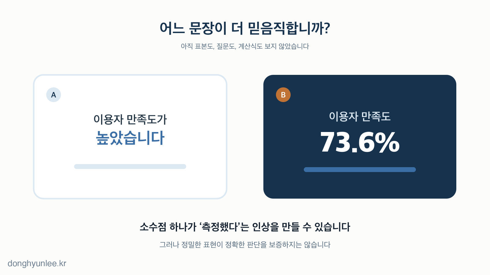
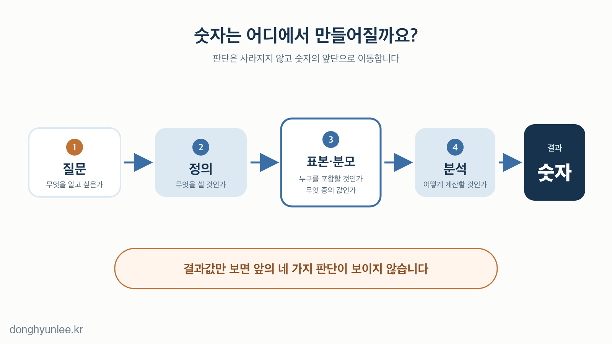
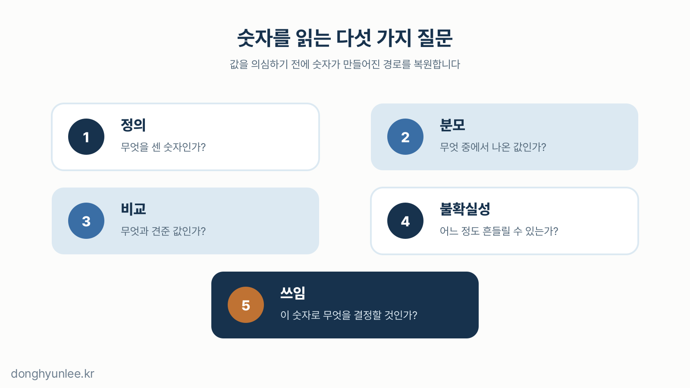

다음 두 문장은 설명을 위해 만든 가상의 예입니다.

> 새 방식을 도입한 뒤 이용자 만족도가 높아졌습니다.
>
> 새 방식을 도입한 뒤 이용자 만족도가 73.6%로 나타났습니다.

두 번째 문장에는 한 번 더 눈이 갈 수 있습니다. 어딘가에 설문지가 있고, 계산표가 있고, 결과를 확인한 사람이 있을 것 같습니다. 첫 번째 문장은 의견처럼 들리지만 두 번째 문장은 증거처럼 들립니다.

그런데 우리는 아직 아무것도 확인하지 않았습니다. 몇 명에게 물었는지, 누구에게 물었는지, 질문은 무엇이었는지, 언제 조사했는지 모릅니다. 새로 얻은 정보는 소수점이 붙었다는 사실뿐입니다.

**숫자는 현실을 비교하고 결정하게 만드는 강력한 언어입니다.** 문제는 숫자가 틀릴 때만 생기지 않습니다. 숫자가 너무 그럴듯해서 질문을 멈출 때도 생깁니다.

_그림 1. 소수점이 붙는 순간 문장은 의견보다 측정 결과처럼 보일 수 있습니다._

## 30초 핵심

- 숫자는 모호함을 줄이지만, 소수점의 길이가 근거의 질까지 보증하지는 않습니다.
- 숫자 안에는 정의·분모·기간·평균·비교 기준이라는 사람의 선택이 들어 있습니다.
- 숫자를 잘 믿으려면 값만 보지 말고 만들어진 경로·불확실성·바꿀 행동을 함께 봐야 합니다.

## [1] 숫자는 사실보다 먼저 신뢰를 얻습니다

1. **‘많이 좋아졌다’보다 ‘37.2% 좋아졌다’가 더 믿음직하게 느껴질 수 있습니다.**  
   37.2%는 가상의 숫자입니다. 그런데도 ‘많이’보다 단단한 측정 결과처럼 보일 수 있습니다. 애매한 형용사가 비교 가능한 값으로 바뀌었기 때문입니다.

2. **하지만 우리는 아직 원자료도 계산식도 보지 않았습니다.**  
   숫자가 있다는 사실과 그 숫자에 좋은 근거가 있다는 사실은 다릅니다. 계산됐다는 것과 제대로 계산됐다는 것도 다릅니다.

3. **구체적인 숫자는 ‘누군가 자세히 알고 있다’는 신호처럼 읽힙니다.**  
   실험 연구에서도 둥근 숫자보다 세밀한 숫자가 이후 추정에 더 큰 영향을 주는 조건이 관찰됐습니다. 다만 언제나 그런 것은 아니었습니다. 숫자를 말한 사람에게 관련 지식과 전달 의도가 있다고 여겨지고, 그 세밀함이 과제에 필요할 때 효과가 나타났습니다.[1]

4. **소수점 자릿수만으로 정확성을 판단할 수는 없습니다.**  
   측정학에서 ‘정밀도’는 같은 대상을 반복 측정한 값들이 서로 얼마나 가까운지를, ‘정확도’는 측정값이 참값에 얼마나 가까운지를 가리킵니다. 반복 측정값들이 서로 가깝더라도 참값에 가까운지는 별개의 문제입니다.[2] 체온계가 같은 조건에서 늘 실제보다 0.5도 높게 표시된다면 측정은 일관될 수 있지만 정확하지는 않습니다.

5. **의견에는 말한 사람이 보이지만, 숫자는 스스로 말하는 것처럼 보입니다.**  
   “제 생각에는”이라는 말에는 해석한 사람이 드러납니다. 반면 표와 그래프에서는 질문을 정하고 자료를 고른 사람이 뒤로 숨기 쉽습니다. 숫자가 객관적으로 보이는 이유 중 하나입니다.

## [2] 숫자는 판단을 없애지 않고 앞단으로 옮깁니다

6. **모든 숫자 앞에는 ‘무엇을 셀 것인가’라는 정의가 있습니다.**  
   ‘만족한 사람’은 5점 척도에서 4점과 5점을 고른 사람일까요. 5점만 고른 사람일까요. 정의가 바뀌면 같은 응답에서도 만족도는 달라집니다.

7. **모든 비율 뒤에는 ‘무엇 중에서’라는 분모가 있습니다.**  
   “열 명 중 여덟 명”과 “응답한 사람의 80%”는 같은 말일 수도, 전혀 다른 말일 수도 있습니다. 응답하지 않은 사람을 빼도 되는지는 숫자가 아니라 조사 설계가 답해야 합니다.

8. **표본이 크다는 것만으로 충분하지 않습니다.**  
   만 명을 조사해도 알고 싶은 사람들과 다른 집단만 조사했다면 답은 빗나갈 수 있습니다. 숫자의 크기보다 먼저 볼 것은 그 숫자가 누구를 대표하는가입니다.

9. **평균은 차이를 지우는 데 탁월합니다.**  
   두 집단의 평균이 같아도 한 집단은 값이 가운데 모여 있고, 다른 집단은 양끝으로 갈라져 있을 수 있습니다. 평균은 유용한 요약이지만 원래 모습을 그대로 보존하지는 않습니다.

10. **분석 방법도 숫자의 일부입니다.**  
    한 연구에서는 29개 분석팀이 같은 데이터와 같은 질문을 분석했는데, 변수와 모형을 다루는 선택에 따라 효과 추정치와 결론이 상당히 달라졌습니다.[3] 이는 통계가 마음대로라는 뜻이 아닙니다. 어떤 선택을 거쳐 그 숫자가 나왔는지 공개해야 의미를 판단할 수 있다는 뜻입니다.

_그림 2. 숫자에서 사라진 판단은 없어진 것이 아니라 숫자가 만들어지는 앞단으로 이동합니다._

## [3] 같은 숫자도 놓이는 자리에 따라 의미가 달라집니다

11. **증감률에는 반드시 출발점이 있습니다.**  
    방문자가 한 명에서 두 명으로 늘면 100% 증가입니다. ‘두 배’라는 말도 맞고 ‘한 명 증가’라는 말도 맞습니다. 무엇을 함께 보여 주느냐에 따라 독자가 느끼는 크기는 달라집니다.

12. **비교 기준은 숫자 밖에 있지만 의미의 절반을 차지합니다.**  
    20점이라는 값만으로는 좋은지 나쁜지 알 수 없습니다. 어제는 10점이었는지, 목표가 100점인지, 비슷한 집단의 평균이 18점인지가 있어야 판단이 시작됩니다.

13. **기간을 바꾸면 같은 현상도 다른 이야기처럼 보입니다.**  
    하루의 급등만 보면 위기로 보이고, 1년의 흐름만 보면 작은 흔들림으로 보일 수 있습니다. 짧은 기간과 긴 기간 중 어느 하나가 항상 정답인 것은 아닙니다. 결정하려는 문제에 맞는 기간인지가 중요합니다.

14. **수학적으로 같은 결과도 표현 방식에 따라 선택을 다르게 만들 수 있습니다.**  
    고전적인 의사결정 연구에서는 결과를 얻는 것으로 표현했을 때와 잃는 것으로 표현했을 때 사람들의 선택이 달라지는 현상이 관찰됐습니다.[4] 숫자도 문장과 맥락 밖에서 홀로 작동하지 않습니다.

15. **처음 본 숫자는 다음 판단의 출발점이 되기 쉽습니다.**  
    불확실한 값을 추정할 때 앞서 제시된 숫자가 이후 추정에 영향을 미치는 ‘기준점 효과’는 오래 연구돼 왔습니다.[5] 다만 아무 숫자나 언제나 같은 힘을 갖는 것은 아닙니다. 한 가지 실천법은 첫 숫자를 보기 전에 내가 사용할 기준을 먼저 적어 두는 것입니다.

## [4] 좋은 숫자는 자기 한계까지 함께 말합니다

16. **과거 평균 성능은 오늘 이 한 건의 확실성이 아닙니다.**  
    제가 감염병·환경 예측 모델을 연구하고 현장 적용을 고민하며 반복해서 마주한 간극입니다. 과거 자료에서 모델이 전반적으로 잘 맞았다는 설명만으로는 부족합니다. 현장이 알고 싶은 것은 지금 받은 이 예측을 얼마나 믿을 수 있고, 무엇에 활용할 수 있느냐입니다.

17. **숫자의 가치는 그 숫자가 바꿀 행동에서 드러납니다.**  
    보고만 하고 지나갈 숫자와 사람·예산·시간을 움직일 숫자에는 다른 수준의 근거가 필요합니다. 중요한 결정일수록 값 하나보다 틀렸을 때의 비용과 되돌릴 조건을 함께 봐야 합니다.

18. **불확실성을 밝힌다고 신뢰가 반드시 크게 무너지지는 않습니다.**  
    네 개의 온라인 실험과 BBC 뉴스 웹사이트 현장실험에는 모두 5,780명이 참여했습니다. 연구들을 종합하면, 불확실성을 알렸을 때 숫자 자체에 대한 신뢰는 낮아졌지만 수치 범위로 제시한 경우 감소폭은 작았습니다. 출처에 대한 신뢰는 수치 범위에서는 거의 낮아지지 않았고, 더 큰 감소는 모호한 언어 표현에서 나타났습니다.[6] 연구 하나로 모든 상황을 일반화할 수는 없지만, 범위를 정직하게 밝힌다고 신뢰가 반드시 무너지는 것은 아닙니다.

19. **숫자를 볼 때 다섯 가지만 복원해도 이야기가 달라집니다.**

    - 무엇을 센 숫자인가 — **정의**
    - 무엇 중에서 나온 값인가 — **분모**
    - 무엇과 견준 값인가 — **비교**
    - 어느 정도 흔들릴 수 있는가 — **불확실성**
    - 이 숫자로 무엇을 결정할 것인가 — **쓰임**

20. **숫자는 결론이 아니라 질문의 시작입니다.**  
    숫자가 붙은 말을 믿지 말자는 이야기가 아닙니다. 숫자가 붙었다는 이유만으로 판단을 끝내지 말자는 이야기입니다. 좋은 숫자는 아는 것을 선명하게 보여 주면서, 모르는 부분도 함께 드러냅니다.

_그림 3. 숫자를 의심하는 가장 좋은 방법은 거부하는 것이 아니라, 숫자가 만들어진 경로를 복원하는 것입니다._

## 마무리

숫자는 복잡한 현실을 한눈에 보이게 해 줍니다. 그래서 필요합니다. 동시에 한눈에 보이게 만드는 과정에서 많은 맥락을 접어 둡니다. 그래서 질문이 필요합니다.

다음에 `73.6%`처럼 단단해 보이는 숫자를 만나면, 소수점부터 보지 말고 다섯 가지를 먼저 확인해 보십시오.

**정의, 분모, 비교, 불확실성, 쓰임.**

숫자가 정확해 보이는 순간, 우리의 판단은 끝나는 것이 아니라 시작되어야 합니다.

---

## 관련 글

- [AI 예측은 왜 ‘하나의 숫자’로 답하면 안 될까 — 점추정에서 신뢰구간의 시대로](/posts/2026-07-07-ai-uncertainty-interval/)
- [AI가 코드를 다 짜주는데, 파이썬을 배워야 할까요 — ‘쓰는 능력’에서 ‘검증하는 능력’으로](/posts/2026-07-14-python-still-needed/)

## 출처

[1] Zhang, Y. C., & Schwarz, N. (2013). *The power of precise numbers: A conversational logic analysis.* Journal of Experimental Social Psychology, 49(5), 944–946. https://doi.org/10.1016/j.jesp.2013.04.002

[2] Joint Committee for Guides in Metrology. *International Vocabulary of Metrology — Measurement accuracy (2.13); Measurement precision (2.15).* https://jcgm.bipm.org/vim/en/2.13.html · https://jcgm.bipm.org/vim/en/2.15.html

[3] Silberzahn, R. et al. (2018). *Many Analysts, One Data Set: Making Transparent How Variations in Analytic Choices Affect Results.* Advances in Methods and Practices in Psychological Science, 1(3), 337–356. https://doi.org/10.1177/2515245917747646

[4] Tversky, A., & Kahneman, D. (1981). *The Framing of Decisions and the Psychology of Choice.* Science, 211(4481), 453–458. https://doi.org/10.1126/science.7455683

[5] Tversky, A., & Kahneman, D. (1974). *Judgment under Uncertainty: Heuristics and Biases.* Science, 185(4157), 1124–1131. https://doi.org/10.1126/science.185.4157.1124

[6] van der Bles, A. M. et al. (2020). *The effects of communicating uncertainty on public trust in facts and numbers.* Proceedings of the National Academy of Sciences, 117(14), 7672–7683. https://doi.org/10.1073/pnas.1913678117

---

───────────────────────────────
**이해관계 및 책임 고지**

이동현은 한국외국어대학교 Social Science & AI융합학부 교수이자 한국인공지능 주식회사(AI Korea Inc.)의 대표입니다.
이 글의 견해는 저자 개인의 것이며, 소속 기관이나 연구과제 발주처의 공식 입장이 아닙니다.

이 글은 일반적인 정보 제공과 교육을 목적으로 합니다. 특정 사안에 대한 자문이나
정책 권고가 아니며, 실제 의사결정의 단독 근거로 사용될 수 없습니다.

사실에 오류가 있다면 알려주십시오.
───────────────────────────────
