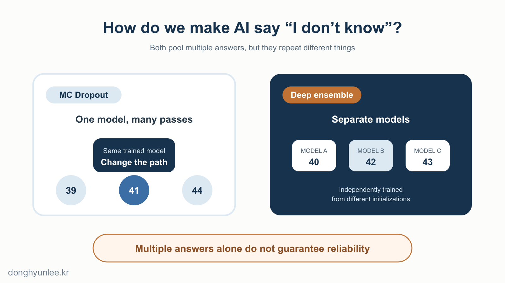
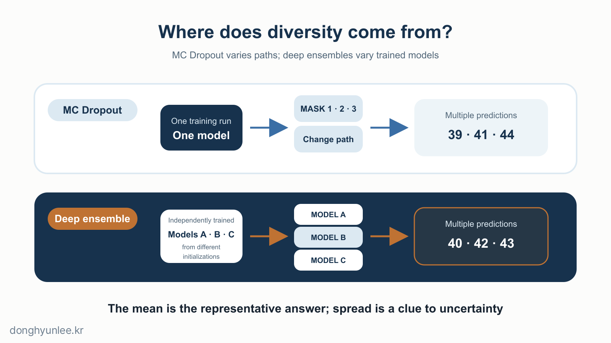
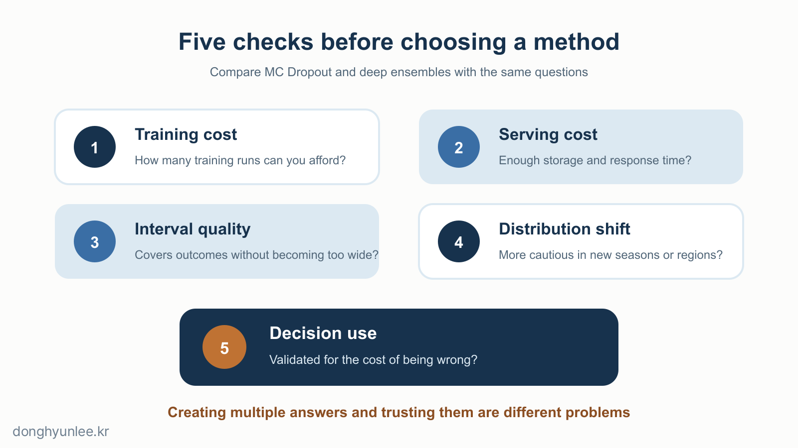

I fed the same particulate-matter data into the same AI model. Yet the result changed slightly each time I made a prediction.

Is the model broken?

**With MC Dropout, we create this variation deliberately.** If one run returns 41, the next 44, and another 39, we examine how widely those values are spread to estimate the model’s uncertainty.

I used this method in actual research on particulate-matter prediction. In a 2024 paper published in the *Journal of Cleaner Production*, I combined MC Dropout with a deep-learning model called ICNN to produce PM10 and PM2.5 predictions together with uncertainty ranges.[5]

That does not mean MC Dropout is always the best method. <strong>Deep ensembles</strong> are also widely used for a similar purpose. Both approaches collect multiple predictions, but the way they generate those predictions is completely different.

_Figure 1. Both methods produce multiple predictions, but they vary different parts of the process._

## The 30-Second Takeaway

- Bayesian deep learning is a broad framework; MC Dropout is one way to approximate it.
- MC Dropout changes paths within one model, while a deep ensemble trains multiple models separately to create variation among predictions.
- The fact that predictions vary does not mean that their variation honestly reflects real-world error.

## [1] First, Correct the Map of the Comparison

1. **We can deliberately produce different answers for the same input.**  
   We ordinarily expect the same model to return the same answer for the same input. To estimate uncertainty, we deliberately disturb this rule. We examine multiple possible models or paths and observe how tightly their answers cluster or how widely they spread.

2. **A conventional deep-learning model learns one set of the most plausible weights.**  
   A neural network adjusts a large number of weights during training. In ordinary prediction, it uses one set of trained weights to produce one answer. The answers that other possible models might have produced do not appear on the screen.

3. **There is more than one reason for AI not to know.**  
   Uncertainty inherent in the data, such as measurement error or random variation, is called <strong>aleatoric uncertainty</strong>. When the model does not know because training data are limited or conditions are unfamiliar, the uncertainty is closer to <strong>epistemic uncertainty</strong>.[1] The two cannot always be separated perfectly in practice, but differences among MC Dropout or deep-ensemble predictions are used mainly as clues to uncertainty on the model side.

4. **Bayesian deep learning and MC Dropout are not competing alternatives.**  
   Bayesian deep learning is a broad approach that represents multiple plausible weights or functions as a distribution in light of the data, rather than fixing one set of weights or one function. MC Dropout was proposed as a computationally tractable way to approximate this Bayesian inference using dropout neural networks.[2] Treating the two as an `A versus B` choice therefore compares a broad category with one method inside it.

5. **A deep ensemble is a more natural comparison with MC Dropout.**  
   A deep ensemble also creates multiple predictions and examines their differences to study uncertainty. Rather than approximating an explicit posterior distribution, however, it trains several neural networks independently from the beginning. The original paper presented this as a practical alternative to approximate Bayesian neural networks.[3]

## [2] MC Dropout Creates Multiple Opinions Within One Model

6. **Dropout was originally a training method for reducing overfitting.**  
   During training, it randomly makes some units in a neural network sit out. This prevents the model from always depending on the same combination of units. It resembles having different groups of people take turns solving a problem so that all the work does not fall on one person.[4]

7. **Ordinarily, dropout is turned off at prediction time.**  
   Some units are randomly dropped during training, but conventional inference turns dropout off and uses one stable computational path. That is why the same input produces the same answer.

8. **MC Dropout keeps dropout on during prediction.**  
   `MC` stands for Monte Carlo, a method that approximates a quantity by drawing random samples repeatedly. Because a different combination of units sits out on each prediction, the process has the effect of sampling slightly different virtual models from within one model.

9. **The average of the predictions becomes the answer; their spread offers a clue to what the model does not know.**  
   Passing the same input through the model repeatedly produces a collection of predicted values. Their mean or median can serve as the representative prediction, while their dispersion can serve as an uncertainty measure. More repetitions reduce the variability of this sampling calculation, but they do not eliminate bias or flawed assumptions in the original model.

10. **I used this structure to predict particulate matter.**  
    In the 2024 paper, we arranged air-quality and meteorological data in a multidimensional grid and combined ICNN with MC Dropout to produce PM10 and PM2.5 concentrations together with 95% uncertainty ranges.[5] The goal was to show not only a single prediction, but also how much it might vary. The use of MC Dropout in this study does not mean it is best for every region, time period, or environmental model. The verification criteria described in this article apply equally to the method I used.

## [3] Deep Ensembles Gather the Opinions of Multiple Models

11. **A deep ensemble trains multiple models separately.**  
    A typical deep ensemble begins several neural networks with the same architecture from different initial values and optimizes each one separately. Even with the same training data, differences in starting points, minibatch order, and other factors can lead to slightly different final weights.

12. **The multiple models resemble different teams solving the same problem.**  
    If MC Dropout is like repeatedly asking one team while changing some of its members, a deep ensemble is more like training several teams independently and then asking each the same question. Similar answers converge on one direction; substantially different answers signal greater uncertainty arising from model selection.

13. **Look not only at the average, but also at the disagreement among models.**  
    Averaging the predictions from several models creates one final prediction. At the same time, we can calculate how far apart their answers are. Because all the models may share similar data, architectures, and blind spots, however, agreement does not guarantee that the answer is correct.

_Figure 2. MC Dropout changes paths inside one trained model; a deep ensemble repeats the training itself._

14. **Deep ensembles cost more to train and store.**  
    If an ensemble contains five models, it typically requires five training runs and five stored models. MC Dropout has the advantage of training and storing one model. At prediction time, however, MC Dropout also requires multiple forward passes, so “one model” does not mean “one inference.” Both approaches must be assessed in light of parallel processing and response-time requirements.

15. **Deep ensembles are a strong baseline, but not a universal answer.**  
    In the classification and regression experiments in the original deep-ensemble paper, their uncertainty quality was similar to or better than that of approximate Bayesian neural networks, and the authors also presented experiments showing greater uncertainty on out-of-distribution inputs.[3] This does not prove that deep ensembles are always better than MC Dropout. Rankings can change with the data, architecture, training budget, and evaluation method.

## [4] After Choosing a Method, Verify the Uncertainty Again

16. **The difference between the two methods can be reduced to this table.**

    | Comparison | MC Dropout | Deep Ensemble |
    |---|---|---|
    | Typical training | One model | Multiple models |
    | Storage | One set of weights | Multiple sets of weights |
    | Repeated prediction | Multiple runs with changing dropout masks | One or more runs per model |
    | Source of diversity | Different paths within one model | Multiple independently trained models |
    | Representative advantage | Relatively easy to apply to an existing dropout architecture | Strong empirical baseline |
    | Representative burden | Repeated inference; dependence on dropout design | Training and storage cost |

    There is no universally correct number of repetitions or models. It should be selected by considering task accuracy, latency, and uncertainty quality together.

17. **Predictions that vary are not necessarily predictions whose variation is honest.**  
    A model does not automatically capture real-world error well simply because it produces a wide range. Conversely, a narrow range does not prove genuine certainty. Producing uncertainty and checking whether that uncertainty matches observed frequencies—<strong>calibration</strong>—are separate tasks.

18. **Check whether the model really becomes more cautious on unfamiliar data.**  
    Changes in season, region, or observation equipment can introduce data unlike those seen in training. In a large comparative study, as such distribution shifts grew, both accuracy and uncertainty estimation and calibration could deteriorate.[6] A recent study also reported cases in its experimental setting where MC Dropout did not adequately reflect increased uncertainty in interpolation and extrapolation regions.[7] One study cannot invalidate all uses of MC Dropout, but neither should we assume that the model will “automatically become anxious when the input is unfamiliar.”

19. **A model needs two report cards.**  
    The first reports how accurate its predicted values are. The second reports how often the uncertainty interval contains the actual value and whether the interval is excessively wide. A model can have a small prediction error while understating uncertainty, or it can increase coverage by producing ranges too wide to be useful.

20. **Write down the selection criteria before the method name.**  
    If the existing model uses dropout and you need to establish a baseline quickly, MC Dropout may be practical. If you have the resources to train and store multiple models and need a strong comparison, you can test a deep ensemble as well. For important decisions, do not choose either method by name alone. Under the same data and compute budget, compare prediction error, interval coverage and width, distribution shift, and response time.

_Figure 3. Choosing a method is only the start; its uncertainty quality must be tested on realistic data alongside its computational cost._

## Conclusion

MC Dropout and deep ensembles both look for what AI does not know in the differences among multiple predictions.

MC Dropout **runs one model in multiple forms**. A deep ensemble **trains multiple models separately**. The former has lower training and storage costs; the latter gathers independently trained outcomes at greater cost.

The most important distinction, however, does not lie in the method names.

**AI’s “I don’t know” can be calculated from disagreement among predictions. But that disagreement earns the right to be trusted only through validation on real-world data.**

---

## Related Articles

- [Why AI Predictions Should Not Give a Single Number — From Point Estimates to Confidence Intervals](/en/posts/2026-07-07-ai-uncertainty-interval/)
- [Why Do We Trust Claims More Easily When They Include Numbers? — 20 Short Thoughts on Reading Numbers](/en/posts/2026-07-25-why-we-trust-numbers/)

## Sources

[1] Kendall, A., & Gal, Y. (2017). *What Uncertainties Do We Need in Bayesian Deep Learning for Computer Vision?* Advances in Neural Information Processing Systems 30. https://papers.nips.cc/paper_files/paper/2017/hash/2650d6089a6d640c5e85b2b88265dc2b-Abstract.html

[2] Gal, Y., & Ghahramani, Z. (2016). *Dropout as a Bayesian Approximation: Representing Model Uncertainty in Deep Learning.* Proceedings of the 33rd International Conference on Machine Learning, PMLR 48, 1050–1059. https://proceedings.mlr.press/v48/gal16.html

[3] Lakshminarayanan, B., Pritzel, A., & Blundell, C. (2017). *Simple and Scalable Predictive Uncertainty Estimation using Deep Ensembles.* Advances in Neural Information Processing Systems 30. https://papers.nips.cc/paper_files/paper/2017/hash/9ef2ed4b7fd2c810847ffa5fa85bce38-Abstract.html

[4] Srivastava, N., Hinton, G., Krizhevsky, A., Sutskever, I., & Salakhutdinov, R. (2014). *Dropout: A Simple Way to Prevent Neural Networks from Overfitting.* Journal of Machine Learning Research, 15, 1929–1958. https://jmlr.org/papers/v15/srivastava14a.html

[5] Lee, D., & Lee, B. (2024). *Building reliable AI for quantifying uncertainty in particulate matter predictions with deep learning.* Journal of Cleaner Production, 473, 143457. https://doi.org/10.1016/j.jclepro.2024.143457

[6] Ovadia, Y. et al. (2019). *Can You Trust Your Model's Uncertainty? Evaluating Predictive Uncertainty Under Dataset Shift.* Advances in Neural Information Processing Systems 32. https://proceedings.neurips.cc/paper_files/paper/2019/hash/8558cb408c1d76621371888657d2eb1d-Abstract.html

[7] Djupskås, A., Riemer-Sørensen, S., & Stasik, A. J. (2026). *Unreliable Monte Carlo Dropout Uncertainty Estimation.* Proceedings of the 7th Northern Lights Deep Learning Conference, PMLR 307, 106–114. https://proceedings.mlr.press/v307/djupskas26a.html

---

The author provides related services in this field through AI Korea. This article does not promote any particular product or service.

Predictions always contain uncertainty. They must not be used as the sole basis for decisions on disease-control or environmental policy.

**Disclosure of Interests and Responsibility**

Donghyun Lee is a professor in the Division of Social Science & AI at Hankuk University of Foreign Studies and the CEO of AI Korea Inc.
The views expressed in this article are the author’s own and do not represent the official position of his affiliated institutions or the organizations commissioning his research projects.

This article is intended for general informational and educational purposes. It is not advice or
a policy recommendation for any particular matter, and must not be used as the sole basis for real-world decisions.

If you find a factual error, please let me know.
