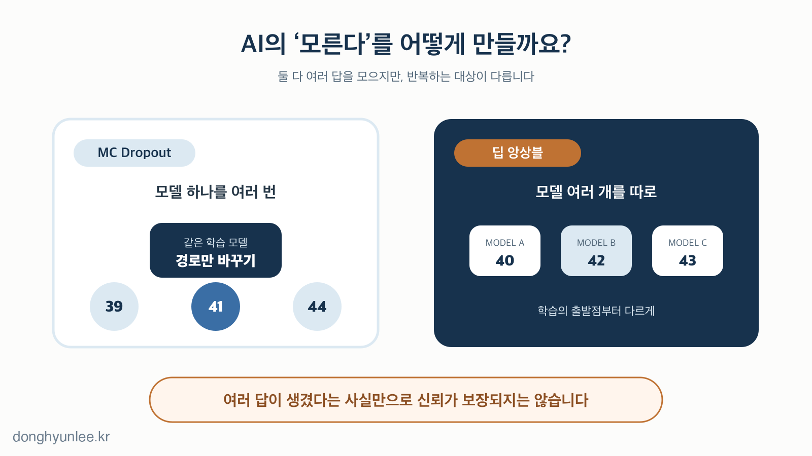
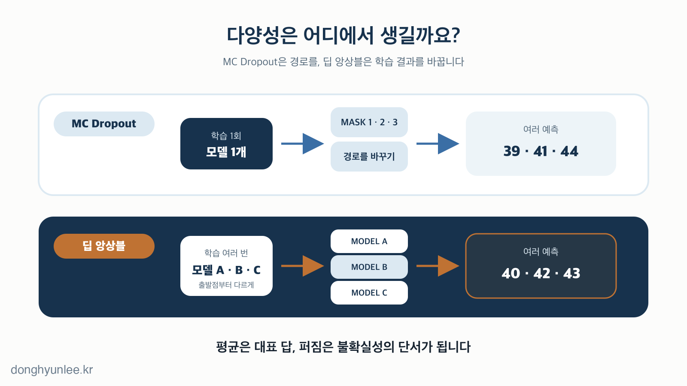
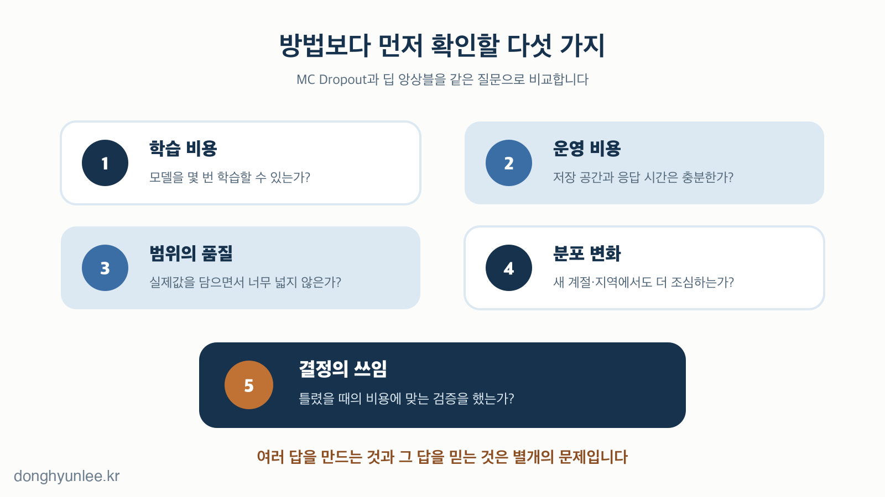

같은 미세먼지 자료를 같은 AI 모델에 넣었습니다. 그런데 예측할 때마다 결과가 조금씩 달라집니다.

모델이 고장 난 것일까요.

**MC Dropout에서는 이 차이를 일부러 만듭니다.** 한 번은 41, 다음에는 44, 또 다음에는 39가 나왔다면, 그 값들이 얼마나 퍼져 있는지를 보고 모델의 불확실성을 가늠합니다.

저는 이 방법을 실제 미세먼지 예측 연구에 사용했습니다. 2024년 *Journal of Cleaner Production*에 발표한 논문에서 ICNN이라는 딥러닝 모델에 MC Dropout을 결합해 PM10·PM2.5 예측값과 불확실성 범위를 함께 산출했습니다.[5]

그렇다고 MC Dropout이 언제나 가장 좋은 방법이라는 뜻은 아닙니다. 비슷한 목적으로 널리 쓰이는 **딥 앙상블(Deep Ensembles)**도 있습니다. 둘 다 여러 예측을 모으지만, 여러 예측을 만드는 방식은 전혀 다릅니다.

_그림 1. 같은 ‘여러 번의 예측’이라도 무엇을 바꾸며 반복하는지가 다릅니다._

## 30초 핵심

- 베이지안 딥러닝은 큰 틀이고, MC Dropout은 그 틀을 근사하는 한 방법입니다.
- MC Dropout은 한 모델의 경로를 바꾸고, 딥 앙상블은 여러 모델을 따로 학습해 예측 차이를 만듭니다.
- 예측이 흔들린다는 사실과 그 흔들림이 현실의 오류를 정직하게 반영한다는 사실은 다릅니다.

## [1] 먼저 비교의 지도를 바로잡습니다

1. **같은 입력에서 다른 답을 일부러 만들 수 있습니다.**  
   보통은 같은 모델에 같은 입력을 넣으면 같은 답이 나올 것이라 기대합니다. 불확실성을 추정할 때는 이 규칙을 의도적으로 흔듭니다. 가능한 모델이나 경로를 여러 번 살펴보고 답들이 얼마나 모이거나 흩어지는지 확인합니다.

2. **보통의 딥러닝은 가장 그럴듯한 가중치 한 묶음을 배웁니다.**  
   신경망은 학습을 거치며 수많은 가중치를 조정합니다. 일반적인 예측에서는 학습이 끝난 가중치 한 묶음을 사용해 답 하나를 냅니다. 그 답을 만든 모델 외에 다른 가능한 모델들이 어떤 답을 냈을지는 화면에 나타나지 않습니다.

3. **AI가 모르는 이유는 하나가 아닙니다.**  
   측정 오차나 우연한 변동처럼 데이터 자체에서 오는 불확실성을 **데이터 불확실성(aleatoric uncertainty)**이라고 합니다. 학습 자료가 부족하거나 낯선 조건을 만나 모델이 잘 모르는 경우는 **모델 불확실성(epistemic uncertainty)**에 가깝습니다.[1] 두 종류를 현실에서 완벽히 분리하기는 어렵지만, MC Dropout과 딥 앙상블의 예측 차이는 주로 모델 쪽의 모름을 살피는 단서로 쓰입니다.

4. **베이지안 딥러닝과 MC Dropout은 경쟁 관계가 아닙니다.**  
   베이지안 딥러닝은 가중치나 함수 하나를 확정하기보다, 데이터에 비추어 가능한 여러 가중치나 함수를 분포로 다루는 큰 접근법입니다. MC Dropout은 dropout 신경망을 이용해 이 베이지안 추론을 계산 가능한 방식으로 근사하는 방법으로 제안됐습니다.[2] 따라서 둘을 `A 대 B`의 선택지로 놓으면 큰 범주와 그 안의 한 방법을 비교하게 됩니다.

5. **MC Dropout과 비교하려면 딥 앙상블이 더 자연스럽습니다.**  
   딥 앙상블도 예측을 여러 개 만든 뒤 그 차이로 불확실성을 살핍니다. 다만 명시적인 사후분포를 근사하는 대신, 여러 신경망을 처음부터 따로 학습시킵니다. 원 논문은 이를 근사 베이지안 신경망의 실용적 대안으로 제시했습니다.[3]

## [2] MC Dropout은 한 모델에서 여러 의견을 만듭니다

6. **원래 dropout은 과적합을 줄이기 위한 학습 방법입니다.**  
   학습할 때 신경망의 일부 유닛을 무작위로 쉬게 합니다. 늘 같은 유닛 조합에만 기대지 못하게 만드는 것입니다. 여러 팀이 한 문제를 번갈아 풀게 해 특정 사람 한 명에게 모든 일이 몰리는 것을 막는 모습과 비슷합니다.[4]

7. **보통은 예측할 때 dropout을 끕니다.**  
   학습 중에는 일부 유닛을 무작위로 쉬게 하지만, 일반적인 추론에서는 dropout을 끄고 하나의 안정된 계산 경로를 사용합니다. 그래서 같은 입력에 같은 답이 나옵니다.

8. **MC Dropout은 예측할 때도 dropout을 켜 둡니다.**  
   여기서 `MC`는 Monte Carlo의 약자입니다. 무작위 표본을 여러 번 뽑아 알고 싶은 값을 근사하는 방식입니다. 예측할 때마다 쉬는 유닛의 조합이 달라지므로, 한 모델 안에서 조금씩 다른 가상 모델을 꺼내 보는 효과가 생깁니다.

9. **여러 예측의 평균은 답이 되고, 퍼짐은 모름의 단서가 됩니다.**  
   같은 입력을 여러 번 통과시키면 예측값들이 모입니다. 그 평균이나 중앙값을 대표 예측으로 쓰고, 값들이 퍼진 정도를 불확실성의 지표로 사용할 수 있습니다. 반복 횟수를 늘리면 이 표본 계산의 흔들림은 줄어들지만, 원래 모델의 편향이나 잘못된 가정까지 사라지는 것은 아닙니다.

10. **저는 미세먼지 예측에서 이 구조를 사용했습니다.**  
    2024년 논문에서는 대기질과 기상 자료를 다차원 격자로 구성하고, ICNN에 MC Dropout을 결합해 PM10·PM2.5 농도와 95% 불확실성 범위를 함께 산출했습니다.[5] 목표는 예측값 하나만 내놓지 않고 그 예측이 얼마나 흔들릴 수 있는지도 보여 주는 것이었습니다. 다만 이 연구에서 MC Dropout을 사용했다는 사실은 이 방법이 모든 지역·기간·환경 모델에서 최선이라는 뜻이 아닙니다. 제가 사용한 방법에도 이 글에서 설명하는 검증 기준이 똑같이 적용됩니다.

## [3] 딥 앙상블은 여러 모델의 의견을 모읍니다

11. **딥 앙상블은 모델을 여러 개 따로 학습합니다.**  
    전형적인 딥 앙상블은 같은 구조의 신경망 여러 개를 서로 다른 초기값으로 시작해 각각 최적화합니다. 같은 학습 자료를 사용하더라도 출발점과 미니배치 순서 등이 달라지면 최종 가중치는 조금씩 달라질 수 있습니다.

12. **여러 모델은 같은 문제를 푼 서로 다른 팀과 비슷합니다.**  
    MC Dropout이 한 팀의 구성원을 조금씩 바꾸며 여러 번 묻는 방식이라면, 딥 앙상블은 여러 팀을 처음부터 따로 훈련한 뒤 같은 질문을 던지는 방식에 가깝습니다. 여러 팀의 답이 비슷하면 한 방향으로 모이고, 크게 다르면 모델 선택에 따른 불확실성이 크다는 신호가 됩니다.

13. **평균만 보지 말고 모델 사이의 의견 차이도 봅니다.**  
    여러 모델의 예측을 평균하면 하나의 최종 예측을 만들 수 있습니다. 동시에 모델들의 답이 얼마나 벌어지는지도 계산할 수 있습니다. 다만 모두가 비슷한 데이터와 구조를 공유하므로, 여러 모델이 같은 답을 냈다고 그 답이 반드시 맞는 것은 아닙니다.

_그림 2. MC Dropout은 학습된 모델 안에서 경로를 바꾸고, 딥 앙상블은 학습 자체를 여러 번 반복합니다._

14. **딥 앙상블은 학습·저장 비용이 더 큽니다.**  
    모델이 다섯 개라면 전형적으로 학습도 다섯 번, 저장도 다섯 개가 필요합니다. 반면 MC Dropout은 학습하고 저장할 모델이 하나라는 장점이 있습니다. 그러나 예측 단계에서는 MC Dropout도 여러 번 순전파해야 하므로, `모델 하나니까 추론도 한 번`은 아닙니다. 두 방법 모두 병렬 처리 여부와 응답 시간 조건을 함께 봐야 합니다.

15. **딥 앙상블은 강한 기준선이지만 만능 정답은 아닙니다.**  
    딥 앙상블 원 논문의 분류·회귀 실험에서는 불확실성 품질이 근사 베이지안 신경망과 비슷하거나 더 좋은 결과를 보였고, 분포 밖 입력에서 더 큰 불확실성을 표현하는 실험도 제시됐습니다.[3] 이것은 딥 앙상블이 언제나 MC Dropout보다 낫다는 증명이 아닙니다. 데이터, 구조, 학습 예산과 평가 방법이 바뀌면 순위도 달라질 수 있습니다.

## [4] 방법을 고른 뒤에는 불확실성을 다시 검증해야 합니다

16. **두 방법의 차이는 이 표로 줄일 수 있습니다.**

    | 비교 | MC Dropout | 딥 앙상블 |
    |---|---|---|
    | 전형적인 학습 | 모델 1개 | 모델 여러 개 |
    | 저장 | 가중치 1묶음 | 가중치 여러 묶음 |
    | 반복 예측 | dropout mask를 바꾸며 여러 번 | 각 모델로 한 번 이상 |
    | 다양성의 출처 | 한 모델 안의 다른 경로 | 따로 학습된 여러 모델 |
    | 대표 장점 | 기존 dropout 구조에 적용하기 비교적 쉬움 | 강한 경험적 기준선 |
    | 대표 부담 | 반복 추론·dropout 설계 의존 | 학습·저장 비용 |

    여기서 반복 횟수나 모델 수에 하나의 정답은 없습니다. 과제의 정확도, 지연 시간과 불확실성 품질을 함께 보며 정해야 합니다.

17. **예측이 흔들린다는 것과 그 흔들림이 정직하다는 것은 다릅니다.**  
    어떤 모델이 넓은 범위를 냈다고 해서 그 범위가 자동으로 현실의 오차를 잘 담는 것은 아닙니다. 반대로 좁은 범위가 나왔다고 정말 확실한 것도 아닙니다. 불확실성을 만들어 내는 일과, 그 불확실성이 실제 빈도와 맞는지 확인하는 **보정(calibration)**은 별도의 작업입니다.

18. **낯선 데이터에서 정말 더 조심하는지 확인해야 합니다.**  
    계절, 지역, 관측 장비가 바뀌면 학습 때와 다른 데이터가 들어올 수 있습니다. 대규모 비교 연구에서는 이런 분포 변화가 커질수록 정확도뿐 아니라 불확실성 추정과 보정도 나빠질 수 있었습니다.[6] 최근 한 연구도 해당 실험 설정에서 MC Dropout이 보간·외삽 영역의 커진 불확실성을 충분히 반영하지 못한 사례를 보고했습니다.[7] 한 연구로 모든 MC Dropout을 부정할 수는 없지만, `낯선 입력이면 알아서 불안해할 것`이라고 가정해서도 안 됩니다.

19. **모델에는 두 장의 성적표가 필요합니다.**  
    첫 번째는 예측값이 얼마나 맞았는지를 보여 주는 성적표입니다. 두 번째는 불확실성 범위가 실제값을 얼마나 자주 포함했는지, 그 범위가 지나치게 넓지는 않았는지 보여 주는 성적표입니다. 예측 오차가 작아도 불확실성을 지나치게 작게 말할 수 있고, 포함률을 높이기 위해 쓸모없이 넓은 범위만 낼 수도 있습니다.

20. **방법 이름보다 선택 조건을 먼저 적어야 합니다.**  
    기존 모델에 dropout이 있고 빠르게 기준선을 만들려면 MC Dropout이 실용적일 수 있습니다. 여러 모델을 학습·저장할 여력이 있고 강한 비교 기준이 필요하다면 딥 앙상블을 함께 시험해 볼 수 있습니다. 중요한 결정에 쓰인다면 둘 중 하나를 이름만 보고 고르지 말고, 같은 데이터와 계산 예산에서 예측 오차·구간의 포함률과 폭·분포 변화·응답 시간을 함께 비교해야 합니다.

_그림 3. 방법 선택은 끝이 아닙니다. 계산비용과 함께 불확실성의 품질을 현실 데이터에서 확인해야 합니다._

## 마무리

MC Dropout과 딥 앙상블은 모두 여러 예측의 차이에서 AI의 모름을 찾습니다.

MC Dropout은 **한 모델을 여러 모습으로 실행**합니다. 딥 앙상블은 **여러 모델을 따로 학습**합니다. 전자는 학습·저장 부담이 작고, 후자는 더 큰 비용으로 서로 다른 학습 결과를 모읍니다.

하지만 가장 중요한 차이는 방법 이름에 있지 않습니다.

**AI의 ‘모른다’는 여러 예측의 불일치로 계산할 수 있습니다. 하지만 그 불일치를 믿을 자격은 현실 데이터에서 검증해야 얻습니다.**

---

## 관련 글

- [AI 예측은 왜 ‘하나의 숫자’로 답하면 안 될까 — 점추정에서 신뢰구간의 시대로](https://blog.naver.com/donghyunlee-ai/224343787239)
- [우리는 왜 숫자가 붙은 말을 더 쉽게 믿을까 — 숫자를 읽는 20개의 짧은 생각](https://blog.naver.com/donghyunlee-ai/224357406993)

## 출처

[1] Kendall, A., & Gal, Y. (2017). *What Uncertainties Do We Need in Bayesian Deep Learning for Computer Vision?* Advances in Neural Information Processing Systems 30. https://papers.nips.cc/paper_files/paper/2017/hash/2650d6089a6d640c5e85b2b88265dc2b-Abstract.html

[2] Gal, Y., & Ghahramani, Z. (2016). *Dropout as a Bayesian Approximation: Representing Model Uncertainty in Deep Learning.* Proceedings of the 33rd International Conference on Machine Learning, PMLR 48, 1050–1059. https://proceedings.mlr.press/v48/gal16.html

[3] Lakshminarayanan, B., Pritzel, A., & Blundell, C. (2017). *Simple and Scalable Predictive Uncertainty Estimation using Deep Ensembles.* Advances in Neural Information Processing Systems 30. https://papers.nips.cc/paper_files/paper/2017/hash/9ef2ed4b7fd2c810847ffa5fa85bce38-Abstract.html

[4] Srivastava, N., Hinton, G., Krizhevsky, A., Sutskever, I., & Salakhutdinov, R. (2014). *Dropout: A Simple Way to Prevent Neural Networks from Overfitting.* Journal of Machine Learning Research, 15, 1929–1958. https://jmlr.org/papers/v15/srivastava14a.html

[5] Lee, D., & Lee, B. (2024). *Building reliable AI for quantifying uncertainty in particulate matter predictions with deep learning.* Journal of Cleaner Production, 473, 143457. https://doi.org/10.1016/j.jclepro.2024.143457

[6] Ovadia, Y. et al. (2019). *Can You Trust Your Model's Uncertainty? Evaluating Predictive Uncertainty Under Dataset Shift.* Advances in Neural Information Processing Systems 32. https://proceedings.neurips.cc/paper_files/paper/2019/hash/8558cb408c1d76621371888657d2eb1d-Abstract.html

[7] Djupskås, A., Riemer-Sørensen, S., & Stasik, A. J. (2026). *Unreliable Monte Carlo Dropout Uncertainty Estimation.* Proceedings of the 7th Northern Lights Deep Learning Conference, PMLR 307, 106–114. https://proceedings.mlr.press/v307/djupskas26a.html

---

저자는 이 분야에서 AI Korea를 통해 관련 서비스를 제공하고 있습니다. 이 글은 특정 제품·서비스의 홍보가 아닙니다.

예측 결과는 언제나 불확실성을 포함합니다. 방역·환경 정책 의사결정의 단독 근거가 될 수 없습니다.

───────────────────────────────
**이해관계 및 책임 고지**

이동현은 한국외국어대학교 Social Science & AI융합학부 교수이자 한국인공지능 주식회사(AI Korea Inc.)의 대표입니다.
이 글의 견해는 저자 개인의 것이며, 소속 기관이나 연구과제 발주처의 공식 입장이 아닙니다.

이 글은 일반적인 정보 제공과 교육을 목적으로 합니다. 특정 사안에 대한 자문이나
정책 권고가 아니며, 실제 의사결정의 단독 근거로 사용될 수 없습니다.

사실에 오류가 있다면 알려주십시오.
───────────────────────────────
