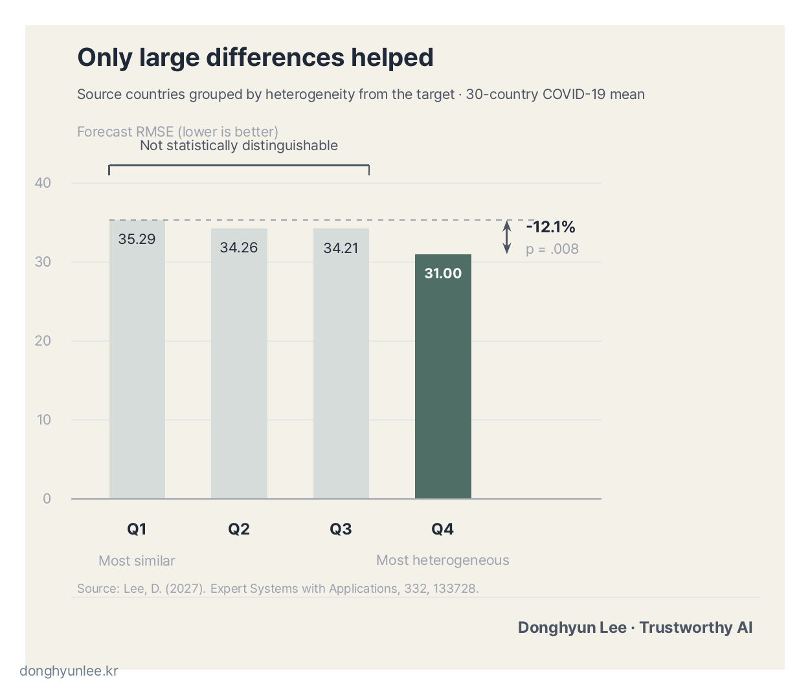
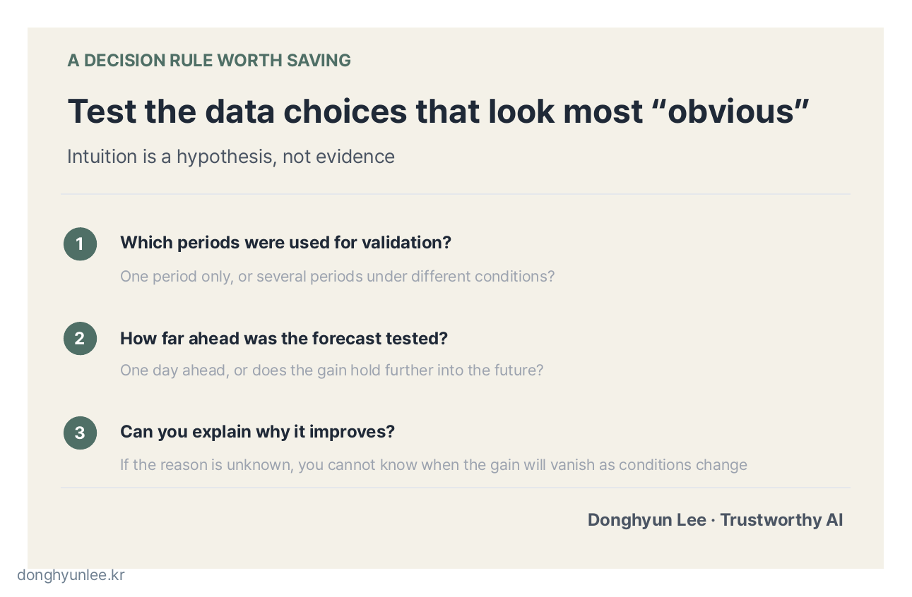

Imagine the moment when a new infectious disease has just begun to spread. We need an AI forecasting model to anticipate how the outbreak will develop. Yet we have only a few weeks of domestic data with which to train it.

One method for this situation is <strong>transfer learning</strong>. We first train a model on data already accumulated in another country, then adapt it to our own data.

That raises the next question: **Which country should the model learn from?**

Choosing a country similar to ours seems obvious. Experience from a country with a similar epidemic curve would appear more likely to transfer well.

When I tested that intuition across 30 countries, the opposite was true.

_Figure 1. In early outbreak forecasting without local data, the first problem is deciding whom to learn from._

This article explains for a general audience a paper that I published as sole author in *Expert Systems with Applications* (IF 9.4).[1] It is also a preview of the “What It Means to Forecast Infectious Disease” series that will begin this fall.

## The 30-Second Takeaway

- When training an infectious-disease forecasting model on data from other countries, models that learned from the most “different” countries consistently outperformed those that learned from the most “similar” countries.
- The benefit did not increase in proportion to dissimilarity. A statistically significant improvement appeared only in the most heterogeneous quartile.
- This is an option for the early stage of an emerging infectious disease, when domestic data are unavailable. Its limited validation conditions, however, must be read alongside the result.

## 1. Why Do We Need Data from Other Countries? — The Data Gap at the Beginning of an Emerging Outbreak

Deep-learning models grow by consuming data. With enough data they can be powerful, but without data, even an excellent architecture has nothing to learn.

The beginning of an emerging infectious disease is exactly that situation. **The moment when forecasts are most urgently needed coincides with the moment when data are scarcest.** When building infectious-disease forecasting models, I find this shortage of early data especially frustrating. When a new disease emerges, domestic data about that disease have not yet accumulated.

Transfer learning is one way to fill the gap. It resembles the way a person who has learned one foreign language can learn a second more quickly. Instead of beginning from the idea of a sentence itself, the learner starts with an existing sense of “how languages generally work.” A model likewise learns first from outbreak data in other countries, then completes its training on domestic data.

The problem is how to choose that “other country.” Most intuitions point in one direction: a country similar to ours. I was often asked the same question: “Surely transfer learning should use data similar to ours?”

This study tested that “surely” against the data.

## 2. A Similar Country Seems Like the Obvious Choice — The Opposite Result from 30 Countries

The experiment was designed as follows. I used 1,143 days of publicly available COVID-19 data from 30 countries, covering January 22, 2020, through March 9, 2023. The sources were the Johns Hopkins University aggregation (JHU CSSE) and Our World in Data (OWID).[2][3]

For each target country, I selected four source countries, pretrained a model on their data, and then fine-tuned it on the target country’s data. Similarity between countries was measured with a distance called <strong>dynamic time warping (DTW)</strong>, which measures how closely the shapes of two time-series curves resemble one another.

I compared several source-selection strategies: the four countries **most similar** to the target, the four **most dissimilar**, four selected at random, and an individual model trained only on the target country’s own data without transfer learning. The model itself was held constant: one lightweight time-series neural network called a TCN.

Here is the result.

**The model that learned from the most dissimilar countries—heterogeneous transfer learning—reduced prediction error (RMSE) by about 40% compared with the individual model trained only on domestic data (52.5 → 31.5).** RMSE measures how far predictions deviate from observed values on average; lower is better.

The relative metrics told the same story. RMSE normalized by the standard deviation of the observed data (RMSE/SD) was 0.37, lower than the 0.62–0.75 of the individual models. R², which indicates how much of the observed variation was explained, was 0.82.

I also tested whether these differences might be due to chance. Using the **Wilcoxon signed-rank test** to pair the errors of the two methods in each of the 30 countries, the differences from all individual models had p<.001; the difference from transfer learning with randomly selected sources had p=.009; and the difference from transfer learning with **similar-country sources also had p<.001**. A p-value is a scale for how likely a difference of this size would be to arise by chance. By convention, a value below 0.05 is treated as difficult to attribute to chance.

In short, learning from similar countries was not a bad choice, but **learning from the most dissimilar countries was consistently better.** The direction ran against conventional wisdom.

## 3. A Stranger Finding — The Benefit Appeared Only at the “Most Dissimilar” Extreme

At this point, it might seem that we can simply replace the old intuition with a new one: “the more different, the better.” The data did not permit that conclusion either.

I divided source countries into four quartiles based on their dissimilarity from the target country. Q1 was the most similar quartile, and Q4 the most dissimilar. Average prediction error (RMSE) across the 30 countries was as follows.

| Quartile | Q1 (most similar) | Q2 | Q3 | Q4 (most dissimilar) |
|---|---|---|---|---|
| Mean RMSE | 35.29 | 34.26 | 34.21 | **31.00** |

Q1, Q2, and Q3 were not statistically distinguishable from one another. Only **Q4 had an error 12.1% lower than Q1, and only this difference was significant (p=.008).**

_Figure 2. After source countries were grouped by heterogeneity, a significant error reduction appeared only in the most heterogeneous quartile, Q4. The vertical axis begins at zero._

The chart’s vertical axis begins at zero. The decline therefore does not look dramatic, and that is the correct impression. Truncating the axis to inflate a difference is precisely the habit this blog opposes. The difference is modest but statistically clear.

The strangest and most interesting aspect of this study is that the benefit did not rise gradually along a similarity scale; **it was concentrated at the extreme**. Being somewhat different did not help. The benefit appeared only when the data were very different.

The more a result contradicts intuition, the more important it becomes to check it against data rather than intuition.

## 4. My Interpretation — Similar Countries Learn Each Other’s “Dialect”

Here I need to separate fact from interpretation. The evidence established by the paper ends with Section 3. **The paper does not yet explain the mechanism that concentrates the benefit in the most heterogeneous quartile.**

My interpretation is as follows.

Imagine someone trying to learn a standard language from speakers in only one region. They may learn the region’s dialect as though it were part of the standard language. A model trained only on similar countries may do something comparable. It may memorize local habits those countries happen to share—aggregation methods, reporting cycles, or the stage at which an outbreak passed—as though they were general laws of transmission. When sufficiently heterogeneous data are combined, by contrast, only the **common grammar of transmission** that survives all those differences remains.

This account fits the result well, but it is **a hypothesis consistent with the result, not a mechanism demonstrated by the paper.** That is where the next study begins.

Two practical points are worth adding. First, this method is **an option that can actually be used early in an emerging outbreak**, before domestic data have accumulated. Second, the result was achieved not with a heavy foundation model, but with **one lightweight TCN**. In settings with limited compute, that difference is not trivial.

## 5. Reading the Limitations as Written — The Same Standard Applies to the Models I Build

It is time to say how far this result can be trusted. The limitations are clear.

First, **the evaluation covered one low-incidence period late in the pandemic.** The study did not test whether the same conclusion would hold during a sharp surge in cases.

Second, **it evaluated one-day-ahead forecasts only.** The paper does not answer whether the benefit of heterogeneous transfer persists for forecasts one week or one month ahead.

Third, as noted above, **it did not explain why the benefit was concentrated at the extreme.** When we do not know why a method works, it is difficult to predict when it will stop working as conditions change.

_Figure 3. The study evaluated one late-pandemic, low-incidence period at a one-day forecast horizon; the result must be read with those conditions attached._

These three questions apply directly to my own work as well. I build infectious-disease forecasting models not only in papers, but also for field settings. What period of data was used for validation? How many steps ahead were tested? Can we explain why the model works? **The fact that this paper has been held to these standards does not mean that other forecasting models I build in practice pass them automatically.** They must face the same questions in the same way.

What I hope you take from this article, then, is not one number but one standard for judgment:

**Validate the data choices that seem “obvious.” Intuition is a hypothesis, not evidence.**

_Figure 4. Intuition is a hypothesis, not evidence; the more obvious a choice appears, the more it needs testing._

## Conclusion

A model learned more effectively from the most dissimilar countries than from the most similar ones; the benefit appeared only at the extreme; and the result was established under the conditions of a low-incidence period and one-day-ahead forecasting. I hope you will remember the result and its conditions in the same sentence.

Beginning this fall, the “What It Means to Forecast Infectious Disease” series will examine this question in earnest. Timed to the avian-influenza season, it will explore what evidence can support forecasts when data are scarce, and when those forecasts should be trusted or questioned.

Does your field have a choice that seems so obvious that no one has ever tested it?

---

## Related Articles

- [How Does AI Calculate ‘I Don’t Know’? — MC Dropout vs. Deep Ensembles](/en/posts/2026-07-26-mc-dropout-vs-deep-ensembles/)
- [Why AI Predictions Should Not Give a Single Number — From Point Estimates to Confidence Intervals](/en/posts/2026-07-07-ai-uncertainty-interval/)

## Sources

[1] Lee, D. (2027). *Heterogeneous transfer learning for robust infectious disease forecasting: A data-centric approach.* Expert Systems with Applications, 332, 133728. https://doi.org/10.1016/j.eswa.2026.133728

[2] Johns Hopkins University CSSE. *COVID-19 Data Repository.* https://github.com/CSSEGISandData/COVID-19

[3] Our World in Data. *Coronavirus Pandemic (COVID-19) Data.* https://ourworldindata.org/coronavirus

All figures reported in the body of this article (RMSE 52.5→31.5, RMSE/SD 0.37, R² 0.82, quartile values 35.29/34.26/34.21/31.00, 12.1%, and the p-values) come from the published version of [1].

---

The author provides related services in this field through AI Korea. This article does not promote any particular product or service.

Predictions always contain uncertainty. They must not be used as the sole basis for decisions on disease-control or environmental policy.

**Disclosure of Interests and Responsibility**

Donghyun Lee is a professor in the Division of Social Science & AI at Hankuk University of Foreign Studies and the CEO of AI Korea Inc.
The views expressed in this article are the author’s own and do not represent the official position of his affiliated institutions or the organizations commissioning his research projects.

This article is intended for general informational and educational purposes. It is not advice or
a policy recommendation for any particular matter, and must not be used as the sole basis for real-world decisions.

If you find a factual error, please let me know.
