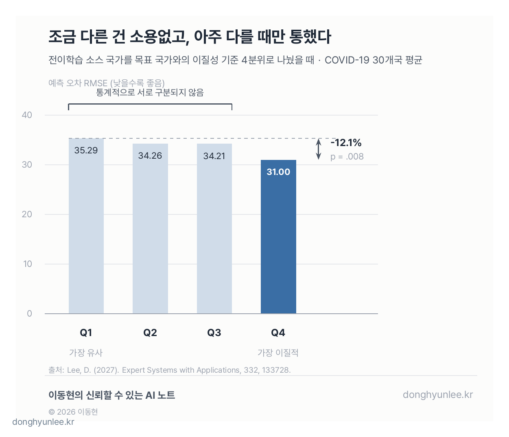
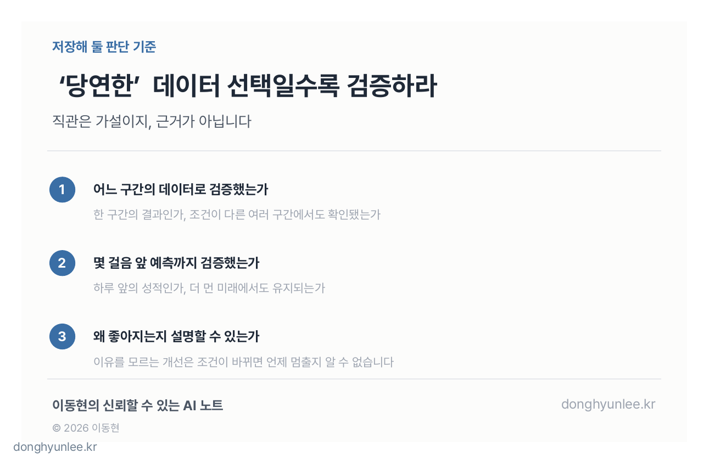

새로운 감염병이 막 퍼지기 시작한 시점을 상상해 보겠습니다. 앞으로의 발생 추이를 내다보는 AI 예측 모델이 필요합니다. 그런데 정작 학습에 쓸 자국 데이터는 몇 주치밖에 없습니다.

이럴 때 쓰는 방법이 <strong>전이학습(transfer learning)</strong>입니다. 다른 나라에서 이미 쌓인 데이터로 모델을 미리 학습시킨 뒤, 우리 데이터에 맞게 다듬는 방식입니다.

그러면 다음 질문이 생깁니다. **어느 나라의 데이터에서 배워야 할까요?**

우리와 비슷한 나라를 고르는 것이 당연해 보입니다. 유행 곡선이 닮은 나라의 경험이라야 우리에게도 잘 옮겨질 것 같습니다.

30개국을 놓고 확인해 보니, 반대였습니다.

_그림 1. 자국 데이터가 없는 시점의 감염병 예측은 '누구에게서 배울 것인가'를 고르는 문제에서 시작합니다._

이 글은 제가 단독저자로 *Expert Systems with Applications*(IF 9.4)에 발표한 논문[1]을 일반 독자용으로 풀어 쓴 것입니다. 가을에 시작할 '감염병을 예측한다는 것' 시리즈의 예고편이기도 합니다.

## 30초 핵심

- 다른 나라 데이터로 감염병 예측 모델을 학습할 때, 가장 '다른' 나라에서 배운 모델이 가장 '비슷한' 나라에서 배운 모델보다 일관되게 나았습니다.
- 이득은 유사도에 비례하지 않았습니다. 가장 이질적인 구간에서만 통계적으로 유의한 개선이 나왔습니다.
- 자국 데이터가 없는 신종 감염병 초기에 쓸 수 있는 선택지입니다. 단, 검증 조건이 제한적이라는 한계도 그대로 읽어야 합니다.

## 1. 왜 남의 나라 데이터가 필요할까 — 신종 감염병 초기의 데이터 공백

딥러닝 모델은 데이터를 먹고 자랍니다. 데이터가 충분하면 강력하지만, 데이터가 없으면 아무리 좋은 구조라도 배울 것이 없습니다.

신종 감염병의 초기가 정확히 그런 상황입니다. **예측이 가장 절실한 시점과, 데이터가 가장 부족한 시점이 겹칩니다.** 감염병 예측 모델을 만들다 보면 가장 아쉬운 것이 바로 이 초기 데이터입니다. 새로운 감염병이 나타난 시점에는 그 감염병의 자국 데이터가 아직 쌓여 있지 않습니다.

전이학습은 이 공백을 메우는 방법 가운데 하나입니다. 외국어를 하나 익힌 사람이 두 번째 외국어를 더 빨리 배우는 것과 비슷합니다. 문장을 처음부터 배우는 대신, '언어란 대체로 이렇게 움직인다'는 감각을 이미 갖고 시작하는 것입니다. 모델도 마찬가지로, 다른 나라의 유행 데이터로 미리 배운 뒤 우리 데이터로 마무리 학습을 합니다.

문제는 그 '다른 나라'를 고르는 기준입니다. 여기서 대부분의 직관은 한 방향을 가리킵니다. 우리와 비슷한 나라. 저 역시 이 질문을 자주 받았습니다. "전이학습은 당연히 우리와 비슷한 데이터에서 해야 하는 것 아닌가요?"

그 '당연히'를 데이터로 확인해 본 것이 이번 연구입니다.

## 2. '비슷한 나라'가 당연해 보입니다 — 30개국에서 나온 반대 결과

실험 설계는 이렇습니다. COVID-19 30개국의 1,143일치(2020년 1월 22일 ~ 2023년 3월 9일) 공개 데이터를 사용했습니다. 존스홉킨스대학의 집계(JHU CSSE)와 Our World in Data(OWID)가 출처입니다.[2][3]

각 목표 국가마다 소스 국가 4개를 골라 모델을 사전학습시킨 뒤, 목표 국가 데이터로 마무리 학습을 했습니다. 나라 사이의 유사도는 <strong>DTW(dynamic time warping)</strong>라는 거리로 쟀습니다. 두 시계열 곡선의 모양이 얼마나 닮았는지를 재는 방법입니다.

그리고 소스를 고르는 전략을 비교했습니다. 목표 국가와 **가장 비슷한** 나라 4개, **가장 다른** 나라 4개, 무작위 4개, 그리고 전이학습 없이 자국 데이터만 쓰는 개별 모델. 모델 자체는 TCN이라는 가벼운 시계열 신경망 하나로 통일했습니다.

결과부터 말씀드리면 이렇습니다.

**가장 다른 나라들에서 배운 모델(이질적 전이학습)이, 자국 데이터만 학습한 개별 모델 대비 예측 오차(RMSE)를 약 40% 줄였습니다(52.5 → 31.5).** RMSE는 예측이 실제에서 평균적으로 얼마나 벗어났는지를 나타내는 오차 지표로, 낮을수록 좋습니다.

상대 지표로 봐도 마찬가지입니다. 오차를 실제 데이터의 출렁임(표준편차)에 견준 값(RMSE/SD)이 0.37로, 개별 모델들의 0.62~0.75보다 낮았습니다. 실제 변동을 얼마나 설명하는지 나타내는 R²는 0.82였습니다.

이 차이가 우연인지도 확인했습니다. 30개 나라 각각에서 두 방법의 오차를 짝지어 비교하는 **Wilcoxon 부호순위검정**을 쓰면, 개별 모델들과의 차이는 모두 p<.001, 무작위로 소스를 고른 전이학습과의 차이는 p=.009, 그리고 **비슷한 나라를 고른 전이학습과의 차이도 p<.001**이었습니다. p값은 '이 정도 차이가 우연히 나올 법한 정도'를 나타내는 눈금으로, 관례적으로 0.05보다 작으면 우연으로 보기 어렵다고 판단합니다.

정리하면, 비슷한 나라에서 배우는 것이 나쁜 선택은 아니었지만, **가장 다른 나라에서 배우는 쪽이 일관되게 더 나았습니다.** 통념과 반대 방향입니다.

## 3. 더 이상한 발견 — 이득이 '가장 다른' 구간에만 몰렸습니다

여기까지라면 "다를수록 좋다"는 새 직관으로 갈아타면 될 것 같습니다. 그런데 데이터는 그것도 허락하지 않았습니다.

소스 국가들을 목표 국가와의 이질성 기준으로 네 구간(사분위)으로 나눠 봤습니다. Q1이 가장 유사한 구간, Q4가 가장 이질적인 구간입니다. 30개국 평균 예측 오차(RMSE)는 이렇게 나왔습니다.

| 구간 | Q1 (가장 유사) | Q2 | Q3 | Q4 (가장 이질적) |
|---|---|---|---|---|
| 평균 RMSE | 35.29 | 34.26 | 34.21 | **31.00** |

Q1, Q2, Q3는 통계적으로 서로 구분되지 않았습니다. 오직 **Q4만 Q1 대비 오차가 12.1% 낮았고, 이 차이만 유의했습니다(p=.008).**

_그림 2. 소스 국가를 이질성 기준 네 구간으로 나누면, 유의한 오차 감소는 가장 이질적인 Q4에서만 나타났습니다. 세로축은 0에서 시작합니다._

그림의 세로축은 0에서 시작합니다. 그래서 낙폭이 극적으로 보이지 않는데, 그것이 정확한 인상입니다. 축을 잘라 차이를 부풀리는 것은 이 블로그가 반대하는 바로 그 습관입니다. 완만하지만 통계적으로는 분명한 차이, 그것이 이 결과의 크기입니다.

이득이 유사도 눈금을 따라 서서히 늘어난 것이 아니라 **극단에만 몰렸다**는 점이 이 연구에서 제일 이상하고, 제일 흥미로운 부분입니다. 조금 다른 것은 도움이 되지 않았습니다. 아주 다를 때에만 도움이 됐습니다.

직관과 반대인 결과일수록, 직관이 아니라 데이터로 확인하는 일이 중요해집니다.

## 4. 제 해석 — 비슷한 나라끼리는 '사투리'까지 함께 배웁니다

여기서 사실과 해석을 구분하겠습니다. 논문이 데이터로 확인한 사실은 3절까지입니다. **왜 하필 가장 이질적인 구간에서만 이득이 몰리는지, 그 메커니즘은 논문도 아직 설명하지 못했습니다.**

그 위에서, 제 해석은 이렇습니다.

표준어를 배우고 싶은 사람이 한 지방 사람들에게만 말을 배우면, 그 지방의 사투리까지 표준어인 줄 알고 함께 익히게 됩니다. 비슷한 나라만 모아 학습한 모델도 마찬가지 아닐까 합니다. 그 나라들이 우연히 공유하는 국지적 습관 — 집계 방식, 보고 주기, 유행이 지나간 시점 같은 것들 — 까지 전파의 일반 법칙인 것처럼 함께 외우는 것입니다. 반대로 충분히 이질적인 데이터가 섞이면, 그 모든 차이를 뚫고 살아남는 **전파의 공통 문법**만 남습니다.

이 설명은 결과와 잘 들어맞지만, 어디까지나 **결과에 들어맞는 가설이지 논문이 입증한 메커니즘이 아닙니다.** 여기서부터가 다음 연구입니다.

실무 관점에서 덧붙일 점이 두 가지 있습니다. 첫째, 이 방법은 자국 데이터가 아직 쌓이지 않은 **신종 감염병 초기에 실제로 집어 들 수 있는 선택지**입니다. 둘째, 이 결과는 무거운 파운데이션 모델이 아니라 **가벼운 TCN 하나로** 얻었습니다. 계산 자원이 제한된 현장에서는 이 차이가 작지 않습니다.

## 5. 한계를 그대로 읽기 — 이 잣대는 제가 만드는 모델에도 적용됩니다

이제 이 결과를 어디까지 믿어야 하는지 말씀드릴 차례입니다. 한계는 분명합니다.

첫째, **평가 구간이 팬데믹 후기의 저발생 시기 한 구간입니다.** 발생이 폭증하던 시기에도 같은 결론이 나올지는 검증되지 않았습니다.

둘째, **하루 앞 예측만 검증했습니다.** 일주일 앞, 한 달 앞을 내다볼 때도 이질적 전이의 이득이 유지되는지는 이 논문이 답하지 못합니다.

셋째, 방금 말씀드린 대로 **왜 이득이 극단에 몰리는지 설명하지 못했습니다.** 작동하는 이유를 모르는 방법은, 조건이 바뀌었을 때 언제 작동을 멈출지도 예측하기 어렵습니다.

_그림 3. 이 연구의 평가는 팬데믹 후기 저발생 시기 한 구간, 하루 앞 예측에서 이뤄졌습니다. 결과에는 이 조건이 함께 붙습니다._

그리고 이 세 가지 질문은 저 자신에게 그대로 돌아옵니다. 저는 논문 속에서만이 아니라 현장에서도 감염병 예측 모델을 만들고 있습니다. 어느 구간의 데이터로 검증했는가. 몇 걸음 앞 예측까지 검증했는가. 왜 잘 되는지 설명할 수 있는가. **이 글이 논문 한 편에 들이댄 잣대를, 제가 현장에서 만드는 다른 예측 모델들이 자동으로 통과하는 것은 아닙니다.** 같은 질문 앞에 같은 방식으로 세워야 합니다.

그래서 이 글에서 저장해 가실 것은 숫자 하나가 아니라 판단 기준 하나입니다.

**'당연한' 데이터 선택일수록 검증하십시오. 직관은 가설이지, 근거가 아닙니다.**

_그림 4. 직관은 가설이지, 근거가 아닙니다. 당연해 보이는 선택일수록 검증이 필요합니다._

## 마무리

가장 비슷한 나라가 아니라 가장 다른 나라에서 배운 모델이 나았고, 그 이득은 극단에만 몰렸으며, 이 결과는 저발생기·하루 앞 예측이라는 조건 안에서 확인됐습니다. 결과와 조건을 한 문장으로 같이 기억해 주시면 좋겠습니다.

가을부터는 '감염병을 예측한다는 것' 시리즈에서 이 질문을 본격적으로 다루려 합니다. 데이터가 부족한 상황에서 무엇을 근거로 예측하는지, 그리고 그 예측을 언제 믿고 언제 의심해야 하는지를 조류독감 시즌에 맞춰 이어가겠습니다.

여러분의 분야에도 '너무 당연해서 한 번도 검증해 본 적 없는 선택'이 있지 않으신가요?

---

## 관련 글

- [AI는 '모른다'를 어떻게 계산할까 — MC Dropout과 딥 앙상블의 차이](/posts/2026-07-26-mc-dropout-vs-deep-ensembles/)
- [AI 예측은 왜 '하나의 숫자'로 답하면 안 될까 — 점추정에서 신뢰구간의 시대로](/posts/2026-07-07-ai-uncertainty-interval/)

## 출처

[1] Lee, D. (2027). *Heterogeneous transfer learning for robust infectious disease forecasting: A data-centric approach.* Expert Systems with Applications, 332, 133728. https://doi.org/10.1016/j.eswa.2026.133728

[2] Johns Hopkins University CSSE. *COVID-19 Data Repository.* https://github.com/CSSEGISandData/COVID-19

[3] Our World in Data. *Coronavirus Pandemic (COVID-19) Data.* https://ourworldindata.org/coronavirus

본문 속 모든 수치(RMSE 52.5→31.5, RMSE/SD 0.37, R² 0.82, 사분위 35.29/34.26/34.21/31.00, 12.1%, p값)는 [1]의 출판본에서 가져왔습니다.

---

저자는 이 분야에서 AI Korea를 통해 관련 서비스를 제공하고 있습니다. 이 글은 특정 제품·서비스의 홍보가 아닙니다.

예측 결과는 언제나 불확실성을 포함합니다. 방역·환경 정책 의사결정의 단독 근거가 될 수 없습니다.

───────────────────────────────
**이해관계 및 책임 고지**

이동현은 한국외국어대학교 Social Science & AI융합학부 교수이자 한국인공지능 주식회사(AI Korea Inc.)의 대표입니다.
이 글의 견해는 저자 개인의 것이며, 소속 기관이나 연구과제 발주처의 공식 입장이 아닙니다.

이 글은 일반적인 정보 제공과 교육을 목적으로 합니다. 특정 사안에 대한 자문이나
정책 권고가 아니며, 실제 의사결정의 단독 근거로 사용될 수 없습니다.

사실에 오류가 있다면 알려주십시오.
───────────────────────────────
