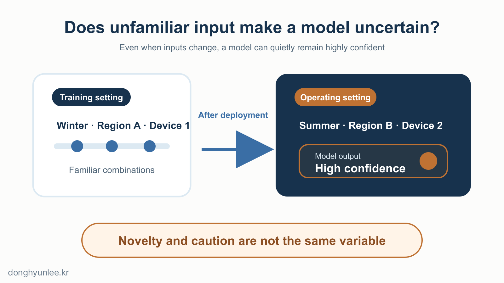
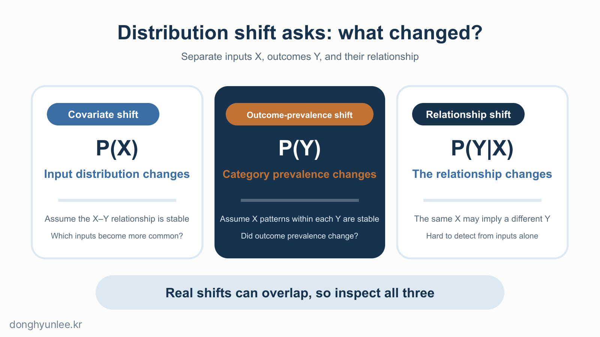
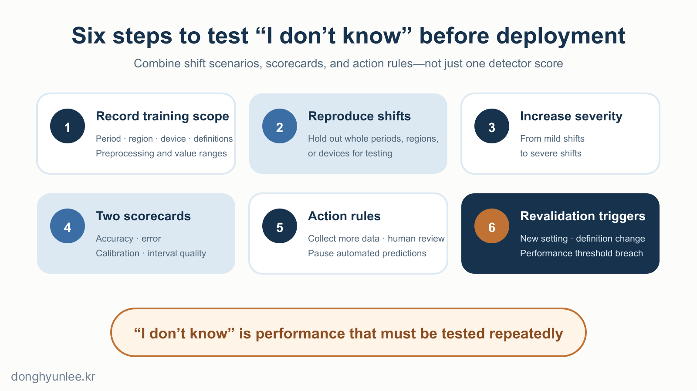

In the [previous article](/en/posts/2026-07-26-mc-dropout-vs-deep-ensembles/), we examined how MC Dropout and deep ensembles can estimate part of predictive uncertainty. Both approaches make repeated predictions for the same input and inspect how far apart the answers are.

**But when AI encounters data it did not see during training, will those predictions automatically spread farther apart?**

It would be convenient if they did, but there is no guarantee. An input can have all the expected columns and units and no missing values, yet contain a combination of season, region, and observation method that was almost absent from the training data. The model may still return an answer without an error message, while reporting uncertainty much like usual.

_Figure 1. An unfamiliar input and a model that knows to be cautious are not the same thing._

The method I used is not exempt from this question. In a 2024 study published in the *Journal of Cleaner Production*, I combined MC Dropout with ICNN to produce PM10 and PM2.5 predictions together with 95% uncertainty ranges.[1] The fact that the model produced uncertainty ranges, however, does not mean that it automatically detects every change in season, region, or observation method. My method also needs criteria for recreating unfamiliar conditions and validating performance again.

## The 30-Second Takeaway

- This article treats OOD as a perspective for warning that an individual input is unfamiliar, and dataset shift as a perspective for comparing a change between the distributions of training and operating environments.
- Changes in the inputs, outcome proportions, and input–outcome relationship are different problems. There is no guarantee that uncertainty will increase automatically.
- Before deployment, recreate expected changes, evaluate performance and uncertainty together, and define criteria for human review and revalidation.

## 1. OOD and Dataset Shift

A data distribution includes not just the average value, but also how often values occur, the ranges they occupy, and the combinations in which they appear.

<strong>Dataset shift, or distribution shift</strong>, is a state in which the pattern that generated the training data differs from the pattern generating operational data. <strong>Out-of-distribution (OOD) data</strong> usually concerns whether an operational input came from a distribution different from the chosen in-distribution baseline. Making that judgment requires a reference distribution, a detection score, and a threshold.[5] The boundary between these terms varies somewhat across studies; this article uses the following operational distinction.

| Perspective | Primary question | Unit |
|---|---|---|
| Dataset shift | Has the data-generating pattern changed between the training environment and the current environment? | Comparison between two periods or datasets |
| OOD detection | Is this incoming input within the familiar range? | An individual input or batch of inputs |

The two overlap but are not identical. A distribution shift can occur gradually as the proportion of certain conditions changes, even though each individual input appears familiar and no single case triggers a clear OOD alert.

**An OOD alert is a signal of unfamiliarity, not a verdict that the prediction is wrong.** The absence of an alert is not a certificate that the prediction is correct.

## 2. What Changed? — Inputs, Proportions, or Relationships

Distribution shifts become easier to understand when classified by what has changed. In the table below, `X` is the input and `Y` is the outcome to be predicted.

| Shift | What changed? | Question to ask | Simplified example |
|---|---|---|---|
| Covariate shift | The distribution of `X` changes; the relationship between `X` and `Y` is assumed to remain the same | Which input conditions now occur more frequently than before? | A temperature–humidity combination that was rare during training appears frequently in operation |
| Label-prior shift | The proportions of classification outcomes `Y` change; the pattern of `X` within each outcome is assumed to remain the same | Have the proportions of outcome categories, such as normal and caution, changed? | The proportion of caution cases rises, while the feature pattern within caution cases remains the same |
| Relationship shift (concept drift as used here) | The conditional distribution of `Y` given the same `X` changes | Does the same input now imply a different outcome? | A change in the outcome definition or generating mechanism changes the meaning of the same observation |

Covariate shift has long been studied as the problem of the training sample and the real-world target population having different input distributions.[2] In classification, label shift assumes that the proportions of outcome categories change while the input pattern within each category remains stable.[3] The scope of concept drift varies across the literature. The relationship shift in this article refers to the case in which the conditional distribution of `Y` given the same `X` changes.[4]

Real changes do not always fit neatly into one of these three boxes and may overlap. When someone says, “Drift was detected,” do not treat that sentence as identifying the cause. Work through the questions in the table to narrow down what changed.

In particular, input data alone cannot confirm the absence of the relationship shift described here. The shape of the inputs can remain the same while their relationship with the correct outcome changes. Such a shift often becomes visible only after actual outcomes arrive.

_Figure 2. Under the single label of distribution shift, inputs, outcome prevalence, and the relationship between inputs and outcomes can change in different ways._

## 3. Uncertainty Does Not Increase Automatically

An AI model does not reflect, “This situation is outside my experience.” It produces a number according to learned computational rules. A conventional classification neural network is trained to separate the classes it learned, but the ability to recognize unfamiliar inputs does not appear automatically. Experiments by Hendrycks and Gimpel showed that neural networks can assign high softmax scores to misclassified and OOD examples, making it difficult to interpret that score alone as confidence.[5] Hein and colleagues used theory and image experiments to analyze how, under certain settings, ReLU-family classifiers can make highly confident predictions even in regions far from the training data.[6]

What about MC Dropout and deep ensembles? These methods reveal disagreement among computational paths or independently trained models, but all may share the same training data, similar architectures, and the same prediction objective. If those shared elements create a blind spot, multiple predictions can converge in the same wrong direction. In experiments across image, text, ad-click, and genomics classification settings, Ovadia and colleagues compared several uncertainty-estimation methods under distribution shift. Both accuracy and uncertainty quality deteriorated as the shift increased. Deep ensembles were relatively strong on most metrics, but the researchers concluded that substantial room for improvement remained.[7]

> Calculating uncertainty through repeated predictions and having that uncertainty respond properly to unfamiliar data are separate validation problems.

The MC Dropout used in my 2024 particulate-matter study is not an exception to this principle. The paper shows results within that study’s setting.[1] It should not be extended into a claim of automatic warning across every region, period, and observation method.

In operation, we therefore need to separate three signals.

| Signal | Question it answers | What it cannot tell us on its own |
|---|---|---|
| Input-shift or OOD score | How atypical does the detector judge this input relative to the reference data? | Whether the actual prediction is wrong |
| Predictive uncertainty | How much do the answers from models or computational paths vary? | Whether the input is OOD, or whether the range matches real-world error |
| Recent outcome-based report card | Are actual performance, calibration, and interval quality being maintained? | The outcome of a current input for which the ground truth has not yet arrived |

An OOD score is not a universal probability or common distance scale. It must be interpreted together with the detection method, reference data, and threshold used. Disagreement among the three signals matters most. If the input is unfamiliar but uncertainty is low, or the input appears familiar while recent errors are rising, that is a signal for human review and revalidation.

## 4. Stress Testing Before Deployment

We cannot collect every unfamiliar input in the world in advance. We can, however, deliberately create foreseeable changes and test how the model responds. The predeployment checklist is as follows.

- **Summarize the training range on one page.**  
  Record the period, region or institution, equipment, units, preprocessing, missing-value handling, ranges of key variables, and outcome definition. This turns “similar to the training data” into a set of concrete comparison points.

- **Recreate expected shifts through data splits.**  
  Do not rely only on random splits. Hold out an entire later period, an unseen region or institution, or different equipment and collection conditions for testing.

- **Test several levels of severity for each shift type.**  
  The severity scale is not a common unit for comparing different kinds of shift, however, and passing one OOD dataset does not prepare a model for every unfamiliar input.

- **Read two report cards together.**  
  The first covers predictive performance, such as accuracy or error. The second covers probability calibration and the coverage and width of prediction intervals. “Was it wrong?” and “Did it say ‘I don’t know’ properly?” are different questions.

- **Define the action that follows an alert.**  
  Decide at what level to request additional observations, require human review, or suspend automated prediction. There is no universal threshold because it depends on the costs of false alarms and missed detections and on the available review staff.

- **Put revalidation triggers in the operational record.**  
  These include a new season, region, or device; changes to preprocessing or the outcome definition; sustained input shifts; and deterioration in recent performance, calibration, or interval quality. A retrained model is a new model, so the same procedure must be repeated.

_Figure 3. OOD readiness is not one detection score; it combines shift scenarios, two scorecards, action rules, and revalidation triggers._

For a task in which ground truth arrives late, input-shift and OOD scores are early warnings; actual performance and uncertainty quality after outcomes accumulate form a delayed report card. Do not decide to retrain on an early warning alone. Examine what changed and confirm performance deterioration with recent outcomes. Conversely, even when the input alert is quiet, a failing outcome-based report card should trigger revalidation.

## Conclusion

Does AI really say “I don’t know” when it encounters unfamiliar data? The answer is: **you cannot know from the method’s name alone.** MC Dropout, deep ensembles, and OOD detection are all useful, but none comes with a guarantee that it will work automatically when seasons, regions, or observation methods change in the field.

I therefore trust an operational record that says, “We defined which changes count as unfamiliar, tested performance and uncertainty under those changes, and require human review and revalidation when the criteria are exceeded,” more than a description that says, “Our model knows when it does not know.”

---

## Related Articles

- [How Does AI Calculate ‘I Don’t Know’? — MC Dropout vs. Deep Ensembles](/en/posts/2026-07-26-mc-dropout-vs-deep-ensembles/)
- [Why AI Predictions Should Not Give a Single Number — From Point Estimates to Confidence Intervals](/en/posts/2026-07-07-ai-uncertainty-interval/)

## Sources

[1] Lee, D., & Lee, B. (2024). *Building reliable AI for quantifying uncertainty in particulate matter predictions with deep learning.* Journal of Cleaner Production, 473, 143457. https://doi.org/10.1016/j.jclepro.2024.143457

[2] Shimodaira, H. (2000). *Improving predictive inference under covariate shift by weighting the log-likelihood function.* Journal of Statistical Planning and Inference, 90(2), 227–244. https://doi.org/10.1016/S0378-3758(00)00115-4

[3] Lipton, Z. C., Wang, Y.-X., & Smola, A. J. (2018). *Detecting and Correcting for Label Shift with Black Box Predictors.* Proceedings of the 35th International Conference on Machine Learning, PMLR 80, 3122–3130. https://proceedings.mlr.press/v80/lipton18a.html

[4] Widmer, G., & Kubat, M. (1996). *Learning in the Presence of Concept Drift and Hidden Contexts.* Machine Learning, 23, 69–101. https://doi.org/10.1023/A:1018046501280

[5] Hendrycks, D., & Gimpel, K. (2017). *A Baseline for Detecting Misclassified and Out-of-Distribution Examples in Neural Networks.* International Conference on Learning Representations. https://openreview.net/forum?id=Hkg4TI9xl

[6] Hein, M., Andriushchenko, M., & Bitterwolf, J. (2019). *Why ReLU Networks Yield High-Confidence Predictions Far Away From the Training Data and How to Mitigate the Problem.* Proceedings of the IEEE/CVF Conference on Computer Vision and Pattern Recognition, 41–50. https://openaccess.thecvf.com/content_CVPR_2019/html/Hein_Why_ReLU_Networks_Yield_High-Confidence_Predictions_Far_Away_From_the_CVPR_2019_paper.html

[7] Ovadia, Y. et al. (2019). *Can You Trust Your Model's Uncertainty? Evaluating Predictive Uncertainty Under Dataset Shift.* Advances in Neural Information Processing Systems 32. https://proceedings.neurips.cc/paper_files/paper/2019/hash/8558cb408c1d76621371888657d2eb1d-Abstract.html

The author provides related services in this field through AI Korea. This article does not promote any particular product or service.

Predictions always contain uncertainty. They must not be used as the sole basis for decisions on disease-control or environmental policy.

**Disclosure of Interests and Responsibility**

Donghyun Lee is a professor in the Division of Social Science & AI at Hankuk University of Foreign Studies and the CEO of AI Korea Inc.
The views expressed in this article are the author’s own and do not represent the official position of his affiliated institutions or the organizations commissioning his research projects.

This article is intended for general informational and educational purposes. It is not advice or
a policy recommendation for any particular matter, and must not be used as the sole basis for real-world decisions.

If you find a factual error, please let me know.
