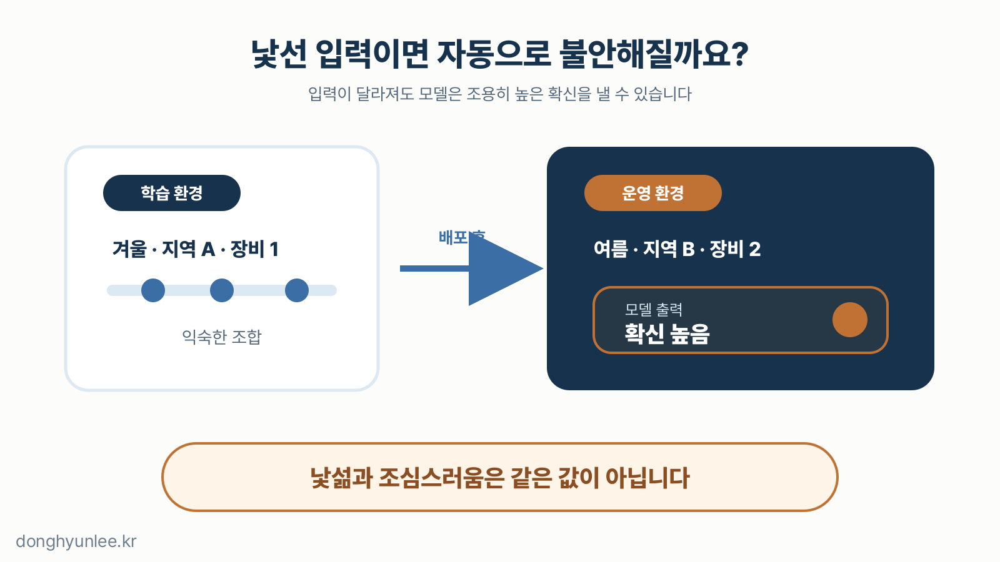
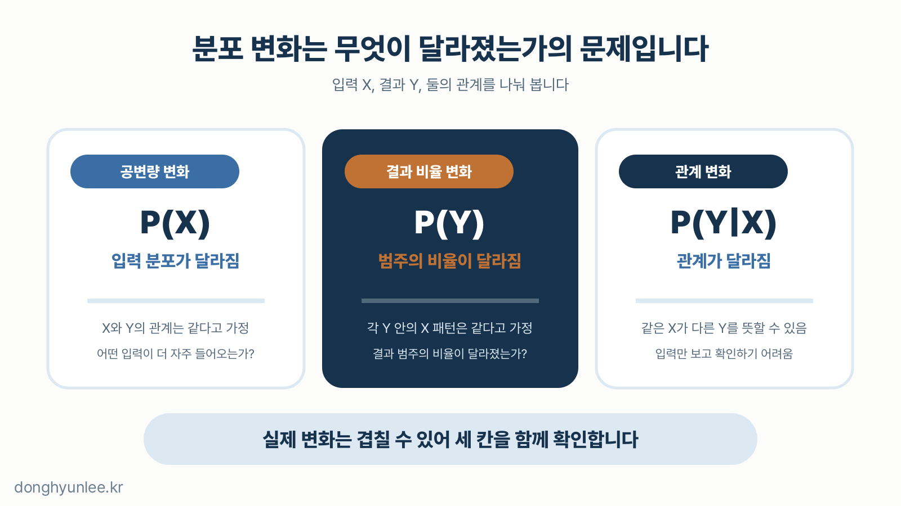
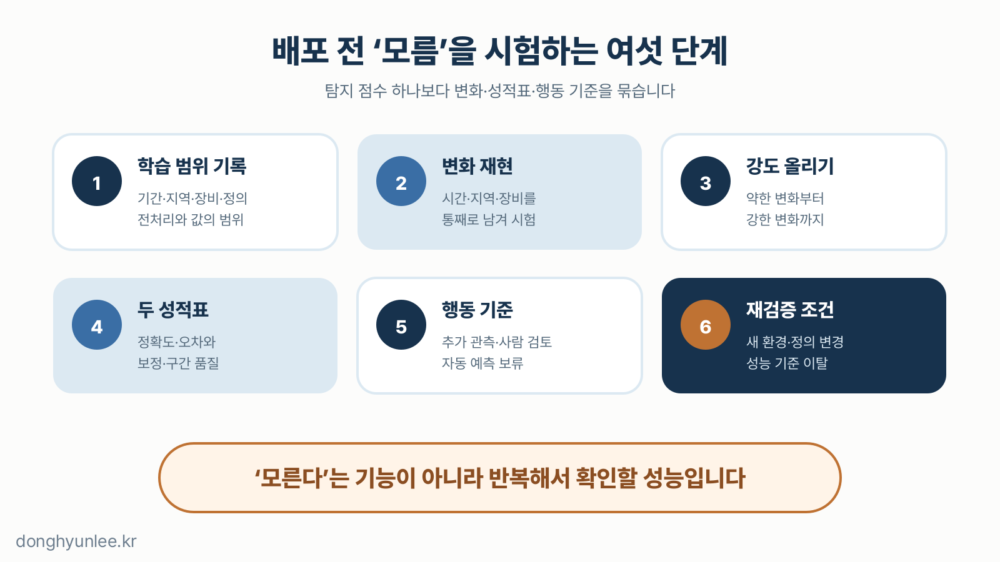

[지난 글](/posts/2026-07-26-mc-dropout-vs-deep-ensembles/)에서는 MC Dropout과 딥 앙상블로 예측 불확실성의 일부를 추정하는 방법을 살펴봤습니다. 같은 입력을 여러 번 예측해 답들이 얼마나 벌어지는지 보는 방식이었습니다.

**그렇다면 AI가 학습 때 보지 못한 데이터를 만나면, 예측들이 알아서 더 벌어질까요?**

그러면 좋겠지만 보장은 없습니다. 열과 단위가 모두 맞고 결측값도 없는데 계절·지역·관측 방식의 조합만 학습 데이터에 거의 없는 입력에도, 모델은 오류 메시지 없이 답을 내고 불확실성도 평소와 비슷하게 보일 수 있습니다.

_그림 1. 입력이 낯설다는 사실과 모델이 스스로 조심한다는 사실은 같지 않습니다._

이 질문은 제가 사용한 방법도 피하지 못합니다. 2024년 *Journal of Cleaner Production*에 발표한 연구에서 저는 ICNN에 MC Dropout을 결합해 PM10·PM2.5 예측값과 95% 불확실성 범위를 함께 산출했습니다.[1] 다만 불확실성 범위를 만들었다는 사실만으로 모든 계절·지역·관측 방식의 변화를 자동으로 알아챈다고 말할 수는 없어서, 제 방법에도 낯선 조건을 따로 재현하고 다시 검증하는 기준이 필요합니다.

## 30초 핵심

- 이 글에서는 OOD를 개별 입력의 낯섦을 경고하는 관점으로, 데이터 분포 변화를 학습 환경과 운영 환경의 분포가 달라진 상태를 보는 관점으로 구분합니다.
- 입력·결과 비율·입력과 결과의 관계가 달라지는 변화는 서로 다른 문제이며, 불확실성이 자동으로 커진다는 보장은 없습니다.
- 배포 전 예상 변화를 재현하고, 성능과 불확실성을 함께 점검하며, 사람 검토와 재검증 기준을 정해야 합니다.

## 1. OOD와 데이터 분포 변화

데이터의 분포는 값의 평균만이 아니라, 어떤 값이 얼마나 자주, 어느 범위에서, 어떤 조합으로 나타나는지까지 포함합니다.

<strong>데이터 분포 변화(dataset shift 또는 distribution shift)</strong>는 학습 데이터를 만든 패턴과 운영 데이터를 만든 패턴이 달라진 상태입니다. <strong>분포 밖 데이터(Out-of-Distribution, OOD)</strong>는 보통 운영 입력이 기준으로 정한 in-distribution과 다른 분포에서 왔는지를 묻는 문제이고, 판정에는 기준 분포와 탐지 점수, 임계값이 함께 필요합니다.[5] 두 용어의 경계는 연구마다 조금씩 달라, 이 글은 다음 작업상 구분을 따릅니다.

| 관점 | 주로 묻는 질문 | 단위 |
|---|---|---|
| 데이터 분포 변화 | 학습 환경과 지금의 데이터 생성 패턴이 달라졌는가 | 두 시기·두 데이터셋의 비교 |
| OOD 탐지 | 지금 들어온 이 입력은 익숙한 범위 안에 있는가 | 개별 입력 또는 입력 묶음 |

둘은 겹치지만 같지 않습니다. 각 입력은 익숙해 보이는데 특정 조건의 비율만 서서히 바뀌어, 어느 한 건도 선명한 OOD 경보로 걸리지 않는 분포 변화도 있습니다.

**OOD 경보는 오답 판정이 아니라 낯섦의 신호입니다.** 경보가 없다는 사실 역시 정답 보증서가 아닙니다.

## 2. 무엇이 달라졌는가 — 입력·비율·관계

분포 변화는 무엇이 달라졌는가를 기준으로 나누면 이해하기 쉽습니다. 아래 표에서 입력은 `X`, 예측하려는 결과는 `Y`입니다.

| 변화 | 무엇이 달라졌나 | 확인할 질문 | 단순화한 예 |
|---|---|---|---|
| 공변량 변화 (covariate shift) | `X`의 분포가 변함. `X`와 `Y`의 관계는 같다고 가정 | 예전보다 어떤 입력 조건이 더 자주 들어오는가 | 학습 때 드물던 온도·습도 조합이 운영 중 자주 나타남 |
| 결과 비율 변화 (label-prior shift) | 분류 결과 `Y`의 비율이 변함. 각 결과 안에서 `X`의 패턴은 같다고 가정 | 정상·주의 같은 결과 범주의 비율이 달라졌는가 | 주의 사례의 비율은 늘었지만, 주의 사례 안의 특징 패턴은 유지됨 |
| 관계 변화 (이 글에서의 concept drift) | 같은 `X`에서 `Y`의 조건부분포가 변함 | 같은 입력이 이제 다른 결과를 뜻하는가 | 결과 정의나 생성 메커니즘이 바뀌어 같은 관측값의 의미가 달라짐 |

공변량 변화는 학습 표본과 실제 대상의 입력 분포가 다른 문제로 오래 연구돼 왔고,[2] label shift는 분류 문제에서 결과 범주의 비율이 달라지되 각 범주 안의 입력 패턴은 유지된다는 가정을 둡니다.[3] Concept drift의 범위는 문헌마다 다른데, 이 글의 관계 변화는 그중 같은 `X`에 대한 `Y`의 조건부분포가 바뀌는 경우를 가리킵니다.[4]

실제 변화는 이 세 칸에 깔끔하게 나뉘지 않고 겹칠 수 있습니다. 그래서 “드리프트가 감지됐다”는 한 문장만으로 원인을 확정하지 말고, 표의 질문을 차례로 확인해 무엇이 달라졌는지 좁혀야 합니다.

특히 입력 데이터만 보고 이 글에서 말한 관계 변화가 없다고 확인할 수는 없습니다. 입력의 모양은 그대로인데 정답과의 관계만 바뀔 수 있고, 이런 변화는 실제 결과가 들어와야 드러나는 경우가 많습니다.

_그림 2. 분포 변화라는 한 이름 아래에서도 입력, 결과의 비율, 입력과 결과의 관계가 서로 다르게 바뀔 수 있습니다._

## 3. 불확실성은 자동으로 커지지 않는다

AI 모델은 “이 장면은 내 경험 밖이다”라고 성찰하지 않고 학습된 계산 규칙에 따라 숫자를 출력합니다. 일반적인 분류 신경망은 학습한 범주의 경계를 잘 나누도록 훈련될 뿐, 낯선 것을 찾아내는 능력이 자동으로 따라오지는 않습니다. Hendrycks와 Gimpel의 실험에서는 신경망이 틀린 사례나 OOD 사례에도 높은 softmax 점수를 낼 수 있었고, 그 점수 하나를 확신으로 곧바로 읽기 어렵다는 점을 보였습니다.[5] Hein과 동료들은 ReLU 계열 분류기의 특정 설정에서 학습 데이터에서 멀리 떨어진 영역에도 높은 확신의 예측이 나올 수 있음을 이론과 이미지 실험으로 분석했습니다.[6]

그렇다면 MC Dropout이나 딥 앙상블은 어떨까요. 두 방법이 보여 주는 것은 계산 경로나 따로 학습된 모델들의 의견 차이인데, 모두 같은 학습 데이터와 비슷한 구조, 같은 예측 목표를 공유할 수 있습니다. 공유된 맹점이 있다면 여러 예측이 틀린 방향으로 모일 수도 있습니다. 실제로 Ovadia와 동료들이 이미지·문서·광고 클릭·유전체 분류 설정에서 여러 추정법을 분포 변화 아래 비교한 실험에서는 변화가 커질수록 정확도와 불확실성의 품질이 함께 나빠졌고, 딥 앙상블이 대부분 지표에서 비교적 강했지만 연구진은 개선할 여지가 크다고 결론 내렸습니다.[7]

> 여러 번 예측해 불확실성을 계산하는 것과, 낯선 데이터에서 그 불확실성이 제대로 반응하는 것은 별도의 검증 문제입니다.

제가 2024년 미세먼지 연구에서 사용한 MC Dropout도 이 원칙의 예외가 아닙니다. 그 논문이 보여 준 것은 해당 연구 설정에서의 결과이며,[1] 그 사실을 모든 지역·기간·관측 방식의 변화에 대한 자동 경보로 넓혀 말해서는 안 됩니다.

그래서 운영에서는 다음 세 신호를 분리해 봐야 합니다.

| 신호 | 답하는 질문 | 이것만으로 알 수 없는 것 |
|---|---|---|
| 입력 변화·OOD 점수 | 탐지기가 이 입력을 기준 데이터와 비교해 얼마나 비전형적으로 평가하는가 | 실제 예측이 틀렸는가 |
| 예측 불확실성 | 모델·경로의 답이 얼마나 흔들리는가 | 입력이 OOD인가, 범위가 현실의 오차와 맞는가 |
| 최근 정답 성적표 | 실제 성능·보정·구간 품질이 유지되는가 | 아직 정답이 들어오지 않은 현재 입력의 결과 |

OOD 점수는 보편적인 확률이나 공통 거리척도가 아니어서 사용한 탐지 방법·기준 데이터·임계값과 함께 해석해야 합니다. 세 신호가 어긋날 때가 더 중요합니다. 입력은 낯선데 불확실성은 낮거나 입력은 익숙한데 최근 오차가 커진다면, 사람이 검토하고 재검증하라는 신호입니다.

## 4. 배포 전 스트레스 테스트

세상의 모든 낯선 데이터를 미리 모을 수는 없으니, 예상 가능한 변화부터 일부러 만들어 모델의 반응을 시험합니다. 배포 전 점검표는 다음과 같습니다.

- **학습 범위를 한 장에 적습니다.**  
   기간, 지역·기관, 장비, 단위, 전처리, 결측 처리, 주요 변수 범위, 결과 정의를 기록해 “학습 데이터와 비슷함”을 실제 비교 항목으로 바꿉니다.

- **예상 변화를 데이터 분할로 재현합니다.**  
   무작위 분할만 보지 않고 더 늦은 기간, 보지 않은 지역·기관, 다른 장비·수집 조건을 통째로 남겨 시험합니다.

- **변화 유형별 강도를 여러 단계로 시험합니다.**  
   다만 이 강도는 변화 유형끼리 비교하는 공통 척도가 아니고, OOD 데이터셋 하나만 통과했다고 모든 낯선 입력에 대비한 것도 아닙니다.

- **두 장의 성적표를 함께 봅니다.**  
   정확도·오차 같은 예측 성능이 첫 장, 확률의 보정과 예측구간의 포함률·폭이 둘째 장입니다. “틀렸는가”와 “모른다고 제대로 말했는가”는 다른 질문이기 때문입니다.

- **경보 뒤의 행동을 미리 정합니다.**  
   어느 수준에서 추가 관측을 요청하고, 사람이 다시 보고, 자동 예측을 보류할지 정합니다. 임계값은 오경보·미탐지의 비용과 검토 인력에 따라 달라져 하나의 보편적 숫자는 없습니다.

- **재검증 조건을 운영 기록에 넣습니다.**  
   새 계절·지역·장비 추가, 전처리·결과 정의 변경, 입력 변화 지속, 최근 성능·보정·구간 품질 이탈이 그 조건입니다. 재학습한 모델은 새 모델이므로 같은 절차를 반복합니다.

_그림 3. OOD 대응은 탐지 점수 하나가 아니라 변화 시나리오·두 성적표·행동 기준·재검증 조건을 묶는 일입니다._

정답이 늦게 들어오는 과제라면 입력 변화·OOD 점수는 이른 경보, 정답이 쌓인 뒤의 실제 성능·불확실성 품질은 지연 성적표입니다. 이른 경보만으로 재학습을 결정하기보다 무엇이 바뀌었는지 살피고 최근 정답으로 성능 저하를 확인하며, 입력 경보가 조용해도 정답 성적표가 무너지면 재검증해야 합니다.

## 마무리

AI가 낯선 데이터를 만나면 정말 “모른다”고 말할까요. 답은 **방법 이름만으로는 알 수 없다**입니다. MC Dropout·딥 앙상블도 OOD 탐지도 유용하지만, 어느 것도 계절·지역·관측 방식이 바뀐 현장에서 자동으로 작동한다는 보증서는 아닙니다.

그래서 저는 “우리 모델은 모를 때 안다”는 소개 문구보다 “어떤 변화를 낯설다고 볼지 정했고, 그 변화에서 성능과 불확실성을 함께 시험했으며, 기준을 벗어나면 사람이 검토하고 다시 검증한다”는 운영 기록을 더 신뢰합니다.

---

## 관련 글

- [AI는 ‘모른다’를 어떻게 계산할까 — MC Dropout과 딥 앙상블의 차이](/posts/2026-07-26-mc-dropout-vs-deep-ensembles/)
- [AI 예측은 왜 ‘하나의 숫자’로 답하면 안 될까 — 점추정에서 신뢰구간의 시대로](/posts/2026-07-07-ai-uncertainty-interval/)

## 출처

[1] Lee, D., & Lee, B. (2024). *Building reliable AI for quantifying uncertainty in particulate matter predictions with deep learning.* Journal of Cleaner Production, 473, 143457. https://doi.org/10.1016/j.jclepro.2024.143457

[2] Shimodaira, H. (2000). *Improving predictive inference under covariate shift by weighting the log-likelihood function.* Journal of Statistical Planning and Inference, 90(2), 227–244. https://doi.org/10.1016/S0378-3758(00)00115-4

[3] Lipton, Z. C., Wang, Y.-X., & Smola, A. J. (2018). *Detecting and Correcting for Label Shift with Black Box Predictors.* Proceedings of the 35th International Conference on Machine Learning, PMLR 80, 3122–3130. https://proceedings.mlr.press/v80/lipton18a.html

[4] Widmer, G., & Kubat, M. (1996). *Learning in the Presence of Concept Drift and Hidden Contexts.* Machine Learning, 23, 69–101. https://doi.org/10.1023/A:1018046501280

[5] Hendrycks, D., & Gimpel, K. (2017). *A Baseline for Detecting Misclassified and Out-of-Distribution Examples in Neural Networks.* International Conference on Learning Representations. https://openreview.net/forum?id=Hkg4TI9xl

[6] Hein, M., Andriushchenko, M., & Bitterwolf, J. (2019). *Why ReLU Networks Yield High-Confidence Predictions Far Away From the Training Data and How to Mitigate the Problem.* Proceedings of the IEEE/CVF Conference on Computer Vision and Pattern Recognition, 41–50. https://openaccess.thecvf.com/content_CVPR_2019/html/Hein_Why_ReLU_Networks_Yield_High-Confidence_Predictions_Far_Away_From_the_CVPR_2019_paper.html

[7] Ovadia, Y. et al. (2019). *Can You Trust Your Model's Uncertainty? Evaluating Predictive Uncertainty Under Dataset Shift.* Advances in Neural Information Processing Systems 32. https://proceedings.neurips.cc/paper_files/paper/2019/hash/8558cb408c1d76621371888657d2eb1d-Abstract.html

저자는 이 분야에서 AI Korea를 통해 관련 서비스를 제공하고 있습니다. 이 글은 특정 제품·서비스의 홍보가 아닙니다.

예측 결과는 언제나 불확실성을 포함합니다. 방역·환경 정책 의사결정의 단독 근거가 될 수 없습니다.

───────────────────────────────
**이해관계 및 책임 고지**

이동현은 한국외국어대학교 Social Science & AI융합학부 교수이자 한국인공지능 주식회사(AI Korea Inc.)의 대표입니다.
이 글의 견해는 저자 개인의 것이며, 소속 기관이나 연구과제 발주처의 공식 입장이 아닙니다.

이 글은 일반적인 정보 제공과 교육을 목적으로 합니다. 특정 사안에 대한 자문이나
정책 권고가 아니며, 실제 의사결정의 단독 근거로 사용될 수 없습니다.

사실에 오류가 있다면 알려주십시오.
───────────────────────────────
