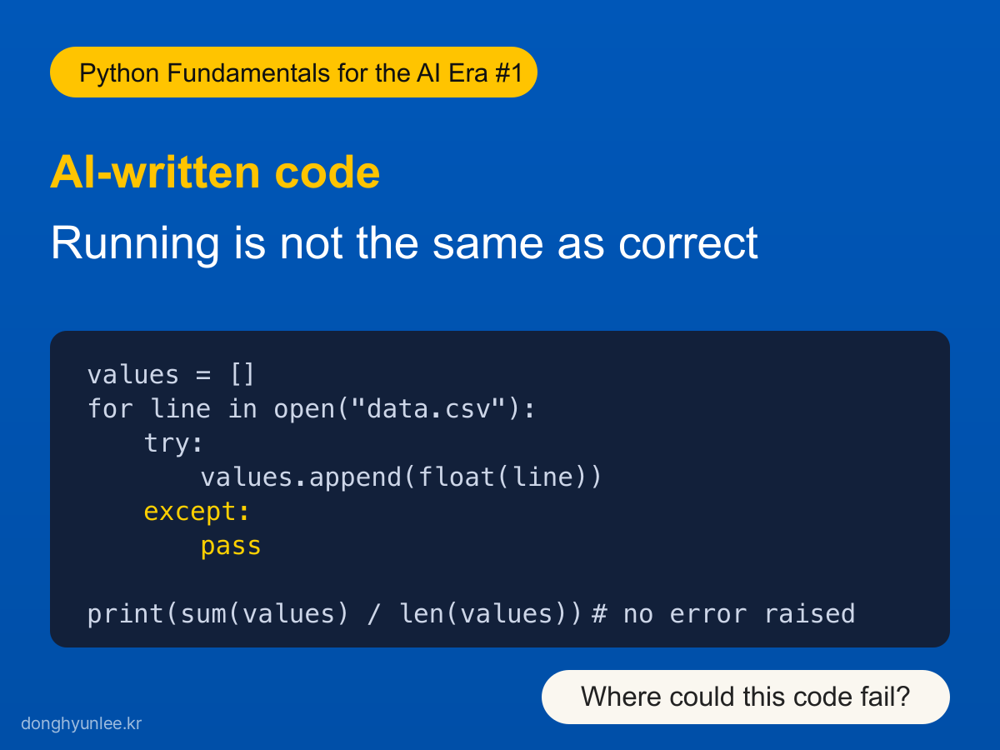
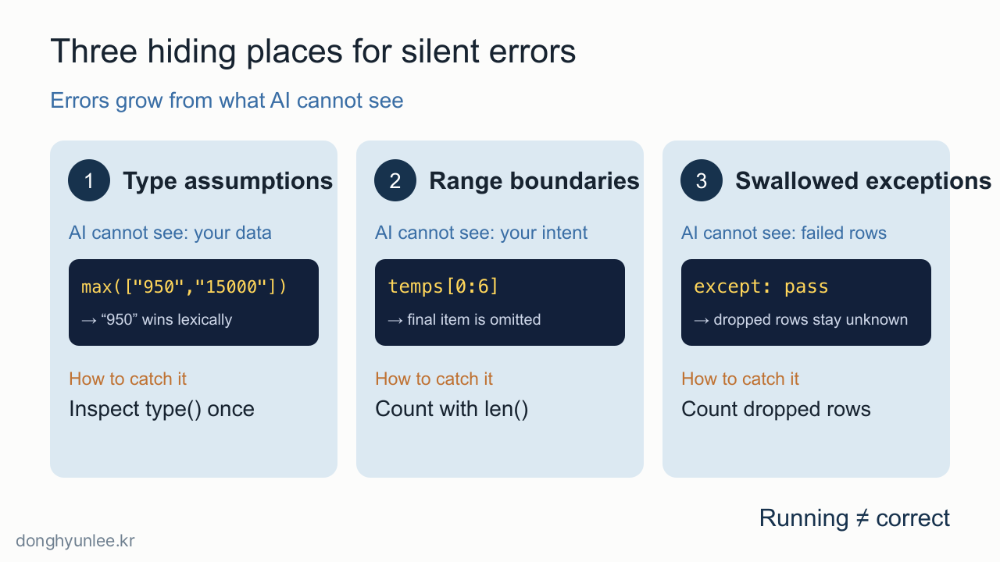
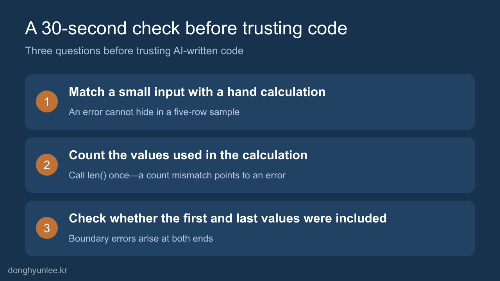

**Python Fundamentals for the AI Era #1**

Let me begin with a piece of code. Ask AI to “read numbers from a file and calculate their average,” and you may receive something as neat-looking as this:

```python
values = []
for line in open("data.csv"):
    try:
        values.append(float(line))
    except:
        pass

print(sum(values) / len(values))
```

Run it, and it finishes without an error. It prints a plausible-looking number as the average.

**What makes this code dangerous?** I will reveal the answer later in the article. For now, one hint: this code will never stop when it is wrong.

## The 30-Second Takeaway

- Code that finishes without an error is not verified code. It is code that does not yet appear to be wrong.
- Silent errors in AI-written code recur in three places: assumptions about data types, range boundaries, and swallowed exceptions—the places where AI cannot see your data or your intent.
- Before trusting the output, spend 30 seconds checking a small input by hand, counting how many values entered the calculation, and confirming whether the first and last values were included.



_Figure 1. Code that runs is not necessarily code that is correct._

## 1. Silent Code Is More Dangerous Than Code That Raises an Error

In the [previous article](/en/posts/2026-07-14-python-still-needed/), I described two kinds of errors. A loud error that stops execution announces its own existence, so feeding the error message back to AI will resolve it in most cases. The problem is the **silent error**: code that runs to completion without an error and even produces a plausible value.

The previous article reached the conclusion that we therefore need the ability to verify. This article takes up the next question: **Where should we look?**

Fortunately, silent errors do not arise everywhere. AI writes syntactically correct code. But there are three things it cannot see: **the actual data inside my file, the precise intent in my head, and the failure conditions that will arise in practice.** Silent errors are born regularly in these three places. Because their locations are predictable, we can define verification points in advance.

While grading in the classroom, I see this difference repeatedly. A student whose code raises an error at least knows with certainty that something is wrong. A student whose code runs usually feels sure that it is correct. That is why working but incorrect code is much harder to discover. There is no signal that it is wrong, and no one suspects it.



_Figure 2. Silent errors live in three places the AI cannot see._

## 2. The First Hiding Place — Why the Largest Value Becomes “950”

Suppose we read prices from a CSV file and ask AI to find the highest one. It produces this code:

```python
prices = ["1200", "950", "15000", "800"]
print(max(prices))
```

The output is `950`, even though 15000 is plainly present.

Values read from the file are **strings** enclosed in quotation marks, and strings are ordered lexicographically rather than numerically. Just as a word beginning with “9” would come after one beginning with “1” in this ordering, `"950"` is judged greater than `"15000"`. The calculation succeeds; only the answer is wrong.

The reason AI writes code like this is simple: **it cannot open and inspect my file.** It has to assume whether the values are numbers or strings. Even when that assumption is wrong, Python helpfully continues the calculation. With four values, we notice the error by eye. If four hours of data contain 40,000 rows, no one may notice.

The check takes one line: use `type()` to inspect one value before calculating, or verify that the code converts values with `float()`.

## 3. The Second Hiding Place — A Seven-Day Average Calculated from Six Days

This code calculates the average temperature over the last seven days.

```python
temps = [27, 29, 31, 30, 28, 26, 25]
week = temps[0:6]
print(sum(week) / 7)
```

The output is `24.42...`, which looks plausible. The correct answer is 28.0.

The Python slice `[0:6]` returns six values because the ending index is excluded. The final day, 25 degrees, silently disappears, but the sum is still divided by 7, distorting the average twice over. The code has no reason to stop.

This kind of boundary mismatch occurs more often not in the first draft written by AI, but **when a person edits AI-generated code**. When requirements change to “through yesterday” or “excluding the first week,” a boundary can easily shift by one, and a shifted boundary does not raise an error. Neither AI nor Python can inspect the intent in our head.

Again, the check takes one line: print `len(week)` to count the values, then confirm that the first and last values are the ones you intended.

## 4. The Third Hiding Place — A `try` Block That Swallows Errors (the Answer to the Opening Code)

Now return to the opening code. The danger lies in these two lines:

```python
    except:
        pass
```

They mean: “If something goes wrong, just move on.” Whether the file contains a header, a blank line, or an entry marked “N/A,” the code silently discards that line and calculates the average from whatever remains. Even if 400 of 1,000 lines are discarded, the only output is one perfectly ordinary-looking number. No one—not even the code itself—knows how many lines were lost.

In my experience, this pattern is especially characteristic of AI-generated errors. AI is trained to treat “code that does not raise an error” as what the user wants, so when it encounters a failure condition it tends to wrap the problem and continue rather than stop and report it. The code looks more robust, but in reality it has **closed off its own channel for signaling that something is wrong**.

Filling values incorrectly can be just as dangerous as dropping them. One of the most painful silent errors I have encountered in practical data analysis arose here. Missing intervals were filled by interpolation during preprocessing, but the interpolation used values from future time points through two-sided interpolation. This leakage of future information is called <strong>look-ahead bias</strong>. It does not raise an error either. Instead, the data become contaminated from that point onward, and the entire analysis built on top of them loses its meaning. In practice, it causes predictive performance to be overestimated. In analyses that use interpolation, we begin by checking “which time point’s information was used to create each filled value.”

The way to catch the error is to count what was dropped. Replacing `pass` inside `except` with a counter and printing “Skipped N lines” at the end is enough to make the error stop being silent.

## 5. Three Questions to Ask in 30 Seconds Before Trusting Code That Ran

This verification routine checks all three hiding places at once. You can begin even if you cannot yet read code, and it is worth learning before Python syntax.

1. **Compare a small input with a hand calculation.** Give the code five values and compare the output with an answer you calculated mentally. An error that hides in 40,000 rows cannot hide in five.
2. **Count how many values entered the calculation.** One call to `len()` is enough. If the number supplied differs from the number calculated, the discrepancy is the silent error confessing.
3. **Check whether the first and last values were included.** Boundary errors occur at the ends. Checking only the beginning and end catches many of them.

One of these is also the first check I actually perform when I receive a result.



_Figure 3. Ask these three questions before trusting code that runs._

“How do I verify AI-generated code?” sounds like a large question, but the answer begins small: do not relax simply because there was no error. Spend 30 seconds examining these three places. This habit is the first muscle of the “ability to verify” discussed in the previous article.

But what should we do on a day when the code stops loudly? If you have been pasting the entire red error message into AI without reading it, the next article will explain how to spend 30 seconds reading that red text before asking AI.

**Python Fundamentals for the AI Era**

- Previous article: [If AI Writes All the Code, Do We Still Need to Learn Python?](/en/posts/2026-07-14-python-still-needed/)

This series grows out of the same concerns as the book *Python Fundamentals for the AI Era*, scheduled for publication in September.

**Disclosure of Interests and Responsibility**

The author wrote the 2026 book *Python Fundamentals for the AI Era*, which addresses this topic.

Donghyun Lee is a professor in the Division of Social Science & AI at Hankuk University of Foreign Studies and the CEO of AI Korea Inc.
The views expressed in this article are the author’s own and do not represent the official position of his affiliated institutions or the organizations commissioning his research projects.

This article is intended for general informational and educational purposes. It is not advice or
a policy recommendation for any particular matter, and must not be used as the sole basis for real-world decisions.

If you find a factual error, please let me know.
