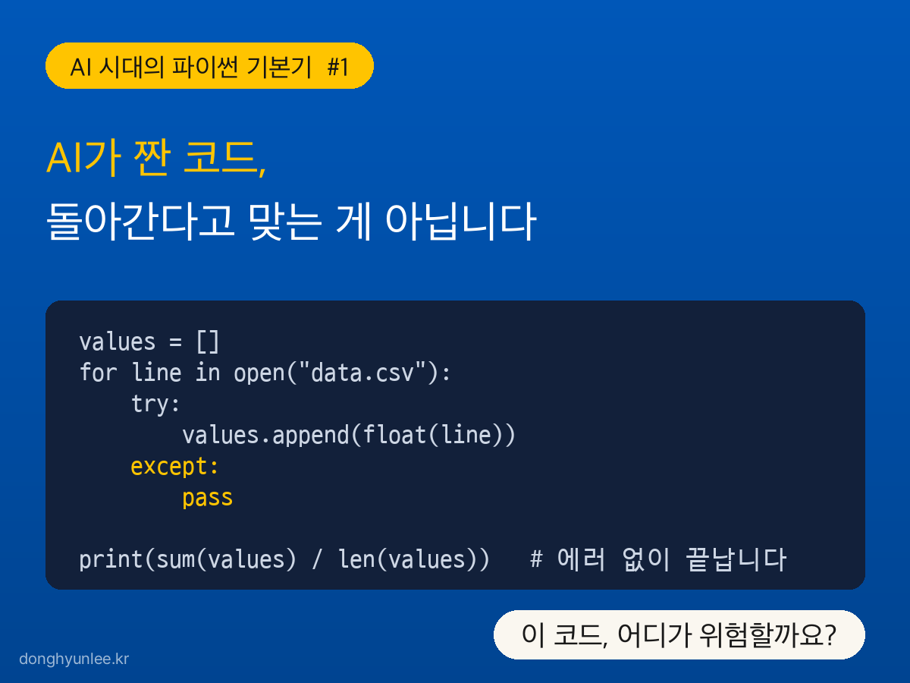
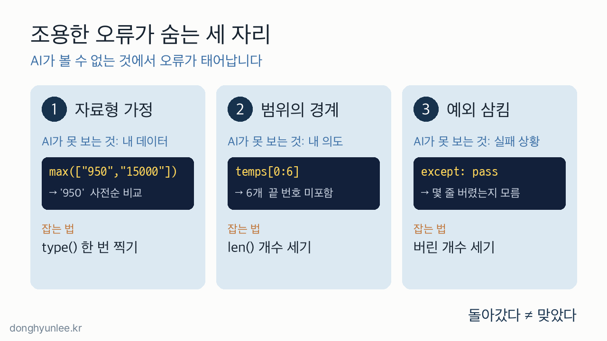
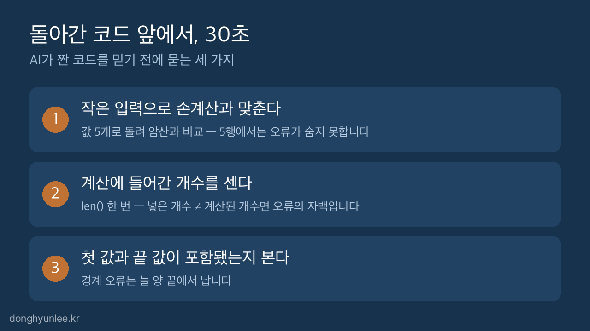

**AI 시대의 파이썬 기본기 #1**

먼저 코드 하나를 보여드리겠습니다. AI에게 "파일에서 숫자를 읽어 평균을 구해 줘"라고 부탁하면 흔히 받게 되는, 아주 정갈해 보이는 코드입니다.

```python
values = []
for line in open("data.csv"):
    try:
        values.append(float(line))
    except:
        pass

print(sum(values) / len(values))
```

실행하면 에러 없이 끝나고, 평균이라며 그럴듯한 숫자를 출력합니다.

**이 코드의 어디가 위험할까요?** 답은 글 뒤에서 공개하겠습니다. 힌트를 하나만 드리면 — 이 코드는 틀려도 절대 멈추지 않습니다.

## 30초 핵심

- 에러 없이 끝난 코드는 검증된 코드가 아니라, 아직 안 틀린 것처럼 보이는 코드입니다.
- AI 코드의 조용한 오류는 자료형 가정·범위의 경계·예외 삼킴, 즉 AI가 내 데이터와 내 의도를 볼 수 없는 세 자리에서 반복됩니다.
- 실행 결과를 믿기 전 30초 — 작은 입력 손계산, 계산에 들어간 개수, 첫 값과 끝 값의 포함 여부를 확인합니다.



_그림 1. 돌아가는 코드와 맞는 코드는 다릅니다._

## 1. 에러가 나는 코드보다 조용한 코드가 위험합니다

[지난 글](/posts/2026-07-14-python-still-needed/)에서 오류에는 두 종류가 있다고 했습니다. 실행하다 멈추는 시끄러운 오류는 스스로 정체를 밝히니, 에러 메시지를 AI에게 되돌려주면 대부분 해결됩니다. 문제는 에러 없이 끝까지 실행되고 그럴듯한 값까지 내놓는 **조용한 오류**입니다.

지난 글이 "그래서 검증하는 능력이 필요하다"까지였다면, 이번 글은 그 다음 질문을 다룹니다. **그래서 어디를 봐야 하는가.**

다행히 조용한 오류는 아무 데서나 나오지 않습니다. AI는 코드를 문법적으로 정확하게 씁니다. 대신 AI에게는 보이지 않는 것이 세 가지 있습니다. **내 파일 안의 실제 데이터, 내 머릿속의 정확한 의도, 그리고 실제로 벌어질 실패 상황.** 조용한 오류는 이 세 자리에서 규칙적으로 태어납니다. 자리가 정해져 있으니, 검증 포인트도 미리 정할 수 있습니다.

강의실에서 채점을 하다 보면 이 차이를 매번 봅니다. 에러가 난 학생은 적어도 자기 코드가 틀렸다는 사실만큼은 확실히 압니다. 반대로 코드가 돌아간 학생은 대부분 맞았다고 확신합니다. 그래서 동작하는데 잘못된 코드가 훨씬 발견하기 어렵습니다. 틀렸다는 신호도 없고, 의심하는 사람도 없기 때문입니다.



_그림 2. AI가 볼 수 없는 세 가지가 조용한 오류의 주소지입니다._

## 2. 첫 번째 자리 — 가장 큰 값이 '950'이 되는 이유

CSV 파일에서 가격을 읽어 왔습니다. 가장 비싼 값을 찾아 달라고 하니 AI가 이렇게 짰다고 해 보겠습니다.

```python
prices = ["1200", "950", "15000", "800"]
print(max(prices))
```

출력은 `950`입니다. 15000이 버젓이 있는데도 그렇습니다.

파일에서 읽은 값은 따옴표가 붙은 **문자열**이고, 문자열의 크기 비교는 숫자가 아니라 사전 순서로 이루어집니다. 사전에서 '9'로 시작하는 단어가 '1'로 시작하는 단어보다 뒤에 오듯, `"950"`이 `"15000"`보다 큰 값으로 판정됩니다. 계산은 성공했고, 결과만 틀렸습니다.

AI가 이런 코드를 짜는 이유는 단순합니다. **AI는 내 파일을 열어 보지 못합니다.** 값이 숫자인지 문자열인지는 가정할 수밖에 없고, 그 가정이 어긋나도 파이썬은 친절하게 계산을 계속해 줍니다. 데이터가 네 개면 눈으로 잡아내지만, 네 시간짜리 데이터가 4만 행이면 아무도 눈치채지 못합니다.

잡는 법은 한 줄입니다. 계산 전에 `type()`으로 값 하나의 정체를 찍어 보거나, `float()` 변환이 들어 있는지 확인합니다.

## 3. 두 번째 자리 — 7일 평균인데 6일만 계산됩니다

최근 7일 기온의 평균을 구하는 코드입니다.

```python
temps = [27, 29, 31, 30, 28, 26, 25]
week = temps[0:6]
print(sum(week) / 7)
```

출력은 `24.42...` — 그럴듯합니다. 정답은 28.0입니다.

파이썬의 범위 자르기 `[0:6]`은 여섯 개를 가져옵니다. 끝 번호는 포함되지 않기 때문입니다. 마지막 날 25도는 조용히 빠졌는데, 나누기는 7로 했으니 평균이 이중으로 어긋났습니다. 그래도 코드는 멈출 이유가 없습니다.

이런 경계 어긋남은 AI가 처음 짠 코드보다, **AI 코드를 사람이 고치는 순간**에 더 자주 생깁니다. "어제까지만", "첫 주 빼고"처럼 요구를 바꾸다 보면 경계 하나가 밀리기 쉽고, 밀린 경계는 에러를 내지 않습니다. 머릿속 의도는 AI도 파이썬도 확인해 주지 않습니다.

잡는 법도 한 줄입니다. `len(week)`를 찍어 개수를 세고, 첫 값과 끝 값이 내가 생각한 그 값인지 봅니다.

## 4. 세 번째 자리 — 오류를 삼키는 try (도입 코드의 정답)

이제 도입의 코드로 돌아가겠습니다. 위험한 곳은 이 두 줄입니다.

```python
    except:
        pass
```

"문제가 생기면 그냥 넘어가라"는 뜻입니다. 파일에 제목 줄이 있어도, 빈 줄이 있어도, 누가 "N/A"라고 적어 놓았어도 — 이 코드는 그 줄들을 소리 없이 버리고 남은 값으로만 평균을 냅니다. 천 줄 중 사백 줄이 버려져도 출력되는 것은 멀쩡한 숫자 하나입니다. 몇 줄이 버려졌는지는 아무도, 코드 자신조차 모릅니다.

제 경험상 이 패턴은 특히 AI다운 오류입니다. AI는 "에러가 나지 않는 코드"를 요청받는다고 학습돼 있어서, 실패 상황을 마주하면 멈추고 알리는 쪽보다 감싸고 지나가는 쪽을 고르는 경향이 있습니다. 겉보기에는 더 안정적인 코드가 됐지만, 실제로는 **틀렸다는 신호를 낼 통로를 코드 스스로 막아 버린 것**입니다.

그리고 버리는 것 못지않게 위험한 쪽이 잘못 채우는 것입니다. 많은 데이터 분석 실무에서 겪은 가장 뼈아픈 무음 오류도 여기서 나옵니다. 데이터 전처리에서 결측 구간을 보간으로 채웠는데, 그 보간에 양측 보간을 통해 미래 시점의 데이터가 섞여 든 것입니다. 이런 미래 정보 유입을 <strong>룩어헤드 바이어스(look-ahead bias)</strong>라고 부르는데, 역시 에러는 나지 않습니다. 대신 데이터가 그 지점부터 오염되고, 그 위에서 이어진 분석은 통째로 의미를 잃습니다. 실제로 예측 성능을 과대 평가 하게 됩니다. 저희는 보간이 들어간 분석에서 '채운 값이 어느 시점의 정보로 만들어졌는지'부터 확인합니다.

잡는 법은 버리는 개수를 세는 것입니다. `except`에서 `pass` 대신 버린 줄 수를 하나씩 세어 마지막에 "몇 줄을 건너뛰었습니다"라고 출력하게만 해도, 이 오류는 조용할 수 없게 됩니다.

## 5. 돌아간 코드 앞에서 묻는 30초 세 가지

세 자리를 한 번에 훑는 검증 루틴입니다. 코드를 읽을 줄 몰라도 시작할 수 있고, 파이썬 문법보다 먼저 익힐 가치가 있습니다.

1. **작은 입력으로 손계산과 맞춘다.** 값 다섯 개짜리 데이터를 넣고, 암산한 답과 출력을 비교합니다. 4만 행에서는 숨는 오류가 다섯 행에서는 숨지 못합니다.
2. **계산에 들어간 개수를 센다.** `len()` 한 번이면 됩니다. 넣은 개수와 계산된 개수가 다르다면, 그 차이가 곧 조용한 오류의 자백입니다.
3. **첫 값과 끝 값이 포함됐는지 본다.** 경계 오류는 늘 양 끝에서 납니다. 처음과 끝만 확인해도 절반은 잡힙니다.

제가 결과를 받았을 때 실제로 가장 먼저 하는 확인도 이 중 하나입니다.



_그림 3. 돌아간 코드를 믿기 전에 묻는 세 가지입니다._

"AI가 짠 코드를 어떻게 검증하죠?"라는 질문은 크게 들리지만, 시작은 이렇게 작습니다. 에러가 없다는 사실에 안심하지 않고, 30초를 들여 세 자리를 들여다보는 것. 이 습관이 지난 글에서 말한 '검증하는 능력'의 첫 근육입니다.

그런데 코드가 시끄럽게 멈춰 버린 날은 어떻게 해야 할까요. 빨간 에러 메시지를 읽지 않고 통째로 AI에 붙여넣고 계셨다면 — 다음 글에서는 그 빨간 글자를 AI에게 묻기 전에 30초만 먼저 읽는 법을 다룹니다.

**AI 시대의 파이썬 기본기**

- 이전 글: [AI가 코드를 다 짜주는데, 파이썬을 배워야 할까요](/posts/2026-07-14-python-still-needed/)

이 시리즈는 9월 출간 예정인 책 『AI 시대의 파이썬 기본기』와 같은 문제의식에서 출발했습니다.

───────────────────────────────
**이해관계 및 책임 고지**

저자는 이 주제를 다룬 책 『AI 시대의 파이썬 기본기』(2026)의 저자입니다.

이동현은 한국외국어대학교 Social Science & AI융합학부 교수이자 한국인공지능 주식회사(AI Korea Inc.)의 대표입니다.
이 글의 견해는 저자 개인의 것이며, 소속 기관이나 연구과제 발주처의 공식 입장이 아닙니다.

이 글은 일반적인 정보 제공과 교육을 목적으로 합니다. 특정 사안에 대한 자문이나
정책 권고가 아니며, 실제 의사결정의 단독 근거로 사용될 수 없습니다.

사실에 오류가 있다면 알려주십시오.
───────────────────────────────
