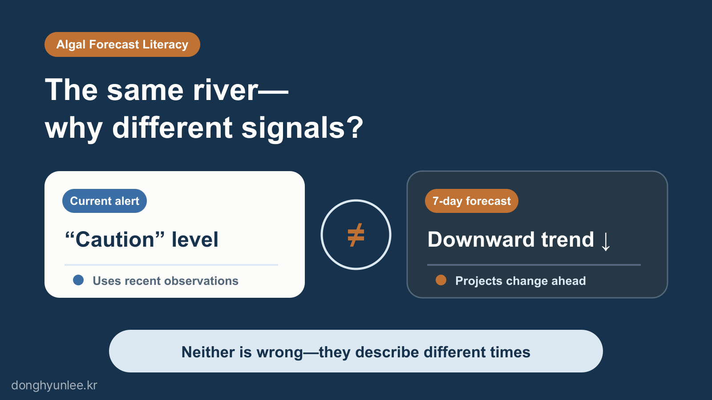
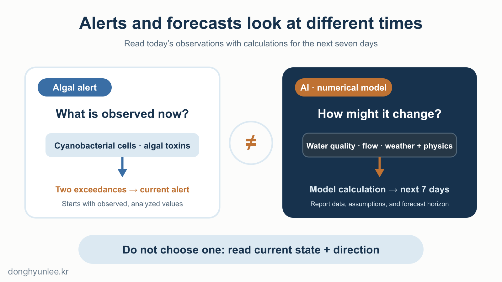
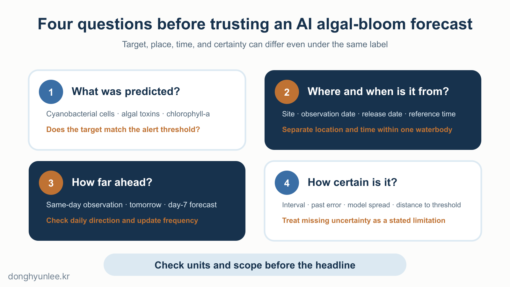

Consider two hypothetical sites.

Site A is under a “Caution” algal bloom alert today, but its seven-day forecast line points downward. Site B has no alert yet, but its forecast line points upward. Which should we trust more?

The answer is not to choose one. **An algal bloom alert describes the observed present, while an AI or numerical-model forecast describes a future calculated by a model.** They answer questions about different points in time, so a difference between them does not mean that one is wrong.

_Figure 1. Algal alerts and AI forecasts answer questions about different times._

## The 30-Second Takeaway

- An algal bloom alert reports the current state from observations; AI and numerical-model forecasts estimate how it may change.
- In 2026, algal bloom forecasts provide information for the next seven days at 13 drinking-water source sites, but alerts and forecasts may concern different targets and times.
- To read algal bloom information well, check the forecast target, site, reference time, horizon, and uncertainty together.

## 1. “Caution” and “Warning” Turn Today’s Observations into Alert Levels

An algal bloom alert level is not assigned directly by a forecasting algorithm. It is issued by comparing samples collected and analyzed at monitoring sites with thresholds defined by law.

Under the criteria for drinking-water source zones in the Enforcement Decree of the Water Environment Conservation Act in force in March 2026, “Caution” (관심) applies when the cyanobacterial cell count is at least 1,000 cells/mL in two consecutive observations. “Warning” (경계) applies when the cyanobacterial cell count is at least 10,000 cells/mL in two consecutive observations or algal toxin is at least 10 μg/L. “Major Bloom” (조류대발생) applies when the cyanobacterial cell count is at least 1,000,000 cells/mL in two consecutive observations.[2]

Three points are easy to miss in this structure.

- An alert begins with an **observed value, not a forecast**.
- A single value above a threshold is not the same as an official alert. The criteria for issuing and lifting alerts look at two consecutive observations.
- Even when values are all described as measures of an “algal bloom,” cyanobacterial cell counts, algal toxin, and chlorophyll-a concentration are different measurement targets.

Do not see the label “Caution” and read it as a model predicting that tomorrow will also be at the caution level. First check what was measured, where, and when to produce that label.

For example, suppose the algal-toxin threshold is not exceeded and the current cyanobacterial cell count is 12,000 cells/mL, but the previous observation was below 10,000 cells/mL. The requirement of two consecutive observations for “Warning” has not yet been met. That is why a recent measurement and the official alert level can appear inconsistent. Understanding this timing rule before reading the color coding prevents a misreading of the number.

## 2. AI and Numerical Models Ask About the Next Seven Days

In May 2026, Korea’s National Institute of Environmental Research began using AI alongside existing methods for algal bloom forecasting. The plan was to combine an existing three-dimensional numerical model with an AI model trained on historical water-quality, water-quantity, and meteorological data, and to provide information about algal bloom occurrence over the following seven days. The number of drinking-water source sites covered increased from 9 to 13, and forecast information is published on the Mulmoa platform every Monday and Thursday from May through October.[1]

Using numerical models and AI together is a natural structure. A numerical model calculates water flows and physical dynamics; AI learns recurring patterns from historical data. Combining them does not make the future certain. The observations and weather forecasts used as inputs, the model structures, and the periods and sites included in training all leave their imprint on the result.

If the two models point in different directions, do not average them into one number and hide the disagreement. Treat it as a signal to investigate which differences in inputs and assumptions produced the divergence. Disagreement between models is inconvenient information, but it is not noise that should be concealed. If we record the conditions under which each model was wrong when the next observation arrives, forecasting becomes a validation record rather than a one-off attempt to guess the right answer.

_Figure 2. An alert reports the observed present; a forecast shows how a model expects conditions to change._

Distinguishing the forecast target is important here. In a 2025 study published in the *Journal of Cleaner Production*, H. Jeon and I used weekly time series from multiple freshwater monitoring sites between 2016 and 2022 to predict **chlorophyll-a concentration** with a one-dimensional convolutional neural network. We also repeated CAM 1,000 times across different initializations so that a single explanation would not depend too heavily on chance.[3]

The chlorophyll-a concentration predicted by this model, however, is not the same target as the cyanobacterial cell count or algal toxin used in the current alert system. Reading the study as a direct prediction of alert levels would change the question the model answered.

## 3. When Alerts and Forecasts Differ, Read Them as a Combination

Separating the algal bloom alert into current state and the seven-day forecast into future direction produces four combinations. The following table is a simplified exercise in judgment; it does not replace official alert actions.

| Current observation or alert | Seven-day forecast direction | How to read the combination |
|---|---|---|
| Low | Rising | The absence of an alert now does not conflict with the possibility of a future increase. Treat it as an early signal and check it against the next observation. |
| High | Falling | A forecast decline does not cancel the current alert. Record both the observed present and the expected direction of improvement. |
| High | Rising | Current observations and the forecast direction send the same signal. You still need to confirm the site and target to which each applies. |
| Low | Falling | The information is relatively consistent for that site and forecast horizon. It does not mean that other sites or times beyond the forecast horizon are safe. |

It is not enough to look only at whether the forecast line rises or falls. We also need to see how far it is from the alert threshold, when within the forecast horizon its direction changes, and when the latest observation was incorporated. A number close to a threshold may be colored “not Caution” or “Caution,” but that does not make the two states separate worlds.

## 4. Four Things to Check Before Trusting an “Algal Bloom Forecast”

First, check **what was predicted**. Cyanobacterial cell count, algal toxin, chlorophyll-a concentration, and alert level are not interchangeable. The headline “algal bloom forecast” hides this difference.

Second, check **which place and time the information describes**. Even within the same river or lake, values can differ across monitoring sites. Distinguishing the observation date, publication date, and forecast reference time makes the word “latest” concrete.

Third, check **how far ahead the forecast extends**. An observation today, a forecast for tomorrow, and a forecast for day seven do not carry the same weight. It is better to read the direction for each date and the update cycle together than to look only at the final point in the forecast horizon.

Fourth, ask **whether uncertainty is visible**. If only one number is provided, look for whatever information is available among a prediction interval, past error, differences between AI and numerical models, and distance from the alert threshold. If some of these are not shown, do not invent values to fill the gaps. Leave them as limitations that cannot be checked.

_Figure 3. Before trusting the label “algal-bloom forecast,” ask what, where, when, and how certain._

These criteria do not apply only to forecasts from public agencies. Models that I have researched or provide through related services are validated only within the ranges defined by their training periods, monitoring sites, and prediction targets. Moving to a new site, climate condition, or observation method requires revalidation. My models are no exception.

## Conclusion

There is nothing strange about a day when an algal bloom alert and an AI forecast appear to differ. One describes the state observed now; the other describes a future possibility.

The next time you see the phrase “algal bloom forecast,” check four things before the number: **what was predicted, where and when, how far ahead, and with how much certainty.** These questions are the starting point for reading an alert and an AI forecast together.

## Related Articles

- [Why AI Predictions Should Not Give a Single Number — From Point Estimates to Confidence Intervals](/en/posts/2026-07-07-ai-uncertainty-interval/)
- [Does AI Really Say ‘I Don’t Know’ When It Encounters Unfamiliar Data? — Dataset Shift and OOD](/en/posts/2026-08-16-dataset-shift-ood/)

## Sources

[1] Ministry of Climate, Energy and Environment & National Institute of Environmental Research. (2026.05.04). *Precision Forecasting of Summer Algal Blooms with Artificial Intelligence (AI).* https://www.mcee.go.kr/home/web/board/read.do?boardId=1861480&boardMasterId=939&menuId=10598

[2] Korean Law Information Center. *Enforcement Decree of the Water Environment Conservation Act*, Article 28 and Attached Table 3 (effective 2026.03.24). https://www.law.go.kr/LSW/lsInfoP.do?lsiSeq=284747

[3] Lee, D., & Jeon, H. (2025). *Reinforced explainable AI for algal bloom forecasting under climate change: A multi-run class activation mapping (CAM) approach.* Journal of Cleaner Production, 529, 146805. https://doi.org/10.1016/j.jclepro.2025.146805

The author provides related services in this field through AI Korea. This article does not promote any particular product or service.

Predictions always contain uncertainty. They must not be used as the sole basis for decisions on disease-control or environmental policy.

**Disclosure of Interests and Responsibility**

Donghyun Lee is a professor in the Division of Social Science & AI at Hankuk University of Foreign Studies and the CEO of AI Korea Inc.
The views expressed in this article are the author’s own and do not represent the official position of his affiliated institutions or the organizations commissioning his research projects.

This article is intended for general informational and educational purposes. It is not advice or
a policy recommendation for any particular matter, and must not be used as the sole basis for real-world decisions.

If you find a factual error, please let me know.
