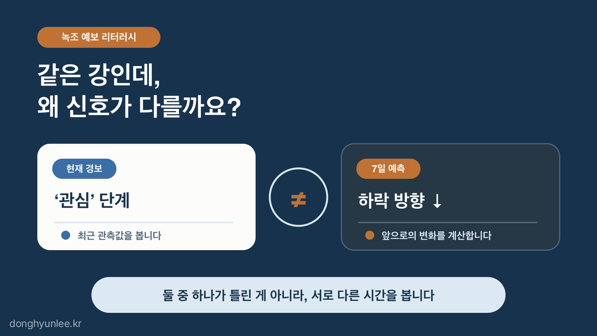
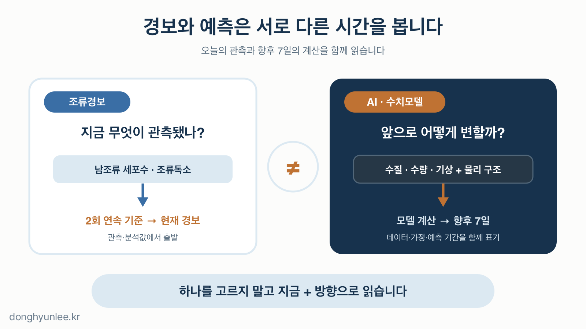
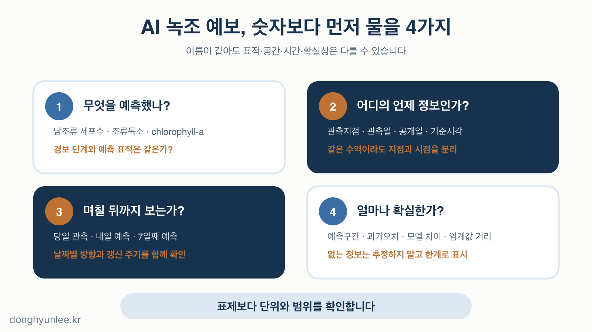

가상의 두 지점을 생각해 보겠습니다.

A 지점은 오늘 조류경보 '관심'이지만 7일 예측선은 아래로 향합니다. B 지점은 아직 경보가 없는데 예측선은 위로 향합니다. 어느 쪽을 더 믿어야 할까요?

정답은 하나를 고르지 않는 것입니다. **조류경보는 관측된 현재를 보여 주고, AI·수치모델 예측은 모델이 계산한 미래를 보여 줍니다.** 서로 다른 시간의 질문에 답하므로 두 정보가 다르다고 하나가 틀렸다고 볼 수는 없습니다.

_그림 1. 조류경보와 AI 예측은 서로 다른 시간의 질문에 답합니다._

## 30초 핵심

- 조류경보는 관측으로 현재 상태를 알리고, AI·수치모델 예측은 앞으로의 변화를 추정합니다.
- 2026년 녹조 예측은 13개 상수원 지점에 향후 7일 정보를 제공하지만, 경보와 예측은 대상과 시간이 다를 수 있습니다.
- 녹조 정보를 읽을 때는 예측 대상·지점·시점·기간·불확실성을 함께 확인해야 합니다.

## 1. '관심·경계'는 오늘의 관측을 경보로 바꾸는 기준입니다

조류경보는 예측 알고리즘이 직접 붙이는 등급이 아닙니다. 관측지점에서 채취·분석한 값을 법에서 정한 기준과 비교해 발령합니다.

2026년 3월 시행 중인 「물환경보전법 시행령」의 상수원 구간 기준을 보면, '관심'은 2회 연속 남조류 세포수가 1,000 cells/mL 이상일 때 해당합니다. '경계'는 2회 연속 남조류 세포수가 10,000 cells/mL 이상이거나 조류독소가 10 μg/L 이상일 때, '조류대발생'은 2회 연속 남조류 세포수가 1,000,000 cells/mL 이상일 때입니다.[2]

이 구조에서 놓치기 쉬운 점이 세 가지 있습니다.

- 경보는 **예측값이 아니라 관측값**에서 출발합니다.
- 한 번 기준을 넘은 숫자와 공식 경보는 같지 않습니다. 발령·해제 기준은 2회 연속 관측을 봅니다.
- 같은 '녹조'라고 불리는 숫자여도 남조류 세포수, 조류독소, chlorophyll-a 농도는 서로 다른 측정 대상입니다.

따라서 '관심'이라는 표시만 보고 모델이 내일도 관심 수준을 예측했다고 읽으면 안 됩니다. 이 표시가 어느 지점의 무엇을, 언제 측정해 만든 정보인지를 먼저 확인해야 합니다.

예를 들어 조류독소 기준은 넘지 않은 상황에서, 이번 남조류 세포수가 12,000 cells/mL이어도 직전 관측이 10,000 cells/mL 미만이었다면 '경계' 기준의 2회 연속 조건은 아직 채워지지 않습니다. 그래서 최근 측정값 한 개와 공식 경보 등급이 다르게 보일 수 있습니다. 색상 표시를 보기 전에 이 시간 규칙을 알아야 숫자를 잘못 읽지 않습니다.

## 2. AI와 수치모델은 향후 7일을 묻습니다

2026년 5월, 국립환경과학원은 녹조 예측에 AI 기술을 병행 도입했습니다. 기존 3차원 수치모델에 과거 수질·수량·기상 데이터를 학습한 AI 모델을 결합해 향후 7일간의 녹조 발생 정보를 제공한다는 계획입니다. 대상 상수원 지점은 9개에서 13개로 늘었고, 예측 정보는 5월부터 10월까지 매주 월요일과 목요일 물모아플랫폼에 공개됩니다.[1]

수치모델과 AI를 함께 쓰는 구조는 자연스럽습니다. 수치모델은 물의 흐름과 물리적 역학 구조를 계산하고, AI는 과거 데이터에서 반복된 패턴을 학습합니다. 둘을 결합한다고 미래가 확정되는 것은 아닙니다. 입력으로 사용한 관측과 기상 예보, 모델의 구조, 학습에 포함된 기간과 지점의 범위가 결과에 남습니다.

두 모델이 다른 방향을 내놓는다면 평균을 내 숫자 하나로 덮기보다, 어떤 입력과 가정 차이가 결과를 갈랐는지 확인할 신호로 읽어야 합니다. 모델 간 차이는 불편한 정보이지만, 감춰야 할 잡음은 아닙니다. 다음 관측이 들어왔을 때 어느 조건에서 각 모델이 어긋났는지 남기면, 예보는 한 번의 정답 맞히기가 아니라 검증 기록이 됩니다.

_그림 2. 경보는 관측된 현재를, 예측은 모델이 계산한 앞으로의 변화를 보여줍니다._

여기서 예측 대상을 구분하는 일이 중요합니다. 저와 전형서가 2025년 *Journal of Cleaner Production*에 발표한 연구는 2016년부터 2022년까지 여러 담수 관측지점의 주간 시계열을 사용해 1차원 합성곱 신경망으로 **chlorophyll-a 농도**를 예측했습니다. 또한 서로 다른 초기화에서 CAM을 1,000회 반복해 한 번의 설명이 우연에 지나치게 의존하지 않도록 했습니다.[3]

그러나 이 모델이 예측한 chlorophyll-a 농도는 현행 조류경보의 남조류 세포수·조류독소와 같은 표적이 아닙니다. 이 연구 결과를 바로 경보 단계 예측이라고 읽는다면 모델이 답한 질문을 바꿔 버리는 셈입니다.

## 3. 경보와 예측이 다를 때는 조합으로 읽습니다

조류경보와 7일 예측을 현재 상태와 향후 방향으로 나누면 네 가지 조합이 나옵니다. 아래 표는 판단 연습을 위한 단순화이며, 실제 경보 조치를 대체하지 않습니다.

| 현재 관측·경보 | 7일 예측 방향 | 읽는 법 |
|---|---|---|
| 낮음 | 상승 | 지금 경보가 없다는 사실과 앞으로 상승 가능성은 충돌하지 않습니다. 조기 신호로 읽되, 다음 관측으로 확인합니다. |
| 높음 | 하락 | 예측된 하락은 현재 경보를 취소하지 않습니다. 관측된 현재와 예상되는 개선 방향을 같이 적습니다. |
| 높음 | 상승 | 현재 관측과 예측 방향이 같은 신호를 냅니다. 다만 어떤 지점과 표적의 정보인지는 여전히 확인해야 합니다. |
| 낮음 | 하락 | 해당 지점·예측 기간의 정보가 비교적 일치합니다. 다른 지점과 예측 기간 밖까지 안전하다는 뜻은 아닙니다. |

예측선이 상승하는지 하락하는지만으로는 부족합니다. 경보 기준과 얼마나 멀리 있는지, 예측 기간의 어느 시점에서 방향이 바뀌는지, 최신 관측이 반영된 시점이 언제인지를 같이 보아야 합니다. 임계값에 가까운 숫자는 '관심 아님'과 '관심'으로 색이 갈릴 수 있지만, 두 상태가 단절된 세계라는 뜻은 아닙니다.

## 4. '녹조 예측'을 믿기 전에 네 가지를 확인합니다

첫째, **무엇을 예측했는지** 봅니다. 남조류 세포수인지, 조류독소인지, chlorophyll-a 농도인지, 경보 단계인지는 교체할 수 없는 정보입니다. '녹조 예측'이라는 표제만으로는 이 차이가 보이지 않습니다.

둘째, **어디의 언제 정보인지** 확인합니다. 같은 하천과 호소에서도 관측지점이 다르면 숫자가 다를 수 있습니다. 관측일·공개일·예측 기준시각을 구분하면 '최신'이라는 말이 구체적으로 바뀝니다.

셋째, **며칠 뒤까지 보는지** 읽습니다. 당일 관측, 내일 예측, 7일째 예측은 같은 무게로 놓을 수 없습니다. 예측 기간 끝의 한 점만 보기보다 날짜별 방향과 갱신 주기를 함께 보는 편이 낫습니다.

넷째, **불확실성이 보이는지** 묻습니다. 숫자 하나만 제공되면 예측 구간, 과거 오차, AI와 수치모델의 차이, 임계값까지의 거리 중 제공된 정보를 찾아야 합니다. 다 보이지 않으면 없는 부분을 추정해 채우지 말고, 확인할 수 없는 한계로 남겨 둡니다.

_그림 3. '녹조 예측'이라는 이름보다 무엇·어디·언제·얼마나 확실한지를 먼저 봐야 합니다._

이 기준은 공공기관의 녹조 예측에만 적용되지 않습니다. 제가 연구했거나 관련 서비스로 제공하는 모델도 학습 기간·관측지점·예측 표적이 정한 범위 안에서만 검증됩니다. 새로운 지점과 기후 조건, 다른 관측 방식으로 넘어가면 재검증이 필요합니다. 제 모델이라고 예외가 되지는 않습니다.

## 마무리

녹조 경보와 AI 예측이 다르게 보이는 날이 있어도 이상하지 않습니다. 하나는 지금 관측된 상태를, 다른 하나는 앞으로의 가능성을 말하기 때문입니다.

다음에 '녹조 예측'이라는 표현을 보면 숫자보다 앞서 네 가지를 확인해 보십시오. **무엇을, 어디의 언제를, 며칠 뒤까지, 얼마나 확실하게 예측했는가.** 이 질문이 경보와 AI 예측을 같이 읽는 출발점입니다.

## 관련 글

- [AI 예측은 왜 '하나의 숫자'로 답하면 안 될까 — 점추정에서 신뢰구간의 시대로](https://blog.naver.com/donghyunlee-ai/224343787239)
- [AI는 낯선 데이터를 만나면 정말 '모른다'고 말할까 — 데이터 분포 변화와 OOD](https://blog.naver.com/donghyunlee-ai/224378720396)

## 출처

[1] 기후에너지환경부·국립환경과학원. (2026.05.04). *여름철 녹조, 인공지능(AI)으로 정밀 예측.* https://www.mcee.go.kr/home/web/board/read.do?boardId=1861480&boardMasterId=939&menuId=10598

[2] 국가법령정보센터. *물환경보전법 시행령* 제28조 및 별표 3(시행 2026.03.24). https://www.law.go.kr/LSW/lsInfoP.do?lsiSeq=284747

[3] Lee, D., & Jeon, H. (2025). *Reinforced explainable AI for algal bloom forecasting under climate change: A multi-run class activation mapping (CAM) approach.* Journal of Cleaner Production, 529, 146805. https://doi.org/10.1016/j.jclepro.2025.146805

저자는 이 분야에서 AI Korea를 통해 관련 서비스를 제공하고 있습니다. 이 글은 특정 제품·서비스의 홍보가 아닙니다.

예측 결과는 언제나 불확실성을 포함합니다. 방역·환경 정책 의사결정의 단독 근거가 될 수 없습니다.

**이해관계 및 책임 고지**

이동현은 한국외국어대학교 Social Science & AI융합학부 교수이자 한국인공지능 주식회사(AI Korea Inc.)의 대표입니다.
이 글의 견해는 저자 개인의 것이며, 소속 기관이나 연구과제 발주처의 공식 입장이 아닙니다.

이 글은 일반적인 정보 제공과 교육을 목적으로 합니다. 특정 사안에 대한 자문이나
정책 권고가 아니며, 실제 의사결정의 단독 근거로 사용될 수 없습니다.

사실에 오류가 있다면 알려주십시오.
